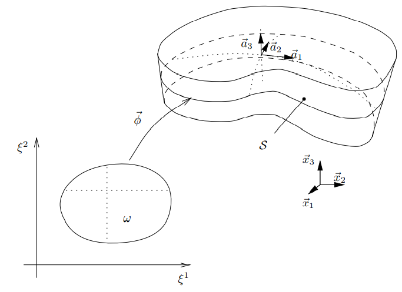

# Shell Geometry

Shell의 midsurface를 $S$, $\R^2$의 bounded ope subset을 $w$라 하자.

injective mapping인 2D chart $\phi$에 의해 $w$가 $S$로 mapping된다.
$$ \phi : w \rightarrow S $$

### basis of tangent space
$\phi(\xi^1,\xi^2)$로 표현되는 $S$위의 점에서 다음과 같이 정의된 vector가 선형 독립이라고 가정하자.
$$ a_\alpha = \frac{\partial \phi (\xi^1, \xi^2)}{\partial \xi^\alpha}, \enspace \alpha = 1,2 $$

따라서, $S$위의 각 점에서 tagent space의 basis는 $a_\alpha(\xi^1,\xi^2), \enspace \alpha = 1,2$이다.

### unit normal vector of tangent space
tagent space의 단위 접선벡터는 다음과 같이 정의한다.
$$ a_3 = \frac{a_1 \times a_2}{\Vert a_1 \times a_2 \Vert} $$

### 3D geometry
shell의 3D geometry $\mathcal B$라 할 때, 3D chart $\Phi$는 다음과 같이 정의된다.
$$ \Phi : \Omega \rightarrow \mathcal B \quad s.t. \quad (\xi^1,\xi^2,\xi^3) \mapsto \phi(\xi^1,\xi^2) + \xi^3a_3(\xi^1,\xi^2) $$

$\Omega$는 3D reference domain으로 다음과 같다.
$$ \Omega := \Big\{ (\xi^1, \xi^2, \xi^3) \in \R^3 \enspace | \enspace ( \xi^1, \xi^2) \in w, \enspace \xi^3 \in \Big[ -\frac{t}{2}, \frac{t}{2} \Big] \Big\} $$

이 때, $t$는 shell의 두깨이다.

$\Phi$와 $\Omega$는 $\mathcal B$를 서술하는 natural curvilinear coordinate system, 즉 natural parametrization을 제공한다. 

> 참고  
> [Book] (Bathe) The FEA of shells - Fundamentals chap 2.2