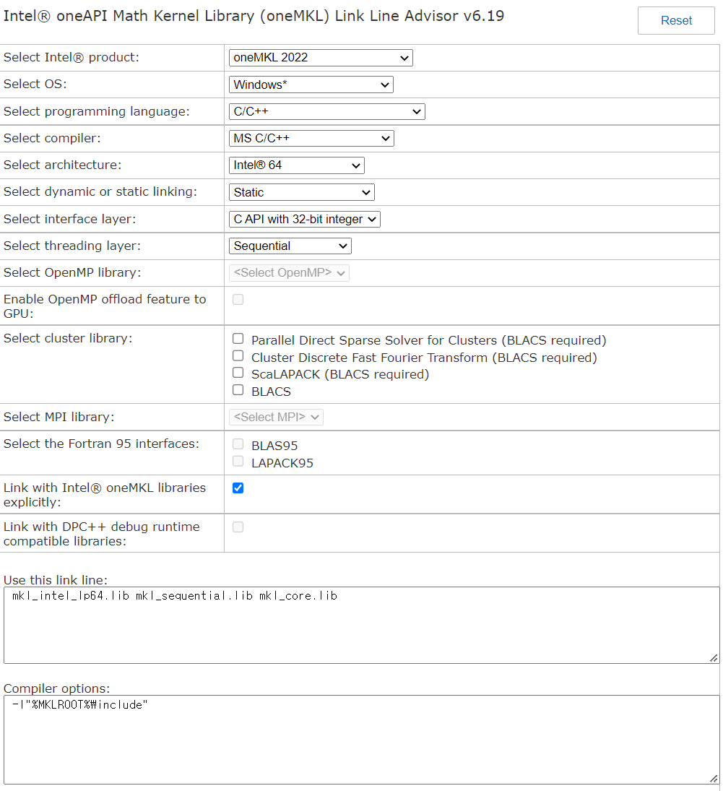

# MKL

## BLAS
추가해야할 Library
* mkl_intel_lp64.lib
* mkl_sequential.lib
* mkl_core.lib

> Reference  
> [Intel - link line advisor](https://www.intel.com/content/www/us/en/developer/tools/oneapi/onemkl-link-line-advisor.html#gs.f75q5u)  
> [StackOverFlow - link intel mkl library](https://stackoverflow.com/questions/19117880/how-to-link-intel-mkl-library-just-cblas-dgemm-function-is-used)

## MPI
* visual studio configuration   
* https://software.intel.com/content/www/us/en/develop/documentation/mpi-developer-guide-windows/top/compiling-and-linking/configuring-a-visual-studio-project.html

## ISSUE
* Environement
  * intel 홈페이지에 나와있는 환경변수가 잘못되어 있음
    * PATH=\$(I_MPI_ONEAPI_ROOT)\bin\\$(ConfigurationName);\$(I_MPI_ONEAPI_ROOT)\libfabric\bin;\$(PATH)
    * ConfigurationName $\rightarrow$ Configuration
  * 인식 못하는 dll 파일이 있는 곳의 위치를 환경변수에 연결해줘야 함
    * PATH=\$(I_MPI_ONEAPI_ROOT)\bin\\$(Configuration);\$(I_MPI_ONEAPI_ROOT)\libfabric\bin;C:\Program Files (x86)\Intel\oneAPI\mkl\2021.4.0\redist\intel64;\$(PATH)