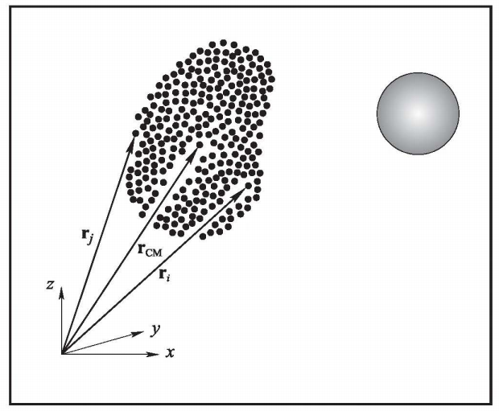

# 뉴턴의 운동 법칙
Truesdell[1]에 의하면 뉴턴이 제시한 `관성 좌표계(inertial frame)`에서 성립하는 운동 법칙은 다음과 같다.
1. 모든 물체는 외부 힘이 작용하지 않는 한 일정한 속도로 움직인다.  
"Every body continues in its state of rest, or of uniform motion straight ahead, unless it be compelled to change that state by forces impressed upon it."
2. 운동의 변화량은 작용하는 힘과 크기와 방향에 있어서 같다.  
"The change of motion is proportional to the motive force impressed, and it takes place along the right 
line in which the force is impressed."  
3. 작용이 있다면 그와 방향이 반대이고 크기는 같은 반작용이 있다. 상호 작용하는 두 물체는 항상 크기는 같고 방향이 반대인 힘을 서로 가한다.  
"To an action there is always a contrary and equal reaction; or, the mutual actions of two bodies upon 
each other are always directed to contrary parts."

뉴턴은 법칙을 방정식 형태로 제시한적이 없기 때문에 다양한 형태가 존재한다. 여기서는 "motion"을 운동량 $m \mathbf v$로 보고 "motive force"를 $\bf f$로 표현하면 운동 법칙의 방정식들은 다음과 같다.

$$ \begin{gather} \mathbf f = 0 \Rightarrow m \mathbf v = \text{constant} \\ \displaystyle\frac{d}{dt}(m \mathbf v) = \mathbf f \\ \mathbf f_{ij} = - \mathbf f_{ji} \end{gather} $$

이 때, 식(2)는 제 2 운동 법칙의 "change of motion"을 운동량의 시간변화율로써 표현하였고 $\mathbf f_{ij}$는 $j$ 물체가 $i$ 물체에게 가하는 힘을 나타낸다.

## 관성 좌표계
관성 좌표계란 뉴턴의 운동 법칙이 성립하는 좌표계이다.

이러한 정의는 바로 순환논리에 빠지게 되는데 이는 실험적으로 관성 좌표계를 결정함으로써 극복할 수 있다[2]. 예를들어, 뉴턴의 운동 법칙으로써 케플러 행성 운동 법칙을 증명할 때 사용한 태양과 고정된 별들을 기준으로한 좌표계가 관성 좌표계에 대한 좋은 근사인 것이다.

## 물체의 운동
물체의 운동에 식(2)를 적용할 경우 $\bf v$를 어떻게 결정해야 되는지 고민해봐야 한다. 왜냐하면 물체의 모든 부분의 속도는 같지 않기 때문이다. 일반적으로 이런 경우 충분히 작은 물체를 하나의 속도를 갖는 `질점(mass point)`으로 모델링하고 그 질점에 식(2)를 적용하여 해결한다. 하지만 이때도 고민해봐야하는 부분이 있다. "충분히 작은"은 얼마나 작은것인가?

이 문제를 고려하기 위해 Feynman et al[3]는 위의 그림과 같은 $N$개의 질점으로 이루어진 `질점 구름(cloud of mass point)`과 질점 구름 밖에 하나의 물체가 있는 경우를 생각하였다.

$i$번째 질점에 식(2)를 적용하면 다음과 같다.
$$ \frac{d}{dt}(m_i \mathbf v_i) = \mathbf b_i + \sum_{j=1}^N \mathbf f_{ij} $$
이 때, $\mathbf b_i$는 질점구름 밖의 물체로 부터 $i$ 질점이 받는 체적력을 의미하며 $\mathbf f_{ij}$는 $j$ 질점에 의해 $i$ 질점에 작용하는 힘이다.

전체 질점 구름 작용하는 힘을 계산하기 위해 모든 질점에 작용하는 힘을 더하면 다음과 같다.
$$ \sum_{i=1}^N \frac{d}{dt}(m_i \mathbf v_i) = \sum_{i=1}^N \mathbf b_i + \sum_{i=1}^N \sum_{j=1}^N \mathbf f_{ij} $$

식 (3)에 의해 $\mathbf f_{ij} = - \mathbf f_{ji}$임으로 다음과 같이 간단하게 정리할 수 있다.
$$ \begin{equation} \sum_{i=1}^N \frac{d}{dt}(m_i \mathbf v_i) = \sum_{i=1}^N \mathbf b_i \end{equation}  $$

질점 구름의 전체 질량 $m$은 다음과 같다.
$$ m = \sum_{i=1}^N m_i $$

이 때, 질량 중심 $\mathbf x_c$과 질량 중심에서의 속도 $\mathbf v_c$를 다음과 같이 정의하자.
$$ \mathbf x_c = \frac{1}{m} \sum_{i=1}^N m_i \mathbf x_i, \quad \mathbf v_c = \frac{1}{m} \sum_{i=1}^N m_i \mathbf v_i$$

질점 구름 전체에 작용하는 외력을 다음과 같이 표현하면,
$$ \mathbf f \equiv \sum_{i=1}^N \mathbf b_i, $$

질점 구름에 대한 뉴턴의 제 2 운동 법칙은 다음과 같다.
$$ \frac{d}{dt}(m \mathbf v_c) = \mathbf f $$

Feynman et al[3]는 "뉴턴의 운동 법칙이 특정 스케일(질점 스케일)에서 성립한다면 더 큰 스케일(질점 구름 스케일)에서도 성립하게 되는 특이한 성질을 가지고 있다"고 설명하고 있다. 이는 만족스러운 결과이지만 입자가 얼마나 작아야 식(2)로 표현되는 뉴턴의 제 2 운동 법칙을 적용할 수 있는지에 대해서는 설명되고 있지는 않다.

강체의 임의의 점 $\mathbf x$에서 속도는 다음과 같다.
$$ \begin{equation} \mathbf {v(x)} = \mathbf v_c + \boldsymbol \omega(\mathbf{x - x}_c) \end{equation} $$

이 때, $\boldsymbol{\omega}$는 각속도를 의미한다.

식(5)를 보면 $\boldsymbol \omega(\mathbf{x - x}_c) \ll  \mathbf v_c$이면 $\mathbf{v(x)} \approx \mathbf v_c$로 근사될 수 있음을 알 수 있다. 즉, 식 (2)가 성립하기 위한 조건은 $\boldsymbol \omega(\mathbf{x - x}_c) \ll  \mathbf v_c$이다.

강체가 아닌 물체에도 적용하기 위해서 식(5)를 조금 더 일반적인 형태로 확장하면 다음과 같다.
$$ \begin{equation} \mathbf {v(x)} = \mathbf v_c + \int_{\mathbf x_c}^{\mathbf x} (\nabla \mathbf v)^T d\eta \end{equation} $$

# 참고 문헌
[1] Truesdell, C., Essays in the History of Mechanics, Springer-Verlag, New York, p.88 (1968)  
[2] Hurley, J.P, andC. Garrod, Principles of Physics, Houghton Mifflin Co., Boston, p. 49 (1978)  
[3] Feynman, R.P, RB. Leighton, and M. Sands, The Feyn- man Lectures on Physics, Addison-Wesley Publishing Company, New York, I, p.18-1 (1963)   

[note] (Whitaker) NEWTON'S LAWS, EULER'S LAWS, AND speed of lights