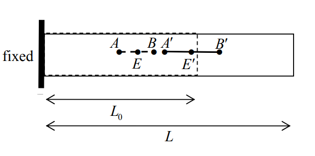
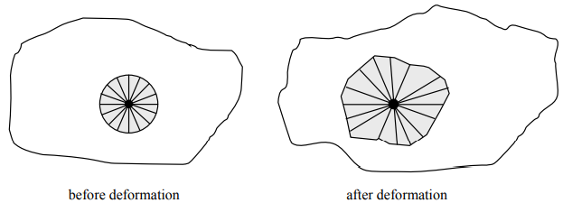
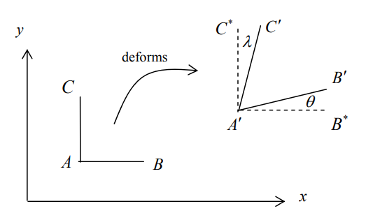
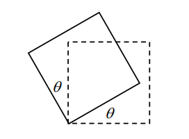
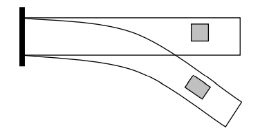

# 강도
`강도(strength)`는 파손에 저항하는 정도를 의미한다.

# 안정성
`안정성(stability)`는 변화 후 원상태로 회복하는 정도를 의미한다.

# 응력
재료역학에서는 "외력을 받는 재료 내부의 임의 위치에는 외력과 평형을 유지하기 위한 `내력(internal force)`이 존재한다"는 내력과 외력의 평형 가정을 한다.

이 때, `응력(stress)`은 단위 면적당 내력을 의미한다.

## 수직응력
`수직 응력(normal stress)` $\sigma$는 임의의 가상 단면에 대하여 법선 방향으로 작용하는 응력이다.

$$ \sigma = \frac{T}{A} $$

이 때, $T$는 법선 방향 외력, $A$는 임의의 가상 단면의 넓이이다.

응력이 늘어나는 방향으로 작용하는 경우 `인장응력(tensil stress)`, 줄어드는 방향으로 작용하는 경우 `압축응력(compressive stress)`이라 한다. 부호규약은 일반적으로 인장응력일 때 $+$, 압축응력일 때 $-$를 사용하는 것이 관례이다,

## 전단응력
`전단응력(shear stress)` $\tau$는 임의의 가상 단면에 대하여 접선 방향으로 작용하는 응력이다.

$$ \tau = \frac{T}{A} $$

이 때, $T$는 접선 방향 외력(전단력), $A$는 임의의 가상 단면의 넓이이다.

전단응력의 분포는 정확하게 유추할 수 없으나 전단력 $T$를 $A$로 나누어 평균전단응력을 구할 수 있다.

## 초기응력
`초기 응력(initial stress)`은 물체의 제작이나 조립 또는 사용과정 중에서 재료의 불균일성 등이 원인이 되어 특별한 외력의 작용을 받지 않았음에도 물체 내부에 존재하는 응력이다.

## 잔류응력
`잔류 응력(residual stress)`은 처음에 응력이 없던 물체에 하중을 작용시켰다가 이를 다시 제거했을 때, 물체 내에 완전히 제거되지 않은 응력이다.

잔류응력 때문에 영구변형이 발생하며, 이는 영구변형 후에 물체가 스스로 보유하게 되는 응력이므로 본질적으로 초기응력과 같다고 볼 수 있다.

## 코시 응력 텐서
물체 내부 임의의 한 점에 대한 응력상태를 다음과 같은 행렬식으로 표현할 수 있다.

$$ \boldsymbol{\sigma} = \begin{bmatrix} \sigma_{11} & \cdots & \sigma_{13} \\ \vdots & & \vdots \\ \sigma_{31} & \cdots & \sigma_{33} \end{bmatrix} $$

위 행렬 각 요소의 첫 번째 하첨자는 응력이 작용하는 면의 법선벡터의 방향이고 두 번째 하첨자는 응력의 방향을 의미한다.

물체 내부 임의의 한 점에 대한 3차원 응력상태를 표현하기 위해 육면체 미소요소를 생각해보자. 육면체의 각 변의 길이는 매우 작은 값임으로 육면체에 대한 언급은 결국 한 점에 대한 설명으로 볼 수 있다. 육면체 미소요소에 대한 모멘트 평형식을 고려하면 다음과 같다.

$$ \begin{align} \sum M_x = 0 \Rightarrow \sigma_{23} = \sigma_{32} \\ \sum M_y = 0 \Rightarrow \sigma_{31} = \sigma_{13} \\ \sum M_z = 0 \Rightarrow \sigma_{12} = \sigma_{21} \end{align} $$

그러므로 3개의 전단응력 성분은 더 이상 독립성분이 아니다. 따라서 최종적인 3차원 응력상태의 독립성분은 $\sigma_{11},\sigma_{22},\sigma_{33},\sigma_{12},\sigma_{23},\sigma_{31}$로 총 6개이다.

### 참고
[Cauchy stress tensor - Wiki](https://en.wikipedia.org/wiki/Cauchy_stress_tensor)

# 변형률
`변위(displacement)`는 물체의 위치의 변화량이다.

물체가 책상 위에 존재하고 그 책상이 움직이는 상황을 생각해보자. 물체의 입자들은 강체와 같이 공간상에서 움직이고 변위을 갖게 된다. 

이번에는 외력을 받아 공간상에서 움직이는 물체를 생각해보자. 물체의 내부에서는 응력이 발생함과 동시에, 강체가 아닌 이상 그 물체를 구성하는 각 분자와 분자 상호간의 운동으로 인하여 물체의 상태가 변하게 되어 형태와 크기가 달라지는 `변형(deformation)`을 겪게 겪으면서 변위를 갖게 된다. 

변형은 `변형률(strain)`로써 서술되며 `운동학(kinematics)`은 변위나 변형에 대해 연구하는 학문이다.

## 1차원 변형률

### 공칭변형률
1차원 변형을 서술하는 다양한 방법이 있지만, 가장 간단한 방법인 공칭변형률 또는 `공학변형률(engineering strain)`을 보자.

위와 같이 $\overline{AB}$가 변형후에 $\overline{A'B'}$가 되었을 때 변형률 $\epsilon$은 다음과 같이 정의된다.

$$\epsilon = \frac{|A'B'| - |AB|}{|AB|}$$

만약 물체가 일정하게 변형한다면 다음이 성립한다.

$$\frac{|A'B'| - |AB|}{|AB|} = \frac{|A'E'| - |AE|}{|AE|} = \frac{|E'B'| - |EB|}{|EB|} = \frac{L - L_0}{L_0} $$

즉, 물체가 일정하게 변형한다면 변형률을 계산하기 위해 어떤 길이의 선분을 잡아도 상관 없다. 

반면에 변형률이 일정하지 않을 경우 선분의 길이에 따라 변형률이 달라진다. 따라서, 변형률을 정확하게 측정하기 위해서는 선분이 미소길이여야 한다.

#### 변위와 변형률
공학적 변형률을 변위를 통해서 표현하면 다음과 같다.

$$ \epsilon = \frac{d_B - d_A}{|AB|} $$

변형률은 변위의 차이다. 예를들어 고정단의 변위를 측정하면 항상 0이겠지만 변형률은 0이 아니다. 반대로 강체가 병진운동할 경우 변위는 모든곳에서 0이 아니겠지만 변형률은 0이 된다. 이는 변형률이 강체의 운동에서는 항상 0이며 변형만을 측정한다는 것을 보여준다. 따라서 변형률만으로는 물체의 위치를 확정할 수 없다. 변형률으로는 강체의 운동에 대한 정보가 누락되어 있기 때문이다. 

### 진변형률
`진 변형률(true strain, logarithmic strain)`은 다음과 같이 정의 된다.

$$ \epsilon_t = \int _{L_0}^L \frac{1}{l}dl = \ln \left( \frac{L}{L_0} \right)$$

이는 현재 길이에서 미소한 변형률을 합한다는 의미를 갖으며 변형된 순간순간의 현재 길이를 반영한것이다. 진 변형률은 공학 변형률에 비해 변형률을 표현하는데 몇가지 장점이 있다.

만약 직선이 2배 늘어날 경우 $\epsilon=1$이고 $\epsilon_t = 0.69$이다. 반대로 직선이 2배 짧아질 경우 $\epsilon = -0.5$이고 $\epsilon_t = -0.69$이다. 진변형률에서는 신장과 수축의 정도가 동일할 경우 같은 크기에 부호만 반대로 나타나는 반면 공학변형률에서는 크기 자체가 다르게 나온다. 

또한 변형이 $L_1 \rightarrow L_2 \rightarrow L_3$로 2단계에 걸쳐 나타났다고 하자. 진변형률의 경우 전체 변형률이 각 단계의 변형률의 합으로 나타난다.
$$ \begin{equation} \epsilon_t = \ln \left(\frac{L_3}{L_1} \right) =  \ln \left(\frac{L_2}{L_1} \right) + \ln \left(\frac{L_3}{L_2} \right) \end{equation} $$

하지만 공학변형률에 경우 식(4)와 같은 관계가 성립하지 않는다.
$$ \epsilon = \frac{L_3-L_1}{L_1} \neq  \frac{L_2 - L_1}{L_1} + \frac{L_3 - L_2}{L_2} $$

진변형률과 공학변형률은 다음과 같은 관계식이 성립한다.
$$ \epsilon_t = \ln \left( \frac{L}{L_0} \right) = \ln \left( \frac{L-L_0 + L_0}{L_0} \right) = \ln ( 1 + \epsilon ) $$

이 때, 테일러 급수(Taylor series)를 이용하면 다음과 같다.
$$ \epsilon_t = \ln ( 1 + \epsilon ) \approx \epsilon - \frac{1}{2}\epsilon^2 + \frac{1}{3}\epsilon^3 \cdots$$

따라서 충분히 작은 $\epsilon$에 대해서는 $\epsilon_t \approx \epsilon$이 성립한다. 즉 공학변형률이 충분히 작을 때에는 진변형률과 비슷한 값을 가지게 된다.

만약 변형률의 정의를 "단위 길이당 길이의 변화량"이라고 정의를 한다면 진변형률이 공학변형률보다 더 정확한 표현이 될것이다. 그러나 만약 변형률의 다양한 정의를 인정한다면, 표현간에 비교가 의미 없어진다. 그저 상황에 따라서 더 유용한 변형률 표현이 존재할 뿐이다.

### 참고
[note] (kelly) An Introduction to Solid Mechanics Chapter4.1.1

## 2차원 변형률

2차원 변형률은 위 그림과 같이 한 점에서 나오는 무수한 직선들이 어떻게 변형되는지로 표현할 수 있다. 그리고 `변형률 변환 법칙(strain transformation rule)`에 의해 두개의 수직한 직선의 변형을 알면 나머지 직선들의 변형을 모두 표현할 수 있다. 

따라서, 2차원의 경우 한 점에서 발생하는 변형은 그 점에서 나오는 두개의 수직한 직선이 겪는 두가지 변형으로 표현된다.
1. 각 직선의 길이가 변한다.
2. 두 직선의 이루는 각이 변한다.

첫번째 경우를 normal strain이라고 하고 두번째 경우를 `전단 변형률(shear strain)`이라고 한다.

### 공학변형률

위 그림과 같이 변형되었다고 할 때, 1차원 공학변형률에 정의를 그대로 확장한 2차원 공학변형률은 다음과 같다.

1. $\epsilon_{11}$은 $x_1$축의 normal strain이며 초기에 $x_1$축과 평행한 직선이 단위길이당 늘어난 길이이다.
$$ \epsilon_{11} = \frac{A'B' - AB}{AB} $$
2. $\epsilon_{22}$은 $x_2$축의 normal strain이며 초기에 $x_2$축과 평행한 직선이 단위길이당 늘어난 길이이다.
$$ \epsilon_{22} = \frac{A'C' - AC}{AC} $$
3. $\epsilon_{12} = \epsilon_{21}$은 전단 변형률이며 초기에 $x_1$축과 평행한 직선이 변형된 각도와 $x_2$축과 평핸한 직선이 변형된 각도의 평균값이다.
$$\epsilon_{12} = \epsilon_{21} = \frac{1}{2} (\theta + \lambda)$$

여기서도 알 수 있듯이, 점 $A$가 강체운동에 의해 변형이 되더라도 변형률은 변하지 않는다.

### 미소 변위 이론
`미소 변위 이론(small strain assumption)`이란 변위가 충분히 작다는 가정을 통해 변형률을 수학적으로 훨씬 간략하게 나타내는 이론이다.

아래 그림을 바탕으로 기하학적으로 미소 변위 이론을 유도해보자. 

변위가 함수 $\mathbf d = \mathbf d(x,y)$로 주어지고 좌표가 $A=(x,y), B = (x + \Delta x, y), C = (x, y + \Delta y)$라 하자. 그러면 변형된 이후의 좌표는 다음과 같다.
$$A' = (x,y) + \mathbf d(x,y), \\ B' = (x + \Delta x, y) + \mathbf d(x + \Delta x, y) $$

이 떄, $\Delta x$가 충분히 작을 경우 $B'$을 다음과 같이 선형 근사할 수 있다.
$$ B' \approx (x + \Delta x, y) + \mathbf d(x, y) +  \left( \frac{\partial d_1}{\partial x} \Delta x, \frac{\partial d_2}{\partial x} \Delta x \right) $$

따라서 공학변형률은 다음과 같다.
$$ \epsilon_{11} = \frac{ \| (\Delta x + \frac{\partial d_1}{\partial x}, \frac{\partial d_2}{\partial x} ) \| - \Delta x }{\Delta x} = \sqrt{ \left( 1 + \frac{\partial d_1}{\partial x} \right) ^2 + \left( \frac{\partial d_2}{\partial x} \right)^2 } - 1 $$

만약 변위가 충분히 작아 $\frac{\partial d_i}{\partial x_j} \ll 1$라 가정하면, $x$축 변형률은 다음과 같이 근사 할 수 있다.
$$ \epsilon_{11} \approx \frac{\partial d_1}{\partial x} $$

위와 동일한 과정을 $y$축 변형률에 적용하면 다음과 같다.
$$ \epsilon_{22} \approx \frac{\partial d_2}{\partial y} $$

전단변형률의 경우에는 먼저 $\theta$를 고려해보자. 변위가 충분히 작아 $\frac{\partial d_i}{\partial x_j} \ll 1$이고 $\theta \approx 0$라 하면 $\theta$는 다음과 같이 근사할 수 있다.
$$ \theta \approx \tan \theta = \frac{\displaystyle \frac{\partial d_2}{\partial x} \Delta x}{\Delta x + \displaystyle \frac{\partial d_1}{\partial x} \Delta x} \approx \frac{\partial d_2}{\partial x} $$

위와 동일한 과정을 거쳐 $\lambda$를 근사하면 다음과 같다.
$$ \lambda \approx \frac{\partial d_1}{\partial y} $$

따라서 전단 변형률은 다음과 같다.
$$ \epsilon_{12} \approx \frac{1}{2} \left( \frac{\partial d_2}{\partial x} + \frac{\partial d_1}{\partial y}\right) $$

즉, 미소 변위 이론은 변형이 충분히 작아 normal strain을 고려할 때는 다른 축 방향으로의 변형은 무시할 수 있으며 전단 변형률을 고려할 때는 $\theta \approx \tan \theta$로 근사할 수 있게 되며 이를 그림을 통해 보면 다음과 같다.
$$ \epsilon_{11} \approx \frac{A'B^* - AB}{AB}, \quad \epsilon_{22} \approx \frac{A'C^* - AC}{AC}, \quad \epsilon_{12} \approx \epsilon_{21} \approx \frac{1}{2} (\frac{B^*B'}{A'B^*} + \frac{C^*C'}{A'C^*}) $$

이 과정을 3차원으로 확장하면 `변형률 텐서(strain tensor)` $\boldsymbol{\epsilon}$을  다음과 같이 간략하게 표현할 수 있다.
$$ \epsilon_{ij} = \frac{1}{2} \left( \frac{\partial d_i}{ \partial x_j } + \frac{\partial d_j}{ \partial x_i }\right) $$

이러한 $\boldsymbol{\epsilon}$을 `미소 변형률 텐서(infinitesimal strain tensor, Cauchy's strain tensor, linear strain tensor)`라 한다.

#### 유한변위 이론에 의한 미소 변형률 텐서 유도
`유한변위 이론(finite strain theory)`에 의한 $\boldsymbol{\epsilon}$는 다음과 같다.
$$ \epsilon_{ij} = \frac{1}{2} \left( \frac{\partial d_i}{ \partial x_j } + \frac{\partial d_j}{ \partial x_i } - \frac{\partial d_k}{ \partial x_i } \frac{\partial d_k}{ \partial x_j } \right) $$

이 때, 미소변위 이론의 가정에 의해 $||\bf \nabla d|| \ll 1$임으로 비선형 2차항은 무시할 수 있다. 

따라서 $\boldsymbol{\epsilon}$는 다음과 같이 간단하게 표현할 수 있다.
$$ \epsilon_{ij} = \frac{1}{2} \left( \frac{\partial d_i}{ \partial x_j } + \frac{\partial d_j}{ \partial x_i }\right) $$

##### 참고
[finite strain theory - Wiki](https://en.wikipedia.org/wiki/Infinitesimal_strain_theory#Infinitesimal_strain_tensor)

#### 회전각이 큰 경우
다음과 같이 회전이 발생하는 경우를 생각해보자.

공학적 변형률의 정의에 따르면 변형률은 0이 되어야 한다. 하지만 미소 변형률 가정을 할 경우 normal strain은 다음과 같이 근사된다.
$$ \epsilon_{11} = \epsilon_{22} \approx \cos \theta -1 $$

테일러 급수로 근사하면 다음과 같다.
$$ \epsilon_{11} = \epsilon_{22} \approx -\theta^2/2 + \theta^4 / 24 + \cdots $$

따라서 $\theta$가 작을 경우 $\theta^2$이 충분히 작아 미소 변형률 가정이 유효하지만 $\theta$가 클 경우에는 미소 변형률 가정에 의해서 발생하는 오차가 매우 커지게 된다.

그 예로 아래 그림과 같이 굽힘이 많이 발생하는 보를 생각해보자.

음영처리된 요소의 경우 회전각이 크기 때문에 미소 변형률 가정에 의해서 발생하는 오차 때문에 실제 변형률과는 차이가 큰 잘못된 변형률 값을 가지게 된다. 따라서 이러한 경우에는 미소 변형률 가정을 사용하지 않고 변형률을 계산해야 한다.

##### 참고
[note] (kelly) An Introduction to Solid Mechanics Chapter4.1.5

### 공학전단변형률
`공학전단변형률(engineering shear strain)` $\gamma_{ij}, (i \neq j)$는 위의 정의한 `텐서전단전형률(tensorial shear strain)` $\epsilon_{ij}, (i \neq j)$와 다음 관계를 만족한다.
$$\gamma_{ij} = 2\epsilon_{ij}$$

### 참고
[note] (kelly) An Introduction to Solid Mechanics Chapter4.1.2

## 세로변형률
`세로변형률(longitudinal strain)` $\epsilon$은 수직응력에 의해 가상 단면에 법선방향으로 발생한 법선방향 단위길이당 변현량이다.

$$ \epsilon = \frac{\delta}{L} = \frac{L' - L}{L} $$

이 때, $L$은 변형전 법선방향 길이, $L'$은 변형후 법선방향 길이, $\delta$는 변화량이다.

$\sigma$가 인장응력일 경우 `인장변형률(tensil strain)`이라하고 압축응력일 경우 `압축변형률(compressive strain)`이라 한다.

## 가로변형률
`가로변형률(lateral strain)` $\epsilon'$은  수직응력에 의해 가상 단면에 접선방향으로 발생한 접선방향 단위길이당 변형량이다.

$$ \epsilon = \frac{\Delta d}{d} = \frac{d' - d}{d} $$

이 때, $d$은 변형전 접선방향 길이, $d'$은 변형후 접선방향 길이, $\Delta d$는 변화량이다.

## 전단변형률
`전단변형률(shear strain)` $\gamma$는 전단응력에 의해 가상 단면에 접선방향으로 발생한 법선방향 단위길이당 미끄럼 변위량이다.

$$ \gamma = \frac{\lambda}{L} = \tan \theta $$

이 떄, $\lambda$는 미끄럼 변위량, $L$은 법선방향 길이이다.

법선방향 길이에 비해 미끄럼 변위량이 매우 작다면 다음과 같은 근사식이 만족한다.

$$ \gamma \approx \theta $$

## 체적변형률
`체적변형률(volumetric strain, bulk strain)` $\epsilon_v$는 물체에 외력이 가해졌을 때 발생하는 체적의 변화량과 원체적에 대한 비이다.

$$ \epsilon_v = \frac{\Delta V}{V} $$

이 때, $\Delta V$는 체적의 변화량, $V$는 변형 전 체적이다.

## 평면변형률
`평면변형률(plane strain)`이란 $\boldsymbol \epsilon$의 원소들 중 평면상의 값 외에는 전부 0인 경우이다.

이 때, 평면을 $x-y$평면으로 잡으면 $\epsilon_{13}=\epsilon_{23}=\epsilon_{33} = 0$이다. 따라서 $\boldsymbol \epsilon$는 2차원의 변형률 텐서로 축소된다.

# 후크의 법칙
1678년 영국의 물리학자 Robert Hooke는 스프링에 하중을 작용시켜 인장시험을 한 결과, 탄성한계 내에서는 신장량 $\delta$가 인장력 $T$와 봉의 길이 $L$에 비례하고 봉의 단면적 $A$에 반비례한다는 것을 알았다. 이를 수식으로 작성하면 다음과 같다.

$$ \delta \propto \frac{TL}{A} $$ 

비례상수 $1 /E$를 도입하면

$$ \begin{align} & \delta = \frac{1}{E} \frac{TL}{A} \\ \Rightarrow \enspace & E\frac{\delta}{L} = \frac{T}{A} \\ \Rightarrow \enspace & \sigma = E \epsilon \end{align} $$

따라서, 후크의 법칙은 응력은 변형률에 비례한다는 법칙이다.

이 떄, $E$를 `탄성계수(modulus of elasticity)`라하고 $\epsilon$이 무차원 변수임으로 단위는 응력과 동일하다.

## 강성도
식 (10)을 단위 변화량당 필요한 외력 $T / \delta$에 대해 정리하면 다음과 같다.

$$ \frac{T}{\delta} = \frac{EA}{L}  $$

따라서, $\frac{EA}{L}$를 `강성도(stiffness)`라하고 변형에 저항하는 정도를 의미한다. 즉, 강성도가 클 경우 변화량을 일이키는데 필요한 힘이 크다는 것을 의미한다.

## 세로탄성계수
`세로탄성계수(modulus of longitudinal elasticity)` $E$는 물체에 수직응력이 작용했을 때, 세로 변형률과의 비례상수이다.

$$ E = \frac{\sigma}{\epsilon} $$

탄성한계 내에서 응력과 변형률이 비례관계에 있음을 후크의 법칙에서 나타내고 있으나, 이를 수치적으로 측정하여 비례상수의 성격이 명확히 확립된 것은 영국의 물리학자 Thomas Young에 의해서이다. 따라서 이를 `영 계수(Young's modulus)`라고도 한다.

## 가로탄성계수
`가로탄성계수(modulus of lateral elasticity)` $G$는 물체에 전단응력이 작용했을 때, 전단 변형률과의 비례상수이다.

$$ \tau = G \gamma $$

$G$는 `전단탄성계수(modulus of shearing elasticity)`라고도 한다.

## 체적탄성계수
`체적탄성계수(bulk modulus)` $K$는 물체에 수직응력이 작용했을 때, 체적 변화율과의 비례상수이다.

$$ K = \frac{\sigma}{\epsilon_V} $$

## 프와송의 비
`프와송의 비(Poissons's ratio)` $\nu$는 수직응력이 작용했을 때, 가로변형률과 세로변형률과의 비를 의미한다.

$$ \nu = - \frac{\epsilon'}{\epsilon} $$

이 떄, $-$는 $\nu$가 항상 양의 값을 가지게 하기 위해 사용되었다.

## 일반화 된 후크의 법칙
응력과 변형률이 선형관계에 있다는 후크의 법칙을 2차 텐서로 표현되는 일반화된 응력과 변형률에 적용하기 위해서는 4치 `탄성 텐서(elasticity tensor)`가 필요하다.

$$ \sigma_{mn} = E_{mnpq} \epsilon_{pq} $$

이 때, 위의 텐서들은 다음과 같은 대칭성을 만족한다.

1. 모멘트 평형식으로부터 $\sigma_{mn} = \sigma_{nm}$이고 따라서 $E_{mnpq} = E_{nmpq}$이다.
2. $\epsilon_{pq} = \epsilon_{qp}$이고 따라서 $E_{mnpq} = E_{mnqp}$이다.
3. 열역학 제 1법칙에 의해 $E_{mnpq} = E_{pqmn}$

4차 텐서 $\bf E$를 결정하기 위해서는 $3^4 = 81$개의 요소를 결정해야 한다. 하지만 위의 대칭성에 의해 $\bf E$는 21개의 독립적인 요소를 갖고, 이를 행렬식으로 표현하면 다음과 같다.

$$ \begin{bmatrix} \sigma_{11} \\ \sigma_{22} \\ \sigma_{33} \\ \sigma_{23} \\ \sigma_{31} \\ \sigma_{12} \end{bmatrix} = \begin{bmatrix} E_{1111} & E_{1122} & E_{1133} & 2E_{1123} & 2E_{1113} & 2E_{1112} \\ E_{1122} & E_{2222} & E_{2233} & 2E_{2223} & 2E_{2213} & 2E_{2212} \\ E_{1133} & E_{2233} & E_{3333} & 2E_{3323} & 2E_{3313} & 2E_{3312} \\ E_{1123} & E_{2223} & E_{3323} & 2E_{2323} & 2E_{1323} & 2E_{1223} \\ E_{1113} & E_{2213} & E_{3313} & 2E_{1323} & 2E_{1313} & 2E_{1312} \\ E_{1112} & E_{2212} & E_{3312} & 2E_{1223} & 2E_{1213} & 2E_{1212} \end{bmatrix} \begin{bmatrix} \epsilon_{11} \\ \epsilon_{22} \\ \epsilon_{33} \\ \epsilon_{23} \\ \epsilon_{31} \\ \epsilon_{12} \end{bmatrix} $$

이 때, $\bf E$요소를 3부분으로 나누면 다음과 같다.

1. 신장변형률과 신장응력의 관계를 나타내는 탄성계수  
$E_{1111}, E_{1122}, E_{1133},E_{2222}, E_{2233}, E_{3333}$
2. 전단변형률과 전단응력의 관계를 나타내는 탄성계수  
$E_{2323}, E_{1323}, E_{1223},E_{1313}, E_{1312}, E_{1212}$
3. 신장변형률과 전단응력의 관계를 나타내거나, 전단변형률과 신장응력의 관계를 나타내는 탄성계수  
$E_{1123}, E_{1113}, E_{1112},E_{2223}, E_{2213}, E_{2212}, E_{3323}, E_{3313}, E_{3312}$

이 때, 3번에 해당하는 요소가 0이 아닌 경우, `비등방성(anisotropic)`재료라고 한다.

### 응력-변형률 관계에 따른 분류

| 응력-변형률 관계 | 독립적인 $\bf E$요소 수|
|:---:|:---:|
| anisotropic | 21 |
| monoclinic | 13 |
| orthotropic | 9 |
| tetragonal | 6 |
| transversely isotropic | 5 |
| cubic | 3 |
| isotropic | 2 |

#### anistropic
`비등방성(anistropic)`은 방향에 따라 물체의 물리적 성질이 다른 것을 말한다. 

#### orthotropic
신장응력으로 전단변형이 발생하지 않으며 동시에 전단응력으로 신장변형이 발생하지 않고 한 면에 전단 응력(변형률)은 다른 면의 전단 응력(변형률)에 영향을 주지 않는다.

따라서 관련된 항을 0으로 두면 총 $21 - 9 - 3 = 9$개의 독립적인 요소가 남는다.

$$ \begin{bmatrix} \sigma_{11} \\ \sigma_{22} \\ \sigma_{33} \\ \sigma_{23} \\ \sigma_{31} \\ \sigma_{12} \end{bmatrix} = \begin{bmatrix} E_{1111} & E_{1122} & E_{1133} & 0 & 0 & 0 \\ E_{1122} & E_{2222} & E_{2233} & 0 & 0 & 0 \\ E_{1133} & E_{2233} & E_{3333} & 0 & 0 & 0 \\ 0 & 0 & 0 & 2E_{2323} & 0 & 0 \\ 0 & 0 & 0 & 0 & 2E_{1313} & 0 \\ 0 & 0 & 0 & 0 & 0 & 2E_{1212} \end{bmatrix} \begin{bmatrix} \epsilon_{11} \\ \epsilon_{22} \\ \epsilon_{33} \\ \epsilon_{23} \\ \epsilon_{31} \\ \epsilon_{12} \end{bmatrix} $$

#### isotropic
orthotropic이면서 동시에 $\bf E$의 요소들이 다음과 같은 관계를 갖는다.

* $E_{1111} = E_{2222} = E_{3333}$
* $E_{1122} = E_{1133} = E_{2233}$
* $E_{2323} = E_{1313} = E_{1212}$
* $E_{1111}, E_{1122}, E_{2323}$중 하나는 나머지 2개의 식으로 표현된다.

따라서 오로지 2개의 독립적인 요소만 남는다.

### 공학적 상수
일반화된 후크의 법칙은 응력-변형률 관계의 모델이다. 따라서 $\bf E$의 요소들은 실험적으로 측정되어야 한다.

$\bf E$의 요소들을 직접 측정할 수는 없지만, 물체는 다음 3가지의 공학적 상수들로 표현할 수 있다.

1. 세로 탄성계수  
$\sigma_{mm}$만 작용하였을 때, $E_{mm} = \displaystyle \frac{\sigma_{mm}}{\epsilon_{mm}}$이다.
2. 프와송 비  
$\sigma_{nn}$만 작용하였을 때, $\nu_{nm} = \displaystyle - \frac{\epsilon_{mm}}{\epsilon_{nn}} \quad (n \neq m)$이다.
3. 전단 탄성계수  
$\sigma_{mn}$만 작용했을 때, $G_{mn} = \displaystyle \frac{\sigma_{mn}}{2 \epsilon_{mn}}$이다.

각각은 특정 응력이 작용하였을 때 그 영향을 측정하였지만. 선형이기 때문에 `중첩의 원리(principle of superposition)`에 의해 각각을 중첩시켜 전체적인 영향을 알 수 있다. 이를 적용하면 공학적 상수로 compliance 형태의 응력-변형률 관계를 표현할 수 있다.

#### orthotropic
Orthotropic 물체의 경우 6개의 모든 $\nu_{nm}$가 독립인것은 아니고 다음의 관계식이 성립한다.

$$ \nu_{21}E_{11} = \nu_{12}E_{22} \\ \nu_{31}E_{11} = \nu_{13}E_{33} \\ \nu_{32}E_{22} = \nu_{23}E_{33} $$

따라서 세로 탄성계수 3개, 프와송 비 3개, 전단 탄성계수 3개해서 총 9개의 상수가 남는다.

이를 행렬식으로 나타내면 다음과 같다.
$$ \begin{bmatrix} \epsilon_{11} \\ \epsilon_{22} \\ \epsilon_{33} \\ \gamma_{23} \\ \gamma_{31} \\ \gamma_{12} \end{bmatrix} =  \begin{bmatrix} \displaystyle\frac{1}{E_{11}} & -\displaystyle\frac{\nu_{12}}{E_{11}} & - \displaystyle\frac{\nu_{13}}{E_{11}} & 0 & 0 & 0 \\ -\displaystyle\frac{\nu_{12}}{E_{11}} & \displaystyle\frac{1}{E_{22}} & -\displaystyle\frac{\nu_{32}}{E_{33}} & 0 & 0 & 0 \\ -\displaystyle\frac{\nu_{13}}{E_{11}} & -\displaystyle\frac{\nu_{23}}{E_{22}} & \displaystyle\frac{1}{E_{33}} & 0 & 0 & 0 \\ 0 & 0 & 0 & \displaystyle\frac{1}{G_{23}} & 0 & 0 \\ 0 & 0 & 0 & 0 & \displaystyle\frac{1}{G_{31}} & 0 \\ 0 & 0 & 0 & 0 & 0 & \displaystyle\frac{1}{G_{12}} \end{bmatrix} \begin{bmatrix} \sigma_{11} \\ \sigma_{22} \\ \sigma_{33} \\ \sigma_{23} \\ \sigma_{31} \\ \sigma_{12} \end{bmatrix} $$

#### isotropic
Isotropic 물체의 경우 다음과 같은 상수간의 관계식이 성립한다.

* 모든 세로 탄성계수가 동일하다.  
$E_{11}=E_{22}=E_{33}$
* 모든 프와송비가 동일하다.  
$\nu_{12}=\nu_{21}=\nu_{13}=\nu_{31}=\nu_{23}=\nu_{32}$
* 모든 전단 탄성계수가 동일하다.  
$G_{23}=G_{31}=G_{12}$
* 탄성계수들과 프와송비간 다음의 관계식이 성립한다.  
$\displaystyle G = \frac{E}{2(1 + \nu)}$

$$ \begin{bmatrix} \epsilon_{11} \\ \epsilon_{22} \\ \epsilon_{33} \\ \gamma_{23} \\ \gamma_{31} \\ \gamma_{12} \end{bmatrix} =  \begin{bmatrix} \displaystyle\frac{1}{E} & -\displaystyle\frac{\nu}{E} & - \displaystyle\frac{\nu}{E} & 0 & 0 & 0 \\ -\displaystyle\frac{\nu}{E} & \displaystyle\frac{1}{E} & -\displaystyle\frac{\nu}{E} & 0 & 0 & 0 \\ -\displaystyle\frac{\nu}{E} & -\displaystyle\frac{\nu}{E} & \displaystyle\frac{1}{E} & 0 & 0 & 0 \\ 0 & 0 & 0 & \displaystyle\frac{2(1+\nu)}{E} & 0 & 0 \\ 0 & 0 & 0 & 0 & \displaystyle\frac{2(1+\nu)}{E} & 0 \\ 0 & 0 & 0 & 0 & 0 & \displaystyle\frac{2(1+\nu)}{E} \end{bmatrix} \begin{bmatrix} \sigma_{11} \\ \sigma_{22} \\ \sigma_{33} \\ \sigma_{23} \\ \sigma_{31} \\ \sigma_{12} \end{bmatrix} $$
