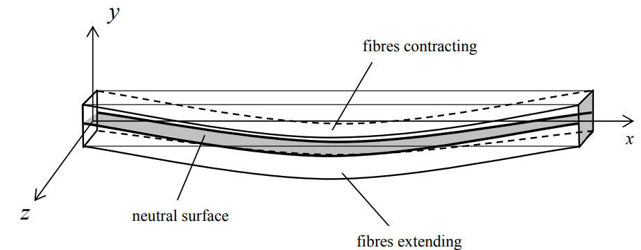

# 보
`보(beam)`는 직선부재를 수평을 유지하도록 지지하고 축 방향에 수직인 하중을 가하여 `굽힘(bending)`을 받아 휘는 부재를 의미한다. 

위의 그림과 같이 보가 $-y$방향으로 작용하는 `횡하중(transverse loading)`에 의해 순수 굽힘을 받을 때, 보의 윗면에는 압축력이 아랫면에는 인장력이 발생한다. 그렇다면 보의 어느 단면에는 압축력과 인장력이 작용하지 않고 동일한 길이를 유지하는 면이 존재하게 되는데 이 면을 `중립면(neutral surface)`이라고 한다.

`보 요소(beam element)`는 1차원 요소로 봉과 다르게 축방향, `횡방향(lateral)`, `비틀림(twisting)` 하중이 작용하는 경우이다.

단면에 발생하는 모멘트는 normal stress의 분포 때문이다.

# 오일러-베르누이 보 이론
오일러-베르누이 보 이론(Euler–Bernoulli beam theory)

neutral axis에 수직인 직선은 변형후에도 수직 직선이다. (전단 변형률이 없다)
