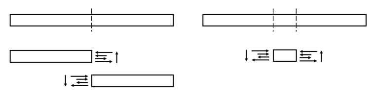
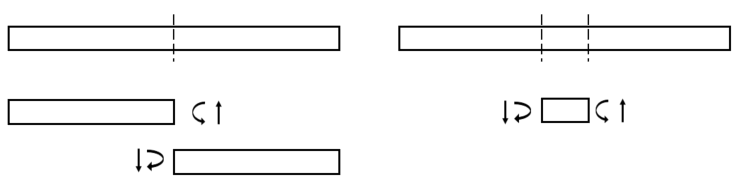

# 보
`보(beam)`는 축 방향에 수직인 하중이 작용해 `굽힘(bending)`을 받아 휘는 부재를 의미한다. 

위의 그림과 같이 보가 $-y$방향으로 작용하는 `횡하중(transverse loading)`에 의해 변형되는 경우를 고려하자.

이 때, $z$방향으로 길이를 $\Delta z$라 했을 때, $z = 0.5 \Delta z$인 $x-y$평면을 기준으로 변형이 대칭이라고 가정하자. 따라서 보는 `비틀림(twist)`없이 순수 굽힘만 작용한다.

횡하중에 의해 변형된 보의 윗면에는 압축력이 발생하고 아랫면에는 인장력이 발생하게 된다. 보 내부에서 물리적 특성은 연속적으로 변하기 때문에 보의 어느 단면에는 압축력과 인장력이 작용하지 않고 동일한 길이를 유지하는 면이 존재하게 되는데 이 면을 `중립면(neutral surface)`이라고 한다.

## 보에 작용하는 응력

보에 작용하는 응력을 다음과 같이 가정하자.

가정된 응력으로 발생하는 절단면의 모멘트와 전단력은 다음과 같다.

`보 요소(beam element)`는 1차원 요소로 봉과 다르게 축방향, `횡방향(lateral)`, `비틀림(twisting)` 하중이 작용하는 경우이다.

단면에 발생하는 모멘트는 normal stress의 분포 때문이다.

# 오일러-베르누이 보 이론
오일러-베르누이 보 이론(Euler–Bernoulli beam theory)

neutral axis에 수직인 직선은 변형후에도 수직 직선이다. (전단 변형률이 없다)
