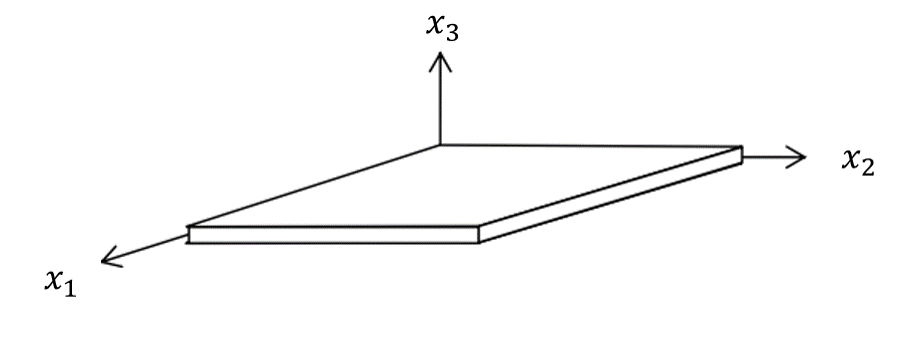
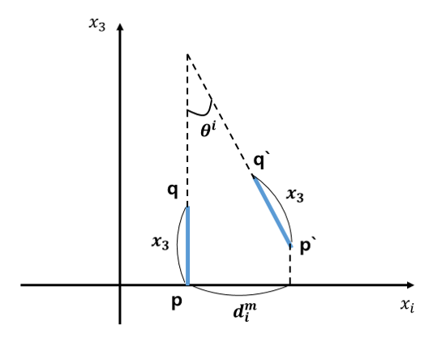
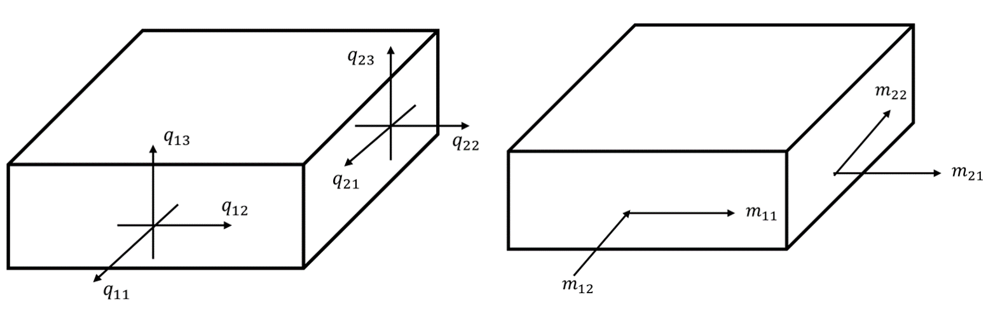

# 판 이론

## 모델링 대상
두께가 다른 길이에 비해 매우 작은 평평한 `판(plate)`을 고려한다.

## 변위 모델링
변위를 모델링 하기 위해 직교 좌표계에 놓인 변형전의 평판 형태의 판 요소를 고려하자.

이 때, $x_3 \in [-0.5t, 0.5t]$이고 $x_3=0$인 면을 판 요소의 `중간 면(mid-surface)`이라고 하자.

다음으로 변위를 모델링 하기 위한 몇가지 가정을 하자.

1. 변위가 충분히 작아 미소 변위이론에 따른 변형률-변위 방정식이 만족된다.
2. 중간 면에 수직인 직선은 변형 후에도 직선을 유지한다.
3. 판 요소의 중간 면의 수직인 직선의 길이는 변형 후에도 변하지 않는다.

3번 가정을 식으로 표현하면 다음과 같다.
$$\epsilon_{33} = \frac{\partial d_3}{\partial x_3} = 0 \Rightarrow d_3 = d_3(x_1,x_2)$$

위의 가정들을 통해 위치 벡터가 $\bf x$인 임의의 점 $q$가 어떤 변위를 갖는지 알아보자.

먼저, $x_1,x_2$평면에 수직인 직선을 내리고 그 점을 $p$라 하자. 그다음에 변형 후에 점을 각 각 $p',q'$이라고 하고 $x_1-x_3$평면으로 보면 다음과 같다.

2번 가정에 의해 변형후에도 $\overline{p'q'}$은 직선이고 3번 가정에 의해 길이는 일정하다. 

이 때, $d^m_1$는 중간면 변위의 1번째 성분이고 $\psi_2$는 변형전 직선과 변형된 후의 직선이 이루는 각도라 하면 $q$점의 변위 $d_1$는 다음과 같이 모델링 된다.

$$ d_1 = d_1^m(x_1,x_2) - x_3 \sin \theta^1 $$

이 과정을 $x_2-x_3$평면에서도 반복하면 변위 $d_2$는 다음과 같이 모델링 된다.
$$ d_2 = d_2^m(x_1,x_2) - x_3 \sin \theta^2 $$

여기서 추가적인 가정을 도입하자. 

4. 중간면은 $d^m_1, d^m_2=0$인 `중립면(neutral surfcae)`이다.
5. $\theta$가 충분히 작다
   
4번 5번 가정과 위의 결과를 종합하여 모델링한 plate의 변위 $\bf d$는 다음과 같다.

$$ \begin{equation} \begin{aligned} d_1 &= -x_3 \theta^1 \\ d_2 &= -x_3 \theta^2 \\ d_3 &= d_3^m(x_1,x_2) \end{aligned} \end{equation} $$

## 변형률 모델링
1번 가정에 의해 미소 변위이론에 따른 변형률-변위 방정식에 위의 변위 모델링을 적용하면 다음과 같다.

$$ \begin{equation} \begin{aligned} \epsilon_{11} &= -x_3 \frac{\partial \theta^1}{\partial x_1} \\ \epsilon_{22} &= -x_3 \frac{\partial \theta^2}{\partial x_2} \\ \epsilon_{33} &= 0 \\ \epsilon_{12} &= -\frac{x_3}{2} \left ( \frac{\partial \theta^1}{\partial x_2} + \frac{\partial \theta^2}{\partial x_1} \right ) \\ \epsilon_{13} &= \frac{1}{2} \left ( \frac{\partial d_3}{\partial x_1} - \theta^1 \right ) \\ \epsilon_{23} &= \frac{1}{2} \left ( \frac{\partial d_3}{\partial x_2} - \theta^2 \right ) \end{aligned} \end{equation} $$

## 응력 모델링
$\sigma_{33} = 0$으로 두고 isotropic하고 homogeneous한 재료에 일반화 된 Hooke's law를 적용하면 다음과 같다.

$$ \begin{bmatrix} \sigma_{11} \\ \sigma_{22} \\ \sigma_{12} \\ \sigma_{13} \\ \sigma_{23} \end{bmatrix} = \frac{E}{1 - \nu^2} \begin{bmatrix} 1 & \nu & 0 & 0 & 0 \\ 1 & \nu & 0 & 0 & 0 \\ 0 & 0 & 1-\nu & 0 & 0 \\ 0 & 0 & 0 & 1-\nu & 0 \\ 0 & 0 & 0 & 0 & 1-\nu \end{bmatrix} \begin{bmatrix} \epsilon_{11} \\ \epsilon_{22} \\ \epsilon_{12} \\ \epsilon_{13} \\ \epsilon_{23} \end{bmatrix} $$

## 내부력 모델링
응력의 결과로 생긴 힘과 모멘트는 다음과 같다.

$$ \begin{equation} \begin{gathered} q_{ij} = \int _{-t/2} ^{t/2} \sigma_{ij} dx_3 \\ m_{ij} = \int _{-t/2} ^{t/2} x_3 \sigma_{ij} dx_3 \end{gathered} \end{equation}  $$

이 때, 면외 전단응력$(\sigma_{13},\sigma_{23})$에 의해 발생할 수 있는 모멘트는 무시하였다. 이는 `순수 굽힘(pure bending)`과 `순수 비틀림(pure twisting)`만 있다고 가정한것과 같은데 이러한 가정은 판의 두께가 다른 길이 방향에 비해 충분히 작기 때문에 유효하다. [1]

### 참고문헌
[1] [note] (Kelly) Engineering Solid Mechanics – small strain, 147p

# Kirhhoff-Love 판 이론
Kirhhoff-Love 판 이론은 다음을 추가로 가정한다.

6. 중간면에 수직인 직선은 변형후에도 수직이다.

이를 식으로 나타내면 다음과 같다.

$$ \begin{equation} \begin{aligned} \epsilon_{13} &= \frac{1}{2}\left ( \theta^1 + \frac{\partial d_3}{\partial x_1} \right ) = 0 \Rightarrow \theta^1 = \frac{\partial d_3}{\partial x_1} \\ \epsilon_{23} &= \frac{1}{2} \left ( \theta^2 + \frac{\partial d_3}{\partial x_2} \right ) = 0 \Rightarrow \theta^2 = \frac{\partial d_3}{\partial x_2} \end{aligned} \end{equation} $$

식(5)를 식(3)에 대입하면 다음과 같은 변형률-곡률 관계식을 얻을 수 있다.

$$ \begin{equation} \begin{bmatrix} \epsilon_{11} \\ \epsilon_{22} \\ \epsilon_{12} \end{bmatrix} = -x_3 \begin{bmatrix} \displaystyle \frac{\partial^2 d_3}{\partial x_1 ^2} \\\\ \displaystyle \frac{\partial^2 d_3}{\partial x_2 ^2} \\\\ \displaystyle \frac{\partial^2 d_3}{\partial x_1 \partial x_2}  \end{bmatrix} \end{equation}  $$

식 (6)를 벡터형태로 쓰면 다음과 같다.
$$  \mathbf e = -x_3 \boldsymbol \kappa$$

일반화된 Hooke's law에 적용하면 다음과 같은 응력-곡률 관계식을 얻을 수 있다.
$$ \begin{equation} \begin{bmatrix} \sigma_{11} \\ \sigma_{22} \\ \sigma_{12} \end{bmatrix} = - \frac{E}{1 - \nu^2} x_3 \begin{bmatrix} 1 & \nu & 0 \\ 1 & \nu & 0  \\ 0 & 0 & 1-\nu \end{bmatrix} \begin{bmatrix} \displaystyle \frac{\partial^2 d_3}{\partial x_1 ^2} \\\\ \displaystyle \frac{\partial^2 d_3}{\partial x_2 ^2} \\\\ \displaystyle \frac{\partial^2 d_3}{\partial x_1 \partial x_2}  \end{bmatrix} \end{equation}  $$

식 (7)을 식(4)에 대입하면 다음과 같은 모멘트-곡률 관계식을 얻을 수 있다.

$$ \begin{equation} \begin{bmatrix} m_{11} \\ m_{22} \\ m_{12} \end{bmatrix} = -D \begin{bmatrix} 1 & \nu & 0 \\ 1 & \nu & 0 \\ 0 & 0 & 1-\nu \end{bmatrix} \begin{bmatrix} \displaystyle \frac{\partial^2 d_3}{\partial x_1 ^2} \\\\ \displaystyle \frac{\partial^2 d_3}{\partial x_2 ^2} \\\\ \displaystyle \frac{\partial^2 d_3}{\partial x_1 \partial x_2}  \end{bmatrix} \end{equation}  $$

이 떄, `굽힘강성(flexural rigidity)` $\displaystyle D = \frac{Et^3}{12(1-\nu^2)}$이다.

# Mindlin–Reissner 판 이론
자유수면 경계조건에서 $x_3 = \pm t/2$의 $\epsilon_{13}, \epsilon_{23} = 0$이어야 한다. 이를 만족하기 위해서는 최소한 $\epsilon_{13}, \epsilon_{23}$은 $x_3$에 대한 이차다항식 이상이어야 하지만 식(3)에서 알 수 있듯이 $\epsilon_{13}, \epsilon_{23}$은 오로지 $x_1,x_2$만의 함수로 두께방향으로 상수임을 알 수 있다. 이러한 한계점을 보정하기 위해 Mindlin–Reissner 판 이론에서는 `전단 보정 계수(shear correction factor)` $k$를 도입한다.

$k$를 도입한 변형률 변위 관계식은 다음과 같다.

$$ \begin{equation} \begin{aligned} \epsilon_{11} &= -x_3 \frac{\partial \theta^1}{\partial x_1} \\ \epsilon_{22} &= -x_3 \frac{\partial \theta^2}{\partial x_2} \\ \epsilon_{33} &= 0 \\ \epsilon_{12} &= -\frac{x_3}{2} \left ( \frac{\partial \theta^1}{\partial x_2} + \frac{\partial \theta^2}{\partial x_1} \right ) \\ \epsilon_{13} &= \frac{k}{2} \left ( \frac{\partial d_3}{\partial x_1} - \theta^1 \right ) \\ \epsilon_{23} &= \frac{k}{2} \left ( \frac{\partial d_3}{\partial x_2} - \theta^2 \right ) \end{aligned} \end{equation} $$

# 향후 공부할 내용
1. Element for plate
bar, plate 요소를 많이 쓰임

Chapter 3          //  앞부분  
Chapter 6.1 - 6.3  //  고차요소, Solid 전까지  

