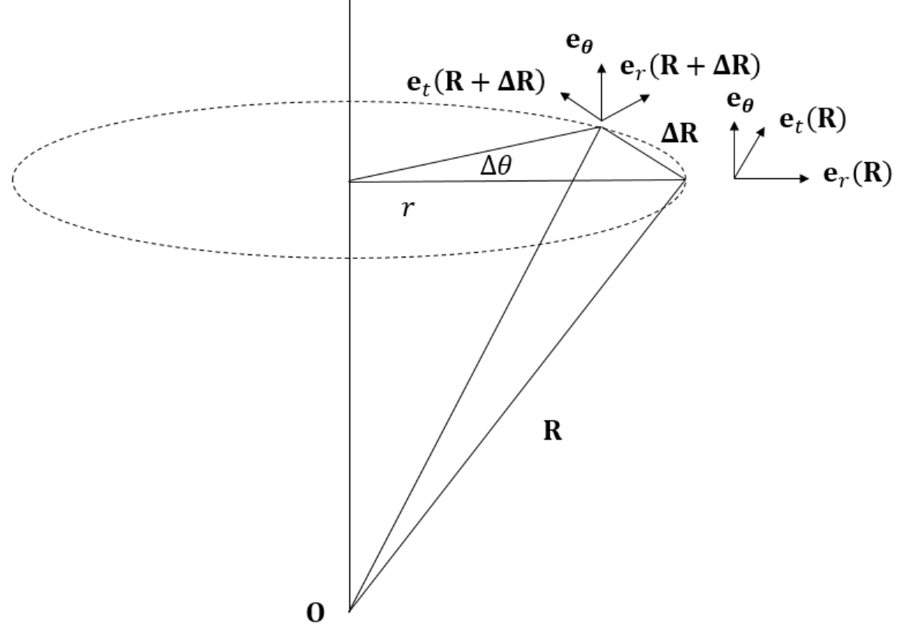

# 원운동
아래 그림과 같이 회전축이 $\mathbf e_\theta$이고 반지름이 $r$인 원운동을 하는 입자를 고려하자.

그림을 통해 다음 관계식이 성립함을 알 수 있다.
$$ \begin{equation} \mathbf e_\theta \times \mathbf R = r \mathbf e_t(\mathbf R) \end{equation}  $$

원운동하는 입자의 선속도를 알기 위해 위치의 변화량 $\Delta \mathbf R$을 다음과 같이 근사해보자.
$$ \begin{equation} \Delta \mathbf R \approx r \Delta \theta \mathbf e_t \end{equation}  $$

그림을 통해 $\Delta \theta$ 작으면 작을수록 식(2)의 근사는 정확해진다는 것을 알 수 있다.

식(1)을 식(2)에 대입하면 다음과 같다.
$$ \Delta \mathbf R = \mathbf e_\theta \Delta \theta \times \mathbf R $$

양변을 $\Delta t$로 나누고 극한을 취해주면 다음 관계식을 얻을 수 있다.
$$ \frac{d\mathbf R}{dt} = \boldsymbol{\omega} \times \mathbf R  $$