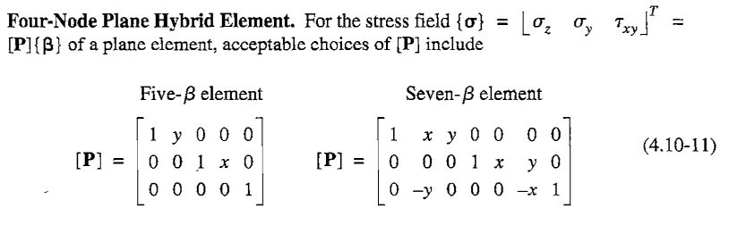

# Mecsolver

### Shell Element Class diagram

* R: drilling
* DK: discrete Kirchhoff
* ANS : assumed natural strain

### Shell::compute_element_stiffness_matrix

#### ShellBase::get_integ_pt_ABD_Ct
rebar layer를 고려하지 않는 경우 ShellBase::get_integ_pt_ABD_Ct으로 Elasticity tensor를 계산한다.

Elasticity tensor를 계산하기전에 다음 조건들을 확인한다.
* temperature dependency
* field variable dependecy
* coordinate system (for non isotropy materal)
* uniform thickness

위의 조건들을 확인해 QP별로 Elasticity tensor가 동일할 경우 변수 `all_same` = true이고 다를 경우 `all_same` = false다. `all_same` = false일 경우 QP별로 Elasticity tensor값이 달라져 각각 계산해준다.

Elasticity tensor는 `ShellBase::get_ABD_Ct_`루틴에서 `Plane::get_(Membrane, Bending, Shear)`루틴을 각각 호출하고 그 안에서 Generalized Hooke's law에 의해 Elasticity tensor가 계산된다.

이 때 계산되는 Elasticity tensor는 다음 4가지다.
* A : Membrane
* B : Membrane(for non zero offset of $x_3$-axis)
* D : Bending
* Ct : Shear

Membrane과 Bending의 Elasticity tensor는 flexural rigidity를 제외하고 동일하다. 그러나 실제로는 동일한 재료더라도 보강등을 고려해 다른 물성치를 적용하는 기능이 GTS에 존재하기 때문에 Elasticity tensor를 각각 계산한다.

그리고 $x_3$축으로 offset이 있을 경우 B를 계산하고 나중에 D의 값에 반영해준다.

마지막으로 `ShellBase::compute_IbIs`루틴에서 flexural rigidity를 반영하기 위한 변수 `Ib`와 effective thickness for transverse shear deformation를 반영하기 위한 변수 `IS`를 계산하여 Elasticity tensor에 반영해준다.

# 이론
## Finite Element Analaysis
### Principle of stationary potential energy
Potential Energy를 $\Pi_p$는 탄성 에너지를 $U$와 하중에 의한 에너지를 $\Omega$의 합으로 표현된다고 하자.
$$ \Pi_p = U + \Omega $$

Principle of stationary potential energy는 "평형 방정식을 만족하는 경우 $\Pi_p$가 극값을 가진다"이다. 이를 식으로 나타내면 다음과 같다.
$$ \frac {\partial \Pi_p}{\partial d_i} = 0 \quad \forall i $$

#### Linear Ealstic body
선형 탄성재료에서 단위 부피당 탄성 에너지 $U_0$는 다음과 같이 정의된다.
$$ \begin{equation} \sigma_{ij} = \frac{\partial U_0}{\partial \epsilon_{ij}} \end{equation}   $$

Generalized Hooke's law에 의해 $U_0$는 다음과 같다.
$$ U_0 = \frac{1}{2} C_{ijkl}\epsilon_{ij}\epsilon_{kj} $$

Engineering strain vector를 사용해서 나타내면 다음과 같다.
$$ U_0 = \frac{1}{2} \boldsymbol{\epsilon}^T \mathbf E \boldsymbol{\epsilon} $$

#### Displacement based FE
변위기반의 FEM에서 선형탄성재료의 $\Pi_p$는 다음과 같다.
$$ \Pi_p = \frac{1}{2} \mathbf d^T \mathbf {K d} - \mathbf d^T \mathbf r $$

Principle of stationary potential energy을 적용하면 다음과 같다.
$$ \frac{\partial \Pi_p}{\partial d_i} = 0 \Rightarrow \bf Kd - r = 0 $$

### Assumed-stress hybrid elements
$\boldsymbol \sigma$를 다음과 같이 가정하자.
$$ \boldsymbol \sigma = \mathbf P \boldsymbol{\beta} $$

이 떄, $\boldsymbol \beta$는 미지수이고 $\bf P$는 $\boldsymbol{\beta}$에 관계없이 항상 equilibrium equation을 만족하게 하는 값이다.

$\bf P$의 예시는 다음과 같다.

선형탄성재료의 단위부피당 complementary strain energy 다음과 같다.
$$ U^*_0 = \frac{1}{2} \boldsymbol{\sigma}^T \mathbf S \boldsymbol{\sigma} $$

선형탄성재료의 Total complementary energy는 다음과 같다.
$$ \Pi_c = \int U^*_0 \thinspace dV - \int \boldsymbol{\Phi}^T \mathbf d_b \thinspace dS $$

$\boldsymbol \Phi$는 element boundary에서 traction을 나타내고 $\mathbf d_b$는 boundary에서의 displacement이다.

Assumed-stress를 사용한 변위기반의 FEM에서 선형탄성재료의 Total complementary energy는 다음과 같다.
$$ \Pi_c = \frac{1}{2} \boldsymbol{\beta}^T \mathbf H \boldsymbol{\beta} -\boldsymbol{\beta}^T \bf G d$$

$$ \mathbf H = \int \mathbf P^T \mathbf {SP} \thinspace dV, \quad  \boldsymbol \Phi = \mathbf R \boldsymbol{\beta}, \quad \mathbf d_b = \mathbf {Ld}, \quad  \mathbf G = \int  \mathbf R^T \mathbf L \thinspace dS  $$

Principle of stationary complementary energy을 적용하면 다음과 같다.
$$ \frac{\partial \Pi_c}{\partial d_i} = 0 \Rightarrow \bf H \boldsymbol{\beta} - Gd = 0 $$

따라서 $\boldsymbol \beta$를 $\bf d$에 대해서 표현하면 다음과 같다.
$$ \boldsymbol \beta = \bf H^{-1}Gd $$

정리하면 아래식으로 응력을 계산할 경우 equilibrium equation을 만족시킬 수 있다.
$$ \boldsymbol \sigma = \mathbf P \bf H^{-1}Gd $$

이 때, generalized hooke's law를 이용한 식과 비교해보면 다음 관계식을 얻을 수 있다.
$$ \boldsymbol{\sigma} = \bf E\bar Bd  = \mathbf P \bf H^{-1}Gd $$
$$ \text{Where, } \bf \bar B = SPH^{-1}G  $$

### Compatibility condition
미소 변위이론에 따른 변형률-변위 관계식은 다음과 같다.
$$ \epsilon_{ij} = \frac{1}{2} \left( \frac{\partial d_i}{ \partial x_j } + \frac{\partial d_j}{ \partial x_i } \right) $$

따라서 미소 변위이론에 따른 변형률-변위 관계식을 만족하는 경우 다음과 같이 주어진 `compatibility condition`을 만족해야 한다.

$$\begin{gathered} \frac{\partial^2 \epsilon_{ii}}{ \partial (x_j)^2 } + \frac{\partial \epsilon_{jj}}{ \partial (x_i)^2 } = 2 \frac{\partial^2 \epsilon_{ij}}{ \partial x_i \partial x_j } \\ (i,j) = \{(1,2), (1,3), (2,3)\} \\ \text{(it's not a summation}) \end{gathered} $$

즉, 변형률-변위 관계식을 통해서 변형률을 구할 경우 compatibility condition을 반드시 만족한다. 

$\bf Kd=r$을 풀어서 $\bf d$를 구했다면  
Q1. $\bf K$에 관계없이 변형률 변위 관계식을 사용하여 변형률을 계산한다면 compatibility condition을 항상 만족하는 건가요?  
Q2. $\bf K$에 관계없이 assumed stress 관계식을 사용하여 stress를 계산한다면 equilibrium을 항상 만족하는 건가요?

inter element간의 

## ETC
### Tensor
* dyad
* Cartesian Tensor

# 계획
$$\begin{array}{c|l}
월-주차 & 내용 \\ \hline \\
6-2 & \text{Mecsolver}  \\ 
6-3 & \text{ - Shell의 Element stiffness matrix 계산 코드 이해}  \\ 
6-4 & \text{ - Shell의 Elasticity Tensor 계산 코드 이해} \\
    & \text{ - Shell의 B matrix 계산 코드 이해} \\ \hline \\
7-1 & \text{2004 MITC isotropic triangular 논문 정리 및 이해} \\ 
7-2 & \\ 
7-3 & \\ \\ \hline \\
7-4 & \text{2014 MITC3+ 논문 정리 및 수식화} \\ 
8-1 & \\ 
8-2 & \\ \\ \hline \\
8-3 & \text{MITC3+ 구현 및 검증} \\
8-4 & \\ 
9-1 & \\ 
9-2 & \\ \\ \hline \\
9-3 & \text{2017 new 4-node MITC 논문 정리 및 이해} \\
9-4 & \\ \\ \hline \\
10-1 & \text{2017 new MITC4+ 논문 정리 및 수식화} \\ 
10-2 & \\  \\ \hline \\
10-3 & \text{MITC4+ 구현} \\
10-4 & \\ 

\end {array}$$