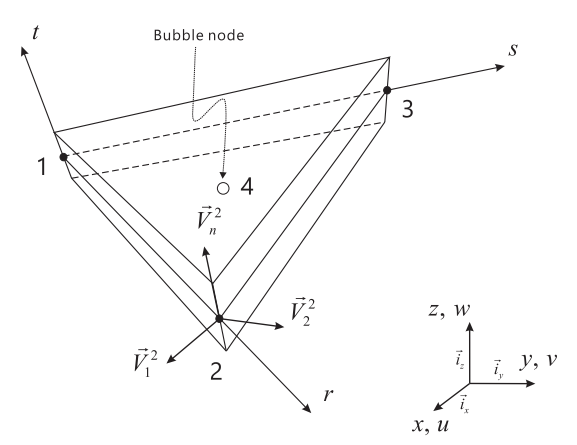
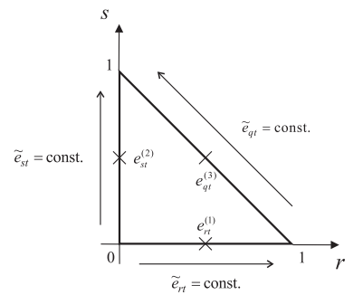
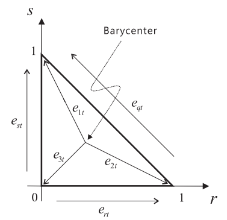
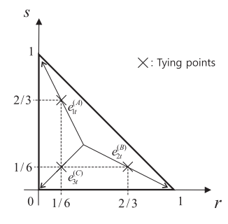
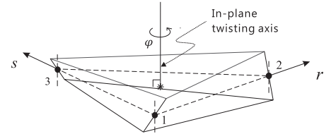
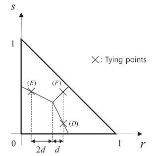
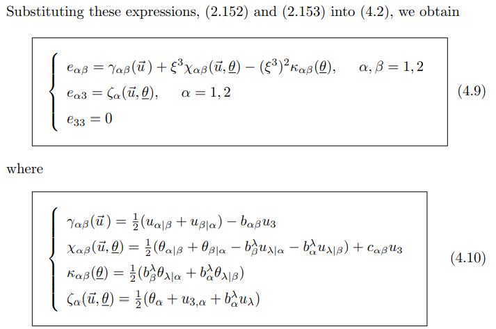

# MITC3+

일반적으로 3-node triangular elements는 lack of displacement modes때문에 성능이 떨어진다. 

이런 내제적인 한계점을 극복하기 위해 displacment field를 enrich 시키는 방법이 효과적이다.

MITC3+에서는 bending displacements를 enrich하기 위해 cubic bubble function을 추가해서 rotation을 interpolation한다. 이를 위해 standard 3-node shell element의 dof에 2개의 internal rotation dof가 추가 된다.

## Geometry
`질량중심(barycenter)`에 bubble node를 포함한 continuum mechanics displacement-based MITC3+ element의 geometry는 다음과 같다.

$$ \mathbf x(r_1, r_2, r_3) = \sum_{i = 1}^3 n_i(r_1, r_2) \mathbf x_i + \sum_{i = 1}^4 \frac{r_3}{2} m_i(r_1,r_2) a_i \mathbf v^i $$

$$ \text{Where, } n_1 = 1 - r_1 - r_2, \enspace n_2 = r_1, \enspace n_3 = r_2 \\ m_1 = n_1 - \frac{1}{3}m_4, \enspace m_2 = n_2 - \frac{1}{3}m_4, \enspace m_3 = n_3 - \frac{1}{3}m_4, \enspace m_4 = 27r_1r_2(1-r_1-r_2) \\ a_4 \mathbf v^4 = \frac{1}{3} \sum_{i = 1}^3 a_i \mathbf v^i $$

$n_i$는 2차원 standard shape function, $m_i$는 2차원 cubic bubble function을 포함한 interpolation functions이다.

## Displacement
이에 따른, displacement는 다음과 같다.
$$ \mathbf d(r_1,r_2,r_3) = \sum_{i = 1}^3 n_i(r_1,r_2)\mathbf d(\mathbf x_i) + \frac{r_3}{2} \sum_{i = 1}^4 a_i m_i(-\mathbf v_2^i \alpha_i + \mathbf v_1^i \beta_i) $$

$\alpha_i, \beta_i$는 $i$ node에서 rotation of $\mathbf v^i_n$ about $\mathbf v^i_1, \mathbf v^i_2$이며, $\alpha_4,\beta_4$는 bubble node를 추가함으로써 추가적으로 생긴 rotation dof이다.

## strain
$$ e_{ij} = \frac{1}{2} \left( \frac{\partial \bf x}{\partial r_i} \cdot \frac{\partial \bf d}{\partial r_j} + \frac{\partial \bf x}{\partial r_j} \cdot \frac{\partial \bf d}{\partial r_i} \right)$$ 

## Assumed strain field
MITC3와 동일하게 assumed strain field를 구성하면 다음과 같다.

$$ \tilde{e}^{MITC3}_{rt} = e_{rt}^{(1)} + cs, \enspace \tilde{e}^{MITC3}_{st} = e_{st}^{(2)} - cr $$

$$ \text{Where, } c = (e^{(3)}_{rt} - e^{(1)}_{rt}) - (e^{(3)}_{st} - e^{(2)}_{st}) $$

이 때, 주목할 점은 bubble function이 element edge에서 0이라는 점이다.

따라서, $e_{rt}^{(1)}$등 edge에서 평가한 displacement-based strain은 MITC3+요소에서 평가하더라도 기존의 요소에서 평가한 값과 동일하다. 
 
즉, bubble function의 effect를 포함하지 않게된다. 따라서 bubble function의 effect를 포함하기 위해 element internal point를 사용하는 new tying scheme을 디자인한다.

## internal tying points

internal tying points를 정의하기 위해 barycenter를 이용하여 새로운 축 $e_{1t},e_{2t},e_{3t}$을 결정하면 다음 관계식이 성립한다.

$$ \begin{equation} \begin{aligned} e_{1t} &= \frac{1}{\sqrt 5}(2e_{st} - e_{rt}) \\ e_{2t} &= \frac{1}{\sqrt 5}(2e_{rt} - e_{st}) \\ e_{3t} &= -\frac{1}{\sqrt 2}(e_{rt} + e_{st}) \end{aligned} \end{equation} $$

식(1)을 이용해서 위 그림에 나온 internal tying point에서 shear strain component를 sampling하면 다음과 같다.

$$ \begin{equation} \begin{aligned} e^{(A)}_{1t} &= \frac{1}{\sqrt 5}(2e^{(A)}_{st} - e^{(A)}_{rt}) \\ e^{(B)}_{2t} &= \frac{1}{\sqrt 5}(2e^{(B)}_{rt} - e^{(B)}_{st}) \\ e^{(C)}_{3t} &= -\frac{1}{\sqrt 2}(e^{(C)}_{rt} + e^{(C)}_{st}) \end{aligned} \end{equation} $$

이를 위해 식(1)을 $e_{rt},e_{st},e_{qt}$에 대해서 정리하면 다음과 같다.
$$ \begin{equation} \begin{aligned} e_{rt} &= \frac{\sqrt 5}{3}e_{2t} - \frac{\sqrt 2}{3}e_{3t} \\ e_{st} &= \frac{\sqrt 5}{3}e_{1t} - \frac{\sqrt 2}{3}e_{3t} \\ e_{qt} &= -\frac{1}{\sqrt 2}(e_{st} - e_{rt}) = \frac{\sqrt 10}{6}(e_{1t} - e_{2t}) \end{aligned} \end{equation} $$

## reduce in-plane twisting mode
transverse shear strains는 two transverse shearing modes와 in-plane twisting mode에서 일어난다. 

이 때, in-plane twisting mode는 barycenter를 축으로 twisting이 발생하여 barycenter에서는 tranverse shear strain이 0인 경우이다.

이를 이용해서 MITC3 shell element의 transverse shear strain을 in-plane twisting mode와 관련없는 constant part와 in-plane twisting mode와 관련된 linear part로 나눌 수 있다.
$$ \tilde{e}_{rt} = e_{rt}^{const} + e_{rt}^{linear}, \enspace \tilde{e}_{st} = e_{st}^{const} + e_{st}^{linear} $$

barycenter에서 in-plane twisting mode에 의한 transverse shear strain이 0이기 때문에 constant part는 barycenter에서 transverse shear strain이 된다.
$$ \begin{gathered} e_{rt}^{const} = e_{rt}|_{s = 1/3} = e^{(1)}_{rt} + \frac{1}{3}c = \frac{2}{3} \Big(e^{(1)}_{rt} + \frac{1}{2}e_{st}^{(2)} \Big) - \frac{1}{3} \Big(e^{(3)}_{st} - e_{rt}^{(3)} \Big) \\ e_{st}^{const} = e_{st}|_{r = 1/3} = e^{(1)}_{st} - \frac{1}{3}c =  \frac{2}{3} \Big(e^{(2)}_{st} + \frac{1}{2}e_{rt}^{(1)} \Big) + \frac{1}{3} \Big(e^{(3)}_{st} - e_{rt}^{(3)} \Big) \end{gathered} $$

linear part는 다음과 같다.
$$ \begin{gathered} \tilde{e}^{linear}_{rt} = \tilde{e}_{rt} - e_{rt}^{const} = \frac{1}{3}c(3s-1) \\ \tilde{e}^{linear}_{st} = \tilde{e}_{st} - e_{st}^{const} = \frac{1}{3}c(1-3r) \end{gathered} $$

### constant part

element edge directions으로 상수인 covariant transverse shear strain $\hat e_{rt}, \hat e_{st}, \hat e_{qt}$ 값을 식(3)를 활용하여 다음과 같이 가정하자.
$$ \begin{equation} \begin{aligned} \hat e_{rt} &= \frac{\sqrt 5}{3}e_{2t}^{(B)} - \frac{\sqrt 2}{3}e_{3t}^{(C)} \\ \hat e_{st} &= \frac{\sqrt 5}{3}e_{1t}^{(A)} - \frac{\sqrt 2}{3}e_{3t}^{(C)} \\ \hat e_{qt} &= -\frac{1}{\sqrt 2}(e_{st}^{(3)} - e_{rt}^{(3)}) = \frac{\sqrt 10}{6}(e_{1t}^{(A)} - e_{2t}^{(B)}) \end{aligned} \end{equation} $$

식(2)에서 구한 sampling point의 값을 대입하면 다음과 같다.
$$ \begin{aligned} \hat e_{rt} &= \frac{1}{3}(2 e_{rt}^{(B)} - e_{st}^{(B)} + e_{rt}^{(C)} + e_{st}^{(C)}) \\ \hat e_{st} &= \frac{1}{3}( -e_{rt}^{(A)} + 2e_{st}^{(A)} + e_{rt}^{(C)} + e_{st}^{(C)}) \\ \hat e_{qt} &=  \frac{\sqrt 2}{6} (-e_{rt}^{(A)} + 2e_{st}^{(A)} -2e_{rt}^{(B)} + e_{st}^{(B)}) \end{aligned} $$

이를 통해 다음과 같은 새로운 constant transverse shear strain을 얻을 수 있다.
$$ \begin{equation} \begin{aligned} \tilde e_{rt}^{const} = \hat e_{rt} &= \frac{1}{3}(2 e_{rt}^{(B)} - e_{st}^{(B)} + e_{rt}^{(C)} + e_{st}^{(C)}) \\ \tilde e_{st}^{const} = \hat e_{st} &= \frac{1}{3}( -e_{rt}^{(A)} + 2e_{st}^{(A)} + e_{rt}^{(C)} + e_{st}^{(C)}) \end{aligned} \end{equation} $$

### linear part

in-plane twisting stiffness를 줄이기 위해 linear part에 새로운 tying scheme을 적용하자.

$(D), (E), (F)$에서 linear part에 있는 $c$를 평가하면 다음과 같다.
$$ \begin{equation} \hat c = (e^{(F)}_{rt} - e^{(D)}_{rt}) - (e^{(F)}_{st} - e^{(E)}_{st}) \end{equation} $$

이를 통해 다음과 같은 새로운 linear transverse shear strain을 얻을 수 있다.
$$ \begin{aligned} \tilde e_{rt}^{linear} &= \frac{1}{3} \hat c(3s - 1) \\ \tilde e_{st}^{linear} &= \frac{1}{3} \hat c(1 - 3r) \end{aligned} $$

### new assumed transverse shear strain

결론적으로 최종식은 다음과 같다.
$$ \begin{aligned} \tilde{e}_{rt} = \tilde e_{rt}^{const} + \tilde e_{rt}^{linear} &= \frac{1}{3}(2 e_{rt}^{(B)} - e_{st}^{(B)} + e_{rt}^{(C)} + e_{st}^{(C)}) + \frac{1}{3}\hat c(3s-1) \\ \tilde{e}_{st} = \tilde e_{rt}^{const} + \tilde e_{rt}^{linear} &= \frac{1}{3}( -e_{rt}^{(A)} + 2e_{st}^{(A)} + e_{rt}^{(C)} + e_{st}^{(C)}) + \frac{1}{3}\hat c(1 - 3r) \end{aligned} $$

# ISSUE

## 1
$$ \mathbf x(r_1, r_2, r_3) = \sum_{i = 1}^3 n_i(r_1, r_2) \mathbf x_i + \sum_{i = 1}^4 \frac{r_3}{2} m_i(r_1,r_2) a_i \mathbf v^i $$

$$ \mathbf d(r_1,r_2,r_3) = \sum_{i = 1}^3 n_i(r_1,r_2)\mathbf d(\mathbf x_i) + \frac{r_3}{2} \sum_{i = 1}^4 a_i m_i(-\mathbf v_2^i \alpha_i + \mathbf v_1^i \beta_i) $$

$$ e_{ij} = \frac{1}{2} \left( \frac{\partial \bf x}{\partial r_i} \cdot \frac{\partial \bf d}{\partial r_j} + \frac{\partial \bf x}{\partial r_j} \cdot \frac{\partial \bf d}{\partial r_i} \right)$$ 

로 주어졌을 때, strain-displacement matrix $B$의 구성하는가?

* vector
* Euclidean space(affine space)
* tensor
* tensor product
* covariant and contravariant vector
* metric tensor
* covariant differentiation
* 3D Christoffel symbols
* chart
* tangent space
* first fundamental form
* second fundamental form
* third fundamental form
* Gaussian curvature
* surface Christoffel symbols

> 참고  
> [Book] (Bathe) The FEA of shells - Fundamentals

## 2
static condensation on the element level for the rotations $\alpha_4,\beta_4$는 어떻게 하는것인가?

## 3
식(1)은 어떻게 유도하는가?

## 4
식(4)를 가정하는데 식(3)이 어떻게 적용된것인가?

## 5
식(5)에서 $\tilde e_{rt}^{const} = \hat e_{rt}, \tilde e_{st}^{const} = \hat e_{st}$는 왜 성립하는가?

## 6
식(6)은 어떻게 유도하는가?

# 계획
$$\begin{array}{c|l}
월-주차 & 내용 \\ 
\hline 
\\
6-2 & \text{Mecsolver}  \\ 
6-3 & \text{ - Shell의 Element stiffness matrix 계산 코드 이해}     \\ 
6-4 & \sout{\text{ \;- Shell의 Elasticity Tensor 계산 코드 이해}}   \\
    & \text{ \;- Shell의 B matrix 계산 코드 이해}                   \\ 
    & \sout{\text{ \;\;- Shell의 B membrane matrix 계산 코드 이해}} \\ 
    & \sout{\text{ \;\;- Shell의 B bending matrix 계산 코드 이해}}  \\ 
    & \sout{\text{ \;\;- Shell의 B shear matrix 계산 코드 이해}}    \\     
    & \sout{\text{ \;\;- Simo \& Fox 논문 이해}}                    \\     
\\
\hline
\\ 
7-1 & \sout{\text{2004 MITC isotropic triangular 논문 정리 및 이해}} \\ 
7-2 & \\ 
7-3 & \\ 
\\
\hline 
\\
7-4 & \text{2014 MITC3+ 논문 스터디} \\ 
8-1 & \text{ - 코드 구현을 위한 알고리즘 정리} \\ 
8-2 & \text{ \; - B matrix 계산} \\ \\
    & \text{MITC3+ 요소와 Mecsolver 요소 성능 비교하기} \\
    & \text{ - 논문 자료만으로 성능 비교가 어려워 보류} \\    
\\ 
\hline 
\\
8-3 & \sout{\text{MITC3+ 구현 및 검증}} \\
8-4 & \text{ - 코드 구현을 위한 알고리즘 정리} \\ 
9-1 & \\ 
9-2 & \\ \\ \hline \\
9-3 & \text{2017 new 4-node MITC 논문 정리 및 이해} \\
9-4 & \\ \\ \hline \\
10-1 & \text{2017 new MITC4+ 논문 정리 및 수식화} \\ 
10-2 & \\  \\ \hline \\
10-3 & \text{MITC4+ 구현} \\
10-4 & \\ 

\end {array}$$