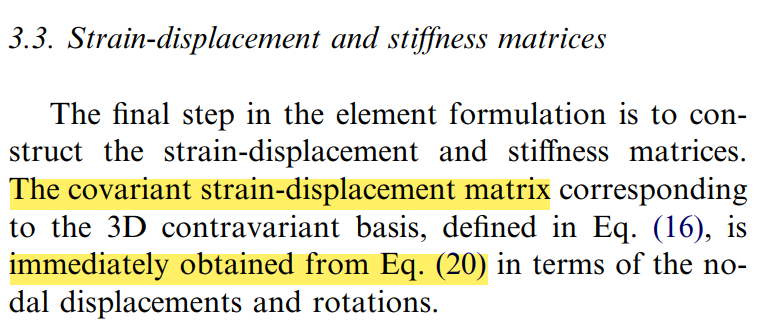
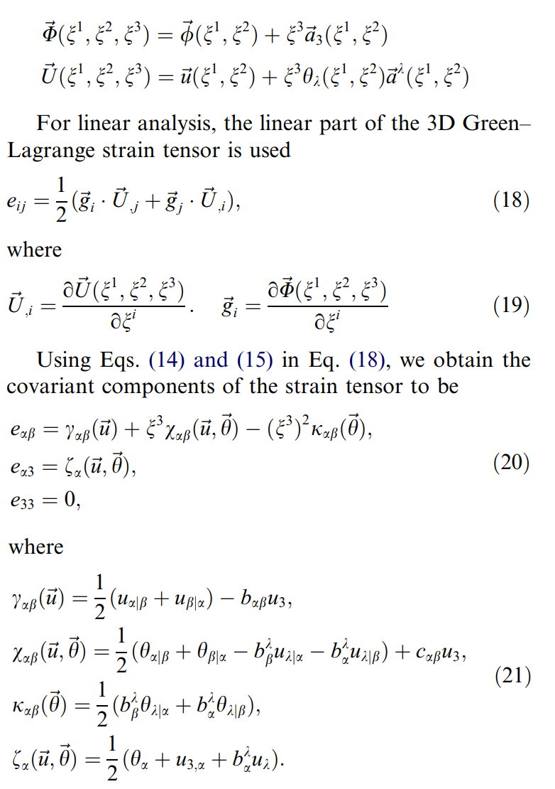
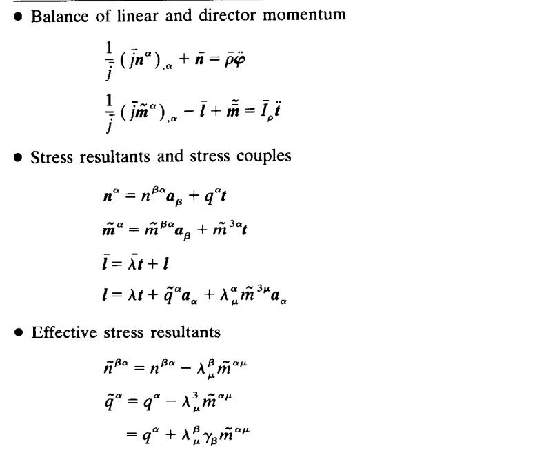
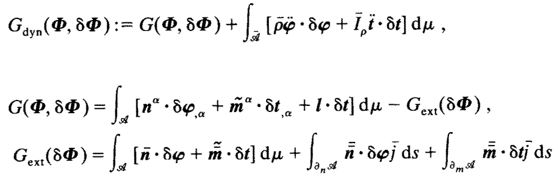
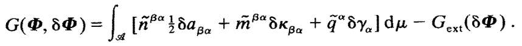
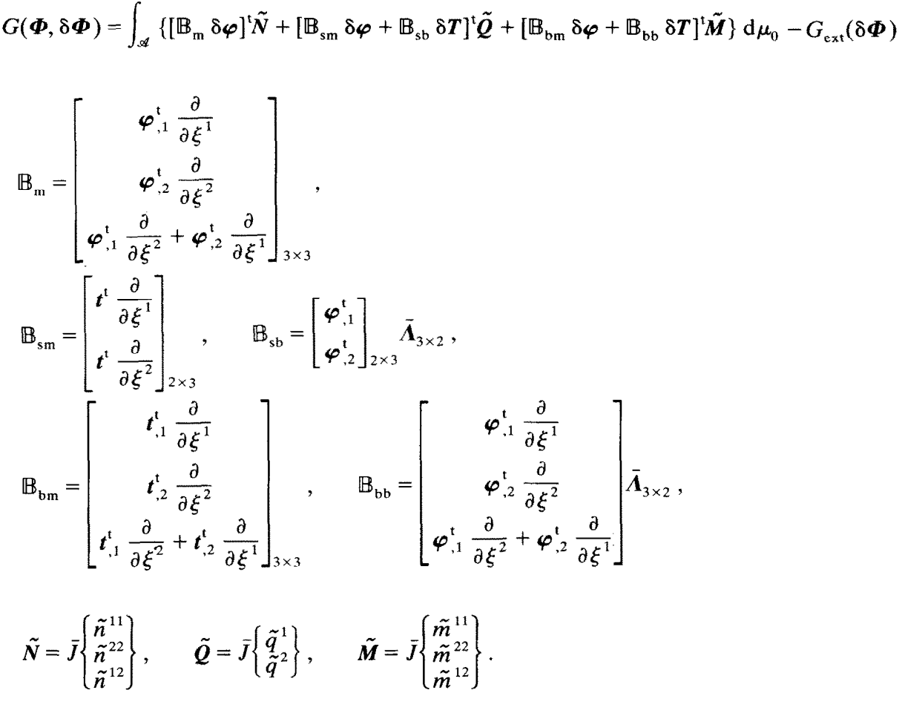
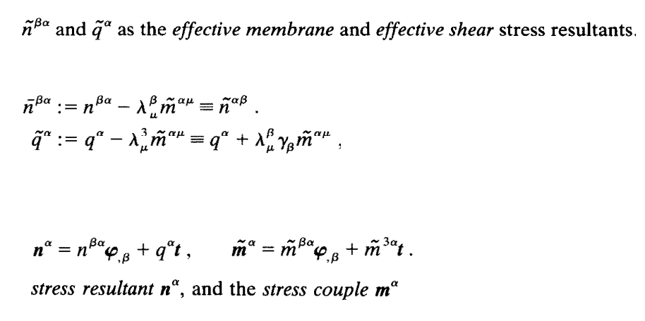

# ISSUE
$$ \mathbf x(r, s, t) = \sum_{i = 1}^3 n_i(r, s) \mathbf x_i + \sum_{i = 1}^4 \frac{t}{2} m_i(r,s) a_i \mathbf v^i_n $$

$$ \mathbf d(r,s,t) = \sum_{i = 1}^3 n_i(r,s)\mathbf d(\mathbf x_i) + \frac{t}{2} \sum_{i = 1}^4 a_i m_i(-\mathbf v_2^i \alpha_i + \mathbf v_1^i \beta_i) $$

$$ e_{ij} = \frac{1}{2} \left( \frac{\partial \bf x}{\partial r_i} \cdot \frac{\partial \bf d}{\partial r_j} + \frac{\partial \bf x}{\partial r_j} \cdot \frac{\partial \bf d}{\partial r_i} \right)$$ 

로 주어졌을 때, strain-displacement matrix $B$는 어떻게 구성하는가?

# 계획
$$\begin{array}{c|l}
월-주차 & 내용 \\ 
\hline 
\\
8-3 & \sout{\text{- MITC3+ 구현 및 검증}} \\
8-4 & \text{- Simo랑 Mecsolver를 보고 direction vector가 있을 때, B를 어떻게 계산하는지 파악 } \\ 
9-1 & \text{- 파악한 내용을 MITC 논문에 적용하여 MITC3+의 B구성 알고리즘 구현 }\\ 
9-2 & \\ \\ 
\hline \\
\end {array}$$

# 결론
Simo와 Mecsolver에 구현된 B 구성 알고리즘을 파악한다고 해서 MITC논문에 적용할 수 있을것 같지 않다.

# MITC

> Reference  
> [paper] 2005 (Lee & Bathe) Insight into FE shell discretizations by use of the basic shell mathematical model

# Simo
## how to calculate $B$
momentum equation이 다음과 같이 주어져 있다고 하자.

weak form은 다음과 같다.

component expression으로 나타내면 다음과 같다.

위의 component expression을 operator expressions으로 나타내면 다음과 같다.

# 향후 계획
$$\begin{array}{c|l}
월-주차 & 내용 \\ 
\hline 
\\
8-3 & \text{} \\
8-4 & \text{} \\ 
9-1 & \text{}\\ 
9-2 & \\ 
\\ 
\hline 
\\
9-3 & \text{2017 new 4-node MITC 논문 정리 및 이해} \\
9-4 & \\ 
\\ 
\hline 
\\
10-1 & \text{2017 new MITC4+ 논문 정리 및 수식화} \\ 
10-2 & \\  
\\ 
\hline 
\\
10-3 & \text{MITC4+ 구현} \\
10-4 & \\ 
\end {array}$$