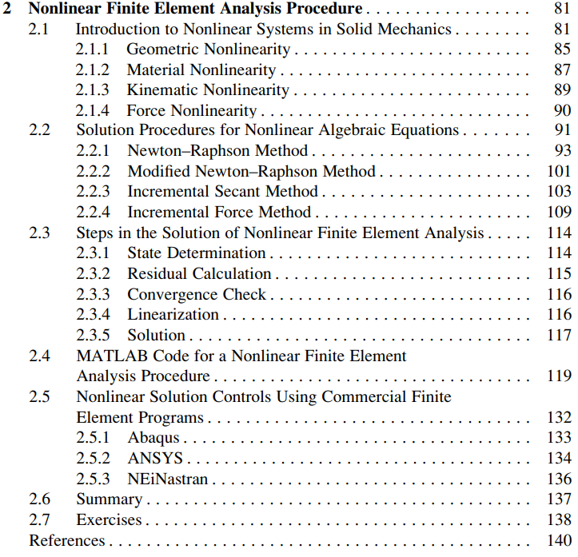
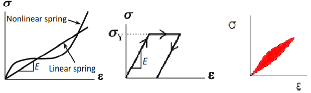
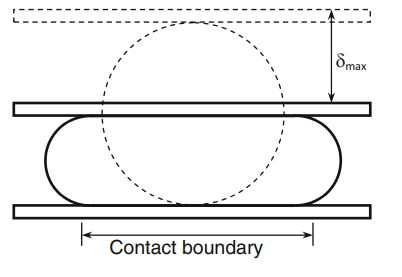
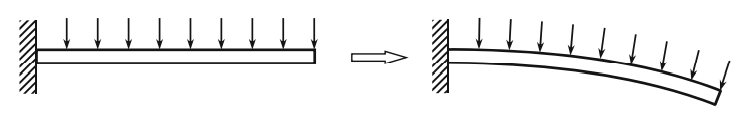

* 2.1
* 2.2.1
* 2.3

# Geometric Nonlinearity
비선형 strain-displacement relation을 사용해야 되거나, deformed element에서 equilibrium을 만족시켜야 할 경우를 geometric nonlinearity라고 한다.

## Strain-displacement relation
Infinitesimal deformation을 가정하면 1D에서 다음 선형 관계식이 성립한다.
$$ \epsilon = \frac{du}{dx} $$

하지만 변형이 커질 경우, 다음 비선형 관계식을 사용하여야 한다.
$$ \epsilon = \frac{du}{dx} + \frac{1}{2} \bigg( \frac{du}{dx} \bigg) ^2 $$

## Equilibrium at deformed element
정적 평형상태의 경우 다음 평형방정식을 만족해야 한다.
$$ \int_{\Omega} \mathbf B^T \boldsymbol\sigma_v \thinspace dV  - \int _{\partial\Omega} \mathbf N^T \mathbf t \thinspace dS - \int _{\Omega} \mathbf N^T \mathbf f \thinspace dV = 0  $$

변형이 작을 경우 변형전의 $\Omega, \partial \Omega$와 변형 후의 $\Omega', \partial \Omega'$가 크게 차이가 없기 때문에 변형전의 $\Omega, \partial \Omega$에서 위의 평형방정식을 만족하는 해를 찾아도 큰 오차를 발생시키지 않는다. 

하지만 변형이 클 경우, 변형 후의 적분영역인 $\Omega', \partial \Omega'$에서 평형방정식을 만족하는 해를 찾아야 한다.

# Material Nonlinearity
stress-strain 관계식이 단순한 선형이 아닌 경우를 material nonlinearity라고 한다.

## Linear elastic material
stress-strain에 대해 다음 관계식이 성립한다.
$$ \sigma = E \epsilon $$

이 때, $E$는 constant로 선형 관계가 성립한다.

## Nonlinear elastic material
stress-strain에 대해 다음 관계식이 성립한다.
$$ \sigma = E(\epsilon) \epsilon $$

이 때, $E$는 현재 변형에 대한 함수로 더이상 선형 관계가 성립하지 않는다.

## Plastic behavior material
Elastic material의 경우, 응력을 제거하면 원래 상태로 돌아간다.

Plastic material의 경우, 응력을 제거하여도 영구 변형이 발생하여 원래 상태로 돌아가지 못한다.

따라서, elastic material의 경우 현재 응력을 알면 변형률을 유일하게 결정할 수 있지만 plastic material의 경우 현재 응력을 알아도 변형률을 유일하게 결정할 수 없다. 변형률을 결정하기 위해서는 이전 history를 알아야 한다.

## Viscoelastic material
외력이 가해질 때, 탄성 에너지를 소산시키는 viscosity가 있는 물질을 의미한다.

따라서, viscoelastic material의 경우 stress-strain rate가 time dependent하다.

# Kinematic Nonliearity
displacment가 주어진 boundary condition이 변형에 대한 함수로 주어진 경우를 kinematic nonliearity라고 한다.

Kinematic nonlinearity는 다공매질이 포함된 문제나 contact 문제에서 발생한다.

# Force Nonliearity
force가 주어진 boundary condition이 변형에 대한 함수로 주어진 경우를 force nonliearity라고 한다.

# Newton-Raphson Method
미분가능한 벡터 함수 $f:\R^n \rightarrow \R^m$가 주어졌을 때 근 $x$를 찾고자 한다.
$$ \text{find} \quad x \in \R^n \quad s.t. \quad  f(x)=0_n $$

이는 다음 연립방정식의 해를 찾는 것과 동일하다.
$$ \begin{cases}
\begin{matrix}
f_1(x) = 0  \\
\vdots \\
f_m(x) = 0    
\end{matrix}
\end{cases} $$

$$ f = \begin{bmatrix}
   f_1 \\ \vdots \\ f_m
\end{bmatrix}, \quad f_i : \R^n \rightarrow \R, \quad i=1,\cdots,m $$

### $n=m$
알고리즘은 다음 순서로 이루어진다.
1. 초기 해 $x_0$를 예측한다
2. $x_0$에서 $f$를 선형근사한다.
$$ y= J_f(x_0)(x-x_0)+f(x_0) $$
3. 선형근사한 함수의 해를 찾는다.
$$ x_1 = x_0 - J_f(x_0)^{-1}f(x_0)$$
4. $x_1$는 $x_0$ 보다 해에 대해 더 나은 근사이다. 이 과정을 원하는 수준의 근사까지 반복한다.
$$ x_{n+1} = x_n - J_f(x_n)^{-1}f(x_n) $$

# Nonlinear FEA Procedure
정적 평형 문제의 경우 지배방정식을 다음과 같은 Nonlinear algebraic equations으로 표현할 수 있다.
$$ R(\mathbf d) = 0 $$

$$ \text{Where, } R(\mathbf d) = \int_{\Omega} \mathbf B^T \boldsymbol\sigma_v \thinspace dV  - \int _{\partial\Omega} \mathbf N^T \mathbf t \thinspace dS - \int _{\Omega} \mathbf N^T \mathbf f \thinspace dV $$

이 떄, $R$을 residual이라고 부른다.

Nonlinear algebraic equations은 Newton-Raphson method를 이용해서 풀 수 있다.
1. 초기 해 $\mathbf d^0$를 예측하고 $n=0$으로 둔다.
2. $\mathbf d^n$에서 $R$를 선형근사한다.
$$ y= J_R(\mathbf d^n)(\mathbf d - \mathbf d^n) + R(\mathbf d^n) $$
3. 선형근사한 함수의 해 $\mathbf d^{n+1}$을 찾는다.
$$ \mathbf d^{n+1} = \mathbf d^n - J_R(\mathbf d^n)^{-1}R(\mathbf d^n)$$
4. $\mathbf d^{n+1}$이 수렴 조건을 만족하는지 확인한다.
$$ R(\mathbf d^{n+1}) \le \epsilon \enspace \land \enspace N \le n + 1  $$   
5. 만족하지 않는 경우 $n = n +1$로 두고 과정2로 돌아간다.

# 향후 계획
* (Kim) Chapter 4.3까지 (최대 1달)
  * Return Mapping Algorithm Concept  
    (Neto et al) Computational Methods for Plasticity_ Theory and Applications chap7

--- specific 주제와 함께 코딩 ----

* THE MOHR–COULOMB YIELD CRITERION  
[Book] (Neto et al) Computational Methods for Plasticity_ Theory and Applications chap6.4 & chap 8
