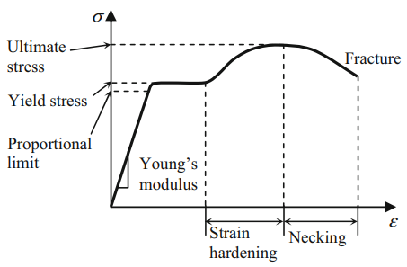
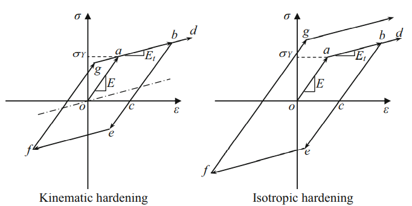
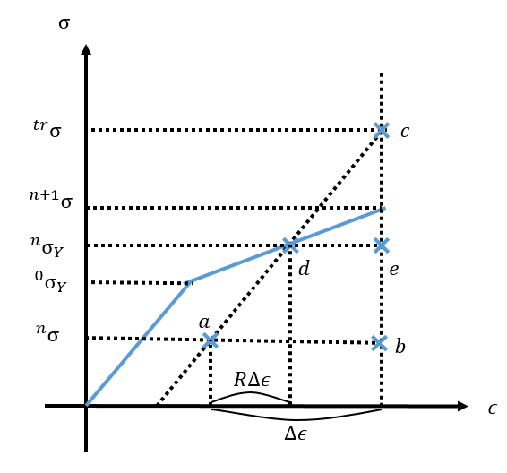
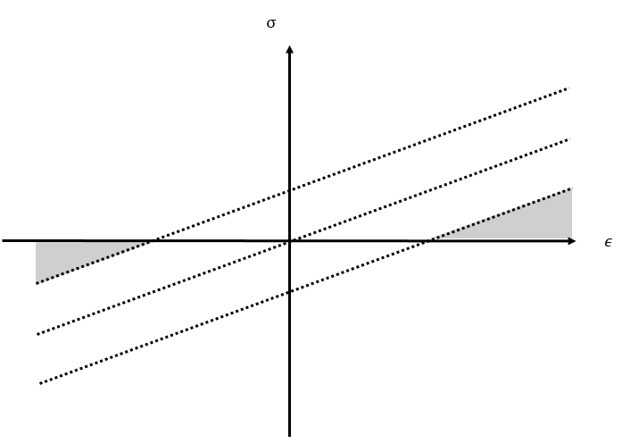

# 1D Stress-Strain Relation in Tension

* Yield stress를 넘어가면 plastic deformation을 한다.
* plastic deformation을 하면 영구변형이 남는다.
* Ultimate strength에 도달하기까지 strain hardening 현상이 나타난다.
* Ultimate strength에 도달 후 Fracture까지 strain-softening 현상이 나타난다.

# 1D Elastoplastic Material Behavior Under Small Deformation
`Elastoplastic material`이란 elastic deformation과 plastic deformation이 전부 발생하는 재료다.

이 떄, small deformation상황에서 elastoplastic material을 modeling할 것이기 때문에 elastic과 strain hardening 현상만 모델링 한다.

## Hardening Model

### 공통점
* Yeild stress를 넘어가면 stress-strain의 기울기가 `tangent modulus` $E_t$가 된다.
  * 단순한 모델에서는 $E_t$가 상수이다. (strain-hardening 현상을 linear로 modeling 한다.)
* Strain-hardening 현상이 발생하면 yeild stress가 증가한다.
  * $b$점까지 loading한 후 unloading하면 $c$점이 되고 다시 loading을 가하면 yeild stress가 $b$점이 된다.
   
### 차이점
`인장-압축(tension-compression)`이 반복되는 cyclic loading이 발생하는 경우에 yield stress를 어떻게 결정하는지에 따라 다른 hardening model을 사용한다.

#### Kinematic hardening model
* Elastic range가 initial yeild stress의 2배이다.
* Elastic range의 중심점이 원점을 지나고 기울기가 tangent modulus인 직선을 따라 움직인다.

##### 참고
Elastic range가 항상 initial yeild stress의 2배임으로 elastic range는 일정하다.

#### Isotropic hardening model
* Elastic range가 현재 yeild stress의 2배이다.
  * $|\sigma_b| = |\sigma_e|$이고 $|\sigma_f| = |\sigma_g|$이다.
* Elastic range의 중심점이 strain축을 따라 움직인다.
   
##### 참고
Plastic deformation이 발생할 때 마다 yeild stress가 증가함으로 elastic range도 증가한다.

## Strain
Elastoplastic material이 elastic deformation하면서 발생하는 strain을 elastic strain $\epsilon_e$, plastic deformation하면서 발생하는 strain을 plastic strain $\epsilon_p$라 하자.

Small deformation 가정에 의해 total strain $\epsilon$,$\epsilon_e$,$\epsilon_p$  사이에 다음 관계가 성립한다.
$$ \epsilon = \epsilon_e + \epsilon_p $$

$\epsilon_p$는 stress에 영향을 주지 않기 때문에 stress를 결정하기 위해서는 $\epsilon_e$가 얼마인지에 알아야한다. 따라서 elastoplastic material에서는 $\epsilon$만으로 stress를 구할 수 없다.

$\epsilon_p$는 재료가 항복할 때마다 축적됨으로, $\epsilon_p$를 계산하기 위해서는 모든 load increment에서 항복이 발생했는지 확인해야 한다. 이러한 특성을 `path(history) dependent`라고 한다.

> Reference  
> 1969 [Paper] (Lee) Elastic-Plastic Deformation at Finite Strain

## Plastic Modulus
Elastoplastic material이 plastic phase에 있을 때 strain increment $\Delta \epsilon$가 주어졌다고 하자.

이 떄, plastic modulus $H$를 다음과 같이 정의한다.
$$ H := \frac{\Delta \sigma}{\Delta \epsilon_p} $$

그러면 stress increment $\Delta \sigma$는 다음과 같다.
$$ \Delta \sigma = E \Delta \epsilon_e = E_t \Delta \epsilon = H\Delta \epsilon_p $$

### 명제1
Elastoplastic material이 plastic phase에 있을 때 strain increment $\Delta \epsilon$가 주어졌다고 하자.

다음을 증명하여라.
$$ \frac{1}{E_t} = \frac{1}{E} + \frac{1}{H} $$

#### 따름명제1
다음을 증명하여라.
$$ H = \frac{EE_t}{E-E_t} $$

#### 따름명제2
다음을 증명하여라.
$$ E_t = \frac{EH}{H + E} $$

### 명제2
Elastoplastic material이 plastic phase에 있을 때 strain increment $\Delta \epsilon$가 주어졌다고 하자.

다음을 증명하여라.
$$ \Delta \epsilon_p = \frac{\Delta \epsilon}{1 + H /E} $$

### 참고
명제1과 2는 Elastoplastic material이 plastic phase에 있는 상황에서 strain increment가 주어졌을 때 성립한다.

# FE Formulation for 1D Elastoplasticity
incremental force method를 사용하고 $n$번째 load increment까지 해석이 완료되었다고 가정하자.

$n+1$번째 load increment에 대한 static structural equilibrium의 FE formulation은 다음과 같다.
$$ \int_\Omega B^T\sigma \thinspace dV - {}^{n+1}F = 0 $$

Material nonlinearity와 Small deformation이라 가정하면 다음과 같다.
$$ \Big( \int_\Omega B^T D^{ep}B \thinspace dV \Big) d - {}^{n+1}F = 0 $$

$R(d)$를 다음과 같이 정의한다.
$$R(d) := K_t d - {}^{n+1}F$$

$$ \text{Where, } K_t := \int_\Omega B^T D^{ep}B \thinspace dV $$

이 때, $K_t$를 `tangent stiffness matrix`라고 한다.

$R(d) = 0$을 풀기 위해 Newton-Raphson method를 적용한다.
1. 초기 값을 결정하고 $k=0$으로 둔다.
$$ {}^{n+1}d^0 = {}^{n}d $$   
2. 선형화 한뒤 해를 구한다.
$$ {}^{n+1}d^{k+1} = {}^{n+1}d^k - J_R({}^{n+1}d^k)^{-1} R({}^{n+1}d^k) $$
3. ${}^{n+1}d^{k+1}$이 convergence criterion을 만족하는지 확인한다.
$$ \lVert R({}^{n+1}d^{k+1}) \rVert \le \epsilon \enspace \land \enspace N \le k $$
4. convergence criterion을 만족하는 경우 ${}^{n+1}d = {}^{n+1}d^{k+1}$로 두고 algorithm을 종료한다. convergence criterion을 만족하지 않는 경우, $k = k+1$로 두고 step2로 돌아간다.

## Stress calculation
Newton-Raphson method의 step2를 보면 $R({}^{n+1}d^k)$를 계산해야 한다.
$$ \begin{aligned} R({}^{n+1}d^k) &= \Big( \int_\Omega B^T D^{ep}B \thinspace dV \Big) {}^{n+1}d^k - {}^{n+1}F \\&= \int_\Omega B^T ({}^{n+1}\sigma^k) \thinspace dV - {}^{n+1}F \end{aligned} $$

${}^{n+1}F$는 주어진 값임으로, displacement가 ${}^{n+1}d^k$일 때 발생하는 stress ${}^{n+1}\sigma^k$를 계산해야 한다.

이 떄, ${}^{n+1}\sigma^k = {}^{n}\sigma + \Delta \sigma$이고, ${}^{n}d$과 ${}^{n}\sigma$는 이미 알고 있는 값임으로 $\Delta \epsilon = B({}^{n+1}d^k - {}^{n}d)$가 주어졌을 때, $\Delta \sigma$가 얼마인지 구하면 된다.

이 때, $\Delta \sigma$ 계산은 hardening model에 따라 달라진다.

### Isotropic Hardening Model
다음과 같은 값들이 주어졌다고 하자.
* elastic modulus $E$
* plastic modulus $H$
* $n$번째 load increment에서 stress ${}^n\sigma$
* $n$번째 load increment에서 yield stress ${}^n\sigma_Y$
* strain increment $\Delta \epsilon$

이 떄, ${}^{n+1}\sigma, {}^{n+1}\sigma_Y$를 구하는 방법은 다음과 같다.

#### 1. Elasiticy assumption
$\Delta \epsilon$가 더해진 후에도 elastic영역이여서 $\Delta \epsilon_p = 0$이라 가정하자.

$\Delta \epsilon = \Delta \epsilon_e$임으로 elasticity 가정에 의한 trial stress와 trial yield stress는 다음과 같다.
$$ \begin{aligned} {}^{tr}\sigma &= {}^n\sigma + E \Delta \epsilon \\ {}^{tr}\sigma_Y &= {}^n\sigma_Y \end{aligned}  $$

#### 2. Checking yield condition
Elasticity 가정이 옳바른지 판단하기 위해, 현재 stress들이 yield condition을 만족하는지 확인한다.

Isotropic hardening model에서 yield condition은 stress가 yield stress보다 항상 작거나 같아야 한다는 조건이다. 
$$ |\sigma| \le {}^{}\sigma_Y $$

따라서, 다음이 성립해야한다.
$$ \begin{equation} \begin{aligned} & |{}^{tr}\sigma| \le {}^{tr}\sigma_Y \\ \Leftrightarrow \enspace & |{}^n\sigma + E \Delta \epsilon| \le {}^{n}\sigma_Y \end{aligned} \end{equation} $$

식(1)이 성립하는 경우 elastic assumption은 참이 되고, stress와 plastic strain은 다음과 같다.
$$ \begin{gathered} {}^{n+1}\sigma = {}^{tr}\sigma \\ {}^{n+1}\sigma_Y = {}^{n}\sigma_Y \end{gathered}$$

#### 3. Plasticity correction
식(1)이 성립하지 않는 경우 ealstic assumption은 거짓이 되고 이는 $\Delta \epsilon_p \neq 0$이 되어 plastic strain에 대한 correction이 필요하게 된다. 
$$ \begin{aligned} {}^{n+1}\sigma &= {}^{tr}\sigma + \sigma_c \\ {}^{n+1}\sigma_Y &= {}^{tr}\sigma_Y + {\sigma_Y}_c \end{aligned}$$

Plastic strain에 의한 strain-hardening 현상을 고려한 stress correction term $\sigma_c$와 yield stress correction term ${\sigma_Y}_c$는 다음과 같다.
$$ \begin{aligned} \sigma_c &= -\text{sgn}({}^{tr}\sigma) E \Delta\epsilon_p \\  {\sigma_Y}_c &=  H \Delta\epsilon_p \end{aligned}  $$

따라서 stress와 yield stress는 다음과 같다.
$$ \begin{aligned} {}^{n+1}\sigma &= {}^{tr}\sigma -\text{sgn}({}^{tr}\sigma) E \Delta\epsilon_p \\ {}^{n+1}\sigma_Y &= {}^{tr}\sigma_Y + H \Delta \epsilon_P \end{aligned} $$

이 과정은 trial stress에 plastic strain increment의 영향을 반영하기 때문에 `plastic corrector`라고하며, trial stress에서 yield stress로 돌아온다는 의미에서 `return-mapping`이라고 한다.

#### 4. Calculating plastic strain increment
$\Delta\epsilon_p$을 계산하기 위해 plastic consistency condition을 이용한다.

Isotropic hardening model에서 plastic consistency condition은 plastic phase라면, stress가 yield stress여야 한다는 조건이다. 
$$ |\sigma| = \sigma_Y $$

따라서, 다음이 성립한다.
$$ \begin{aligned} & |{}^{n+1}\sigma| = {}^{n+1}\sigma_Y \\ \Leftrightarrow \enspace & |{}^{tr}\sigma -\text{sgn}({}^{tr}\sigma) E \Delta\epsilon_p | = {}^n\sigma_Y + H\Delta\epsilon_p \\ \Leftrightarrow \enspace & |{}^{tr}\sigma| - E \Delta\epsilon_p  = {}^n\sigma_Y + H\Delta\epsilon_p \\ \Leftrightarrow \enspace & \Delta\epsilon_p = \frac{|{}^{tr}\sigma| - {}^n\sigma_Y}{H+E} \end{aligned}$$

결론적으로, stress와 yield stress는 다음과 같다.
$$ \begin{aligned} {}^{n+1}\sigma &= {}^{tr}\sigma -\text{sgn}({}^{tr}\sigma) \frac{E}{H+E}(|{}^{tr}\sigma| - {}^n\sigma_Y) \\ {}^{n+1}\sigma_Y &= {}^{tr}\sigma_Y + \frac{H}{H+E}(|{}^{tr}\sigma| - {}^n\sigma_Y) \end{aligned} $$

위 식을 $\Delta\epsilon$으로 나타내기 위해 아래 그림을 고려해보자.

위 그림과 같이 $\Delta \epsilon$중 순수하게 elastic 변형만 나타나는 부분의 비율을 $R$이라 하자.

$\triangle abc \sim \triangle dec$에 의해 다음이 성립한다.
$$ \begin{aligned} & \frac{(1-R)\Delta \epsilon}{\Delta \epsilon} = \frac{|{}^{tr}\sigma| - {}^{n}\sigma_Y}{|{}^{tr}\sigma - {}^{n}\sigma|} \\ \Leftrightarrow \enspace &  R = 1 - \frac{|{}^{tr}\sigma| - {}^{n}\sigma_Y}{|{}^{tr}\sigma - {}^{n}\sigma|} \end{aligned} $$

이를 활용하면 다음이 성립한다.
$$ \begin{aligned} {}^{n+1}\sigma &= {}^{tr}\sigma -\text{sgn}({}^{tr}\sigma)\frac{E}{H+E}(|{}^{tr}\sigma| - {}^n\sigma_Y) \\ &=  {}^{tr}\sigma -\text{sgn}({}^{tr}\sigma) \frac{E(1-R)}{H+E} |{}^{tr}\sigma - {}^{n}\sigma| \\ &= {}^{tr}\sigma -\text{sgn}({}^{tr}\sigma) \frac{E^2(1-R)}{H+E} |\Delta \epsilon| \\ {}^{n+1}\sigma_Y &= {}^{tr}\sigma_Y  + \frac{HE(1-R)}{H+E} |\Delta \epsilon| \end{aligned} $$

### Kinematic hardening model
다음과 같은 값들이 주어졌다고 하자.
* elastic modulus $E$
* plastic modulus $H$
* $n$번째 load increment에서 stress ${}^n\sigma$
* $n$번째 load increment에서 back stress ${}^n\alpha$
* strain increment $\Delta \epsilon$

이 떄, ${}^{n+1}\sigma, {}^{n+1}\alpha$를 구하는 방법은 다음과 같다.

#### 1. Elasiticy assumption
$\Delta \epsilon$가 더해진 후에도 elastic영역이여서 $\Delta \epsilon_p = 0$이라 가정하자.

$\Delta \epsilon = \Delta \epsilon_e$임으로 elasticity 가정에 의한 trial stress와 trial back stress는 다음과 같다.
$$ \begin{aligned} {}^{tr}\sigma &= {}^n\sigma + E \Delta \epsilon \\ {}^{tr}\alpha &= {}^n\alpha \end{aligned}  $$

stress에서 back stress를 뺀 값을 `shifted stress` $\eta$라 할 떄, trial shifted stress는 다음과 같다.
$$ \begin{aligned} {}^{tr}\eta &= {}^{tr}\sigma - {}^{tr}\alpha \\ &= {}^n\sigma + E \Delta \epsilon - {}^n\alpha \end{aligned}  $$

#### 2. Checking yield condition
Elasticity 가정이 옳바른지 판단하기 위해, 현재 stress들이 yield condition을 만족하는지 확인한다.

Kinematic hardening model에서 yield condition은 shifted stress가 initial yield stress보다 항상 작거나 같아야 한다는 조건이다. 
$$ |\eta| \le {}^{0}\sigma_Y $$

따라서, 다음이 성립해야한다.
$$ \begin{equation} \begin{aligned} &|{}^{tr}\eta| \le {}^{0}\sigma_Y \\ \Leftrightarrow \enspace & |{}^n\sigma + E \Delta \epsilon - {}^n\alpha| \le {}^{0}\sigma_Y \end{aligned} \end{equation} $$

식(3)이 성립하는 경우 elastic assumption은 참이 되고, stress와 back stress는 다음과 같다.
$$ \begin{gathered} {}^{n+1}\sigma = {}^{tr}\sigma \\ {}^{n+1}\alpha = {}^{tr}\alpha \end{gathered}$$

#### 3. Plasticity correction
식(3)이 성립하지 않는 경우 ealstic assumption은 거짓이 되고 이는 $\Delta \epsilon_p \neq 0$이 되어 plastic strain에 대한 correction이 필요하게 된다. 
$$ \begin{gathered} {}^{n+1}\sigma = {}^{tr}\sigma + \sigma_c \\ {}^{n+1}\alpha = {}^{tr}\alpha + \alpha_c \end{gathered}$$

Plastic strain에 의한 strain-hardening 현상을 고려한 stress correction term $\sigma_c$와 back stress correction term $\alpha_c$는 다음과 같다.
$$ \begin{aligned} \sigma_c &= -\text{sgn}({}^{tr}\eta) E \Delta\epsilon_p \\  \alpha_c &= \text{sgn}({}^{tr}\eta) H \Delta\epsilon_p \end{aligned}  $$

따라서 stress와 back stress는 다음과 같다.
$$ \begin{aligned} {}^{n+1}\sigma &= {}^{tr}\sigma -\text{sgn}({}^{tr}\eta) E \Delta\epsilon_p \\ {}^{n+1}\alpha &= {}^{tr}\alpha + \text{sgn}({}^{tr}\eta) H \Delta\epsilon_p \end{aligned} $$

##### 참고

위 그림의 음영처리된 영역에 ${}^{tr}\sigma$값이 있는 경우, $\text{sgn}({}^{tr}\eta)$과 $\text{sgn}({}^{tr}\sigma)$의 부호가 반대가 된다.

이 현상은 elasticity region이 일정한 kinematic hardening model에서만 나타나며  correction term의 부호를 $\eta$로 결정하는 이유이기도 하다.

#### 4. Calculating plastic strain increment
$\Delta\epsilon_p$을 계산하기 위해 plastic consistency condition을 이용한다.

Kinematic hardening model에서 plastic consistency condition은 plastic phase라면, shifted stress가 initial yield stress여야 한다는 조건이다. 
$$ |\eta| = {}^{0}\sigma_Y $$

따라서, 다음이 성립한다.
$$ \begin{aligned} & |{}^{n+1}\sigma - {}^{n+1}\alpha| = {}^0\sigma_Y \\ \Leftrightarrow \enspace & |{}^{tr}\sigma - {}^{tr}\alpha - \text{sgn}({}^{tr}\eta) (E + H) \Delta\epsilon_p | = {}^0\sigma_Y \\ \Leftrightarrow \enspace & |{}^{tr}\sigma - {}^{tr}\alpha| - (E+H) \Delta\epsilon_p  = {}^0\sigma_Y \\ \Leftrightarrow \enspace & \Delta\epsilon_p = \frac{|{}^{tr}\eta| - {}^0\sigma_Y}{H+E} \end{aligned}$$

결론적으로, Stress와 back stress는 다음과 같다.
$$ \begin{aligned} {}^{n+1}\sigma &= {}^{tr}\sigma -\text{sgn}({}^{tr}\eta) \frac{E}{H+E}(|{}^{tr}\eta| - {}^0\sigma_Y) \\ {}^{n+1}\alpha &= {}^{tr}\alpha + \text{sgn}({}^{tr}\eta) \frac{H}{H+E} (|{}^{tr}\eta| - {}^0\sigma_Y) \end{aligned} $$

### Combined hardening model
다음과 같은 값들이 주어졌다고 하자.
* elastic modulus $E$
* plastic modulus $H$
* $n$번째 load increment에서 stress ${}^n\sigma$
* $n$번째 load increment에서 back stress ${}^n\alpha$
* $n$번째 load increment에서 yield stress ${}^n\sigma_Y$
* strain increment $\Delta \epsilon$

이 떄, ${}^{n+1}\sigma, {}^{n+1}\alpha, {}^{n+1}\sigma_Y$를 구하는 방법은 다음과 같다.

#### 1. Elasiticy assumption
$\Delta \epsilon$가 더해진 후에도 elastic영역이여서 $\Delta \epsilon_p = 0$이라 가정하자.

$\Delta \epsilon = \Delta \epsilon_e$임으로 elasticity 가정에 의한 trial stress, trial back stress, trial yield stress는 다음과 같다.
$$ \begin{aligned} {}^{tr}\sigma &= {}^n\sigma + E \Delta \epsilon \\ {}^{tr}\alpha &= {}^n\alpha \\ {}^{tr}\sigma_Y &= {}^n\sigma_Y \end{aligned}  $$

Stress에서 back stress를 뺀 값을 shifted stress $\eta$라 할 떄, trial shifted stress는 다음과 같다.
$$ \begin{aligned} {}^{tr}\eta &= {}^{tr}\sigma - {}^{tr}\alpha \\ &= {}^n\sigma + E \Delta \epsilon - {}^n\alpha \end{aligned}  $$

#### 2. Checking yield condition
Elasticity 가정이 옳바른지 판단하기 위해, 현재 stress들이 yield condition을 만족하는지 확인한다.

Combined hardening model에서 yield condition은 shifted stress가 yield stress보다 항상 작거나 같아야 한다는 조건이다. 
$$ |\eta| \le \sigma_Y $$

따라서, 다음이 성립해야한다.
$$ \begin{equation} \begin{aligned} &|{}^{tr}\eta| \le {}^{tr}\sigma_Y \\ \Leftrightarrow \enspace & |{}^n\sigma + E \Delta \epsilon - {}^n\alpha| \le {}^{n}\sigma_Y \end{aligned} \end{equation} $$

식(3)이 성립하는 경우 elastic assumption은 참이 되고, stress, back stress yield stress는 다음과 같다.
$$ \begin{gathered} {}^{n+1}\sigma = {}^{tr}\sigma \\ {}^{n+1}\alpha = {}^{tr}\alpha \\ {}^{n+1}\sigma_Y = {}^{tr}\sigma_Y \end{gathered}$$

#### 3. Plasticity correction
식(3)이 성립하지 않는 경우 ealstic assumption은 거짓이 되고 이는 $\Delta \epsilon_p \neq 0$이 되어 plastic strain에 대한 correction이 필요하게 된다. 
$$ \begin{aligned} {}^{n+1}\sigma &= {}^{tr}\sigma + \sigma_c \\ {}^{n+1}\alpha &= {}^{tr}\alpha + \alpha_c \\ {}^{n+1}\sigma_Y &= {}^{tr}\sigma_Y + {\sigma_Y}_c \end{aligned}$$

Plastic strain에 의한 strain-hardening을 고려한 stress correction term $\sigma_c$, back stress correction term $\alpha_c$, yield stress correction term ${\sigma_Y}_c$는 다음과 같다.
$$ \begin{aligned} \sigma_c &= -\text{sgn}({}^{tr}\eta) E \Delta\epsilon_p \\  \alpha_c &= \text{sgn}({}^{tr}\eta) \beta  H \Delta\epsilon_p \\ {\sigma_Y}_c &= (1 - \beta) H \Delta\epsilon_p \end{aligned}  $$

따라서 stress, back stress, yield stress는 다음과 같다.
$$ \begin{aligned} {}^{n+1}\sigma &= {}^{tr}\sigma -\text{sgn}({}^{tr}\eta) E \Delta\epsilon_p \\ {}^{n+1}\alpha &= {}^{tr}\alpha + \text{sgn}({}^{tr}\eta) \beta H \Delta\epsilon_p \\ {}^{n+1}\sigma_Y &= {}^{tr}\sigma_Y +(1-\beta) H \Delta\epsilon_p \end{aligned} $$

#### 4. Calculating plastic strain increment
$\Delta\epsilon_p$을 계산하기 위해 plastic consistency condition을 이용한다.

Combined hardening model에서 plastic consistency condition은 plastic phase라면, shifted stress가 yield stress여야 한다는 조건이다. 
$$ |\eta| = \sigma_Y $$

따라서, 다음이 성립한다.
$$ \begin{aligned} & |{}^{n+1}\sigma - {}^{n+1}\alpha| = {}^{n+1}\sigma_Y \\ \Leftrightarrow \enspace & |{}^{tr}\sigma - {}^{tr}\alpha - \text{sgn}({}^{tr}\eta) (E + \beta H) \Delta\epsilon_p | = {}^{tr}\sigma_Y +(1-\beta) H \Delta\epsilon_p \\ \Leftrightarrow \enspace & |{}^{tr}\sigma - {}^{tr}\alpha| - (E + \beta H) \Delta\epsilon_p  = {}^{tr}\sigma_Y +(1-\beta) H \Delta\epsilon_p \\ \Leftrightarrow \enspace & \Delta\epsilon_p = \frac{|{}^{tr}\eta| - {}^{tr}\sigma_Y}{H+E} \end{aligned}$$

결론적으로, Stress와 back stress는 다음과 같다.
$$ \begin{aligned} {}^{n+1}\sigma &= {}^{tr}\sigma -\text{sgn}({}^{tr}\eta) \frac{E}{H+E}(|{}^{tr}\eta| - {}^{tr}\sigma_Y) \\ {}^{n+1}\alpha &= {}^{tr}\alpha + \text{sgn}({}^{tr}\eta) \frac{H\beta}{H+E} (|{}^{tr}\eta| - {}^{tr}\sigma_Y) \\ {}^{n+1}\sigma_Y &= {}^{tr}\sigma_Y + \frac{H(1-\beta)}{H+E}(|{}^{tr}\eta| - {}^{tr}\sigma_Y) \end{aligned} $$

## Tangent stiffness matrix calculation
Stress calculation 과정에서 구한 elastoplastic tangent modulus를 `algorithmic tangent modulus` $D^\text{alg}$라고 한다.

식(2)를 이용해서 $D^\text{alg}$을 계산하면 다음과 같다.
$$ \begin{aligned} D^\text{alg} &= \frac{\partial \Delta \sigma}{\partial \Delta \epsilon} \\&= \frac{\partial {}^{n+1}\sigma}{\partial \Delta \epsilon} - \frac{\partial {}^{n}\sigma}{\partial \Delta \epsilon} \\&= \frac{\partial {}^{n+1}\sigma}{\partial \Delta \epsilon} \\&= \frac{\partial {}^{tr}\sigma}{\partial \Delta \epsilon} -\text{sgn}({}^{tr}\sigma) E \frac{\partial \Delta\epsilon_p}{\partial \Delta \epsilon} \end{aligned} $$

$\Delta\epsilon_p = 0$일 때, $D^\text{alg}$는 다음과 같다.
$$ D^\text{alg} = E $$

$\Delta\epsilon_p \neq 0$일 때, $\frac{\partial \Delta\epsilon_p}{\partial \Delta \epsilon}$는 다음과 같다.
$$ \begin{aligned} \frac{\partial \Delta\epsilon_p}{\partial \Delta \epsilon} &= \frac{1}{E + H} \frac{\partial}{\partial \Delta \epsilon} \Big( |{}^{tr}\sigma| - {}^{n}\sigma_Y \Big) \\&= \frac{1}{E + H} \frac{\partial}{\partial \Delta \epsilon} \Big( |{}^{n}\sigma + E \Delta \epsilon| - {}^{n}\sigma_Y \Big) \\ &=  \frac{E}{E + H} \text{sgn}({}^{tr}\sigma) \end{aligned} $$

따라서, $\Delta\epsilon_p \neq 0$일 때, $D^\text{alg}$는 다음과 같다.
$$ D^\text{alg} = E - \frac{E^2}{E + H} = E_t $$

# 계획

4.3 >> Mecsolver 코드 말고 다른 코드로 Von Mises 보기 >> 다른 재료 모델

LU / LDLT