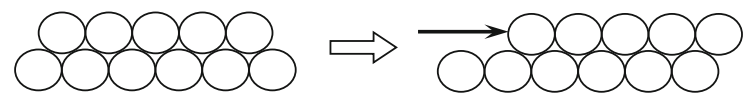
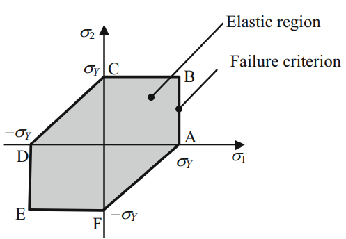

# Yield Criterion in Multidimension
1차원에서는 uniaxial tension test를 통해 stress-strain 관계를 얻을 수 있었고 이를 통해 yield criterion을 자연스럽게 결정할 수 있었다.

하지만 다차원에서는 무한한 하중조합이 가능하기 때문에 tension test를 통해 yield criterion을  결정하는 것은 실질적으로 불가능하다.

따라서 모든 하중 조합을 고려할 수 있는 physics-based model을 이용하여 yield criterion을 결정한다.

> Reference  
> [Book] (Kim) Introduction to Nonlinear Finite Element Analysis Chap 4.3

# Material Failure
Material failure는 일반적으로 brittle material failure(fracture)와 ductile material failure(yield)로 분류한다.

Ductile material에 하중이 작용하여 아래와 같이 변형이 발생했다고 하자.

분자 구조간의 상대적인 미끄러짐이 발생하면 외력을 제거하여도 재료는 원래 모습으로 돌아오지 않으며 영구변형이 발생하게 된다. 

> Reference  
> [Book] (Kim) Introduction to Nonlinear Finite Element Analysis Chap 4.3.1  
> [Wiki - Material failure theory](https://en.wikipedia.org/wiki/Material_failure_theory)  
> 

# Maximum Shear Stress Yield Criterion
항복은 분자간의 상대적인 미끄러짐에 의해 발생함으로 일반적으로 재료의 항복은 shear deformation과 관련되어 있다고 본다.

따라서 maximum shear stress을 활용하여 yield criterion을 결정하는 방법을 `maximum shear stress yield criterion`이라고 한다.

maximum shear stress $\tau_{max}$라 하고 tensile test에서 항복이 발생했을 때 maximum shear stress를 $\tau_Y$라 하자.

이 때, maximum shaer stress yield criterion은 다음과 같다.
$$ \begin{aligned} & \tau_{max} \le \tau_Y \\ \Rightarrow \enspace & \frac{\max(\sigma_{1,2,3}) - \min(\sigma_{1,2,3})}{2} \le \frac{\sigma_Y}{2} \\ \Rightarrow \enspace & \max(\sigma_{1,2,3}) - \min(\sigma_{1,2,3}) \le \sigma_Y \end{aligned}  $$

항복함수 $f_{MS}(\sigma, \sigma_Y)$는 다음과 같이 정의한다.
$$ f_{MS}(\sigma, \sigma_Y) = \max(\sigma_{1,2,3}) - \min(\sigma_{1,2,3}) - \sigma_Y $$

따라서 다음이 성립한다.
$$ \begin{gathered} f_{MS} \le 0 & \text{elastic region} \\ f_{MS} > 0 & \text{plastic region} \\ f_{MS} = 0 & \text{yield surface} \end{gathered} $$

> Reference  
> [Book] (Kim) Introduction to Nonlinear Finite Element Analysis Chap 4.3.1.1

### 예시
2차원 재료에 대해 $\sigma_Y$가 주어졌다고 하자.

principal stress plane에서 maximum shear stress criterion을 표현하면 다음과 같다.

2차원 재료임으로 항상 $\sigma_3 = 0$이다.

각각의 라인은 다음의 principal stress로 결정된다.
* $\overline{AB}$: $\sigma_1, \sigma_3$
* $\overline{BC}$: $\sigma_2, \sigma_3$
* $\overline{CD}$: $\sigma_1, \sigma_2$
* $\overline{DE}$: $\sigma_1, \sigma_3$
* $\overline{EF}$: $\sigma_2, \sigma_3$
* $\overline{FA}$: $\sigma_1, \sigma_2$

# Deviatoric Strain
미소 변위, 변형률을 가정하면 volume-chainging은 다음과 같이 정의된다.
$$ \frac{\Delta V}{V} = \text{tr}(\epsilon) $$

$$ \text{Where, } \lambda, \mu \text{ are Lame's constants} $$

따라서 volume-chainging이 $0$이 되게 $\tilde \epsilon$을 다음과 같이 정의한다.
$$ \tilde \epsilon := \epsilon - \epsilon_m I $$

$$ \text{Where, } \epsilon_m = \frac{1}{3}\text{tr}(\epsilon) $$

이 떄, $\epsilon_mI$를 $\epsilon$의 volume-chainging part, $\epsilon_m$을 volumetric strain이라고 하며 $\tilde \epsilon$를 $\epsilon$의 volume-preserving part 또는 `deviatoric strain`이라고 한다. 

# Deviatoric Stress
미소 변위, 변형률을 가정하고 등방성 선형 탄성재료의 경우 구성방정식은 다음과 같다.
$$ \sigma = \lambda \text{tr}(\epsilon) I + 2\mu \epsilon $$

구성방정식을 $\tilde \epsilon$으로 나타내면 다음과 같다.
$$ \begin{aligned} \sigma &= \lambda \text{tr}(\epsilon) I + 2\mu \epsilon \\ &= 3 \lambda \epsilon_m I + 2\mu(\tilde \epsilon + \epsilon_m I) \\ &= (3\lambda - 2\mu)\epsilon_m I + 2\mu \tilde \epsilon \end{aligned} $$

Volume chainging part와 관련된 항을 제외한 stress $\tilde \sigma$를 다음과 같이 정의한다.
$$ \tilde \sigma := 2\mu \tilde \epsilon $$

이 때, $\tilde \sigma$를 `deviatoric stress`라고 한다.

### 명제1
미소 변위, 변형률을 가정하고 등방성 선형 탄성재료라고 하자.

이 때, 다음을 증명하여라.
$$ \tilde \sigma = \sigma - \sigma_m I $$

$$ \text{Where, } \sigma_m = \frac{1}{3}\text{tr}(\sigma) $$

**Proof**

구성방정식에 의해 다음이 성립한다.
$$ \sigma - \tilde \sigma = (3\lambda + 2\mu)\epsilon_m I $$

동시에 다음도 성립한다.
$$ \begin{aligned} \text{tr}(\sigma) &= (\lambda \text{tr}(\epsilon) I + 2\mu \epsilon) : I \\ &= (3\lambda +  2\mu) \text{tr}(\epsilon) \\ &= 3 (3\lambda +  2\mu) \epsilon_m \end{aligned} $$

두 식을 비교하면 다음이 성립한다.
$$ \begin{aligned} \sigma - \tilde \sigma &= \frac{1}{3}\text{tr}(\sigma)I \\ &= \sigma_mI \end{aligned}  $$

위 식을 정리하면 다음이 성립한다.
$$ \tilde \sigma = \sigma - \sigma_m I \quad {_\blacksquare}$$

# Distortion Strain Energy Density
미소 변위, 변형률을 가정하고 선형 탄성재료의 경우 다음과 같은 strain energy function을 갖는다.
$$ U = \frac{1}{2} \sigma : \epsilon $$

이를 $\tilde \sigma, \tilde \epsilon$로 나타내면 다음과 같다.
$$ \begin{aligned} U &= \frac{1}{2} \sigma : \epsilon \\ &= \frac{1}{2}(\tilde \sigma + \sigma_m I) : (\tilde \epsilon + \epsilon_m I) \\ &= \frac{1}{2} (\tilde \sigma : \tilde \epsilon + 9\sigma_m \epsilon_m) \end{aligned} $$

Volume-chainging과 관련된 항을 제외한 strain energy density를 다음과 같이 정의한다.
$$ U_d = \frac{1}{2}(\tilde \sigma : \tilde \epsilon ) $$

이 때, $U_d$를 `Distortion strain energy density`라 한다.

### 명제1
다음을 증명하여라.
$$ U_d = \frac{1}{4\mu}(\tilde \sigma : \tilde \sigma) $$

**Proof**

$\tilde \sigma$의 정의에 의해 다음이 성립한다.
$$ \tilde \epsilon = \frac{1}{2\mu} \tilde \sigma $$

따라서 다음이 성립한다.
$$ \begin{aligned} U_d &= \frac{1}{2}(\tilde \sigma : \tilde \epsilon ) \\ &= \frac{1}{4\mu}(\tilde \sigma : \tilde \sigma) \quad {_\blacksquare} \end{aligned} $$

### 명제2
1D Tensile test에서 항복응력이 $\sigma_Y$라고 하자.

항복응력이 가해졌을 때 $U_d$가 다음과 같음을 증명하여라.
$$ U_d = \frac{1}{6\mu}\sigma_Y^2 $$

**Proof**

$\tilde \sigma$를 $\sigma$로 나타내면 다음과 같다.
$$ \tilde \sigma = \sigma - \sigma_mI = \begin{bmatrix} \frac{2}{3}\sigma_Y & 0 & 0 \\ 0 & -\frac{1}{3}\sigma_Y & 0 \\ 0 & 0 & -\frac{1}{3}\sigma_Y \end{bmatrix} $$

따라서 다음이 성립한다.
$$ U_d = \frac{1}{4\mu}(\tilde \sigma : \tilde \sigma) = \frac{1}{4\mu} \frac{2}{3} \sigma_Y^2 = \frac{1}{6\mu}\sigma_Y^2 \quad {_\blacksquare} $$

# Von Mises Yield Criterion
항복은 분자간의 상대적인 미끄러짐에 의해 발생한다. 그리고 분자간의 상대적인 미끄러짐이 발생할 경우 부피는 변하지 않는다.

따라서 distortion strain energy density를 이용하여 failure criterion을 결정하는 방법을 `Von Mises yield criterion`이라 한다.

1D tensile test의 항복응력이 가해졌을 때 $U_d$를 $U_d|_Y$라 할 때, Von Mises yield criterion은 다음과 같다.
$$ \begin{aligned} U_d &\le U_d|_Y \\ \frac{1}{4\mu}(\tilde \sigma : \tilde \sigma) &\le \frac{1}{6\mu}\sigma_Y^2 \\ \frac{3}{2} \tilde \sigma : \tilde \sigma &\le \sigma_Y^2 \\ \sigma_e^2 &\le \sigma_Y^2 \end{aligned}  $$

$$ \text{Where, } \sigma_e := \sqrt{\frac{3}{2} \tilde \sigma : \tilde \sigma} $$

이 때, $\sigma_e$를 `equivalent stress` 혹은 `von Mises stress`라고 한다.

Yield function $f_{VM}$은 다음과 같이 정의한다.
$$ f_{VM}(\sigma) = \sigma_e^2 - \sigma_Y^2 $$

따라서 다음이 성립한다.
$$ \begin{gathered} f_{VM} \le 0 & \text{elastic region} \\ f_{VM} > 0 & \text{plastic region} \\ f_{VM} = 0 & \text{yield surface} \end{gathered} $$

### 명제1
$\tilde \sigma$의 second invariant를 $I_2$라 할 떄, $J_2$를 다음과 같이 정의하자.
$$ J_2 = -I_2 $$

이 떄, 다음을 증명하여라.
$$ \sigma_e = \sqrt{3J_2} $$

**Proof**

$I_2$의 정의에 의해 다음이 성립한다
$$ \begin{aligned} I_2 &= \frac{1}{2}(\text{tr}(\tilde \sigma)^2 - \text{tr}(\tilde \sigma^2)) \\ &= -\frac{1}{2}(\tilde \sigma : \tilde \sigma) \end{aligned} $$

이 떄, $\sigma_e$의 정의에 의해 다음이 성립한다.
$$ \begin{aligned} \sigma_e = \sqrt{\frac{3}{2} \tilde \sigma : \tilde \sigma} = \sqrt{-3I_2} = \sqrt{3J_2} \quad {_\blacksquare} \end{aligned} $$

### 명제2
다음을 증명하여라
$$ f_{VM}(\sigma) = ||\mathbf s|| - \sqrt{\frac{2}{3}}\sigma_Y $$

# Effective Strain 
Effective strain $\epsilon_e$는 다음을 만족하게 정의한다.
$$ U_d = \frac{1}{2}\sigma_e \epsilon_e $$

이를 $\tilde \sigma$로 나타내면 다음과 같다.
$$ \begin{aligned} &\frac{1}{4\mu}(\tilde \sigma : \tilde \sigma) = \frac{1}{2} \sqrt{\frac{3}{2} \tilde \sigma : \tilde \sigma} \epsilon_e \\ \Rightarrow \enspace & \epsilon_e = \sqrt {\frac{1}{6\mu^2} \tilde \sigma : \tilde \sigma} \end{aligned}  $$

이를 $\tilde \epsilon$로 나타내면 다음과 같다.
$$ \epsilon_e = \sqrt {\frac{2}{3} \tilde \epsilon : \tilde \epsilon} $$

# 계획

- 다음주는 목요일 아니면 다다음주 월요일로 회의 날짜 변경하기
- 기하학적으로 어떻게 생겼는지 