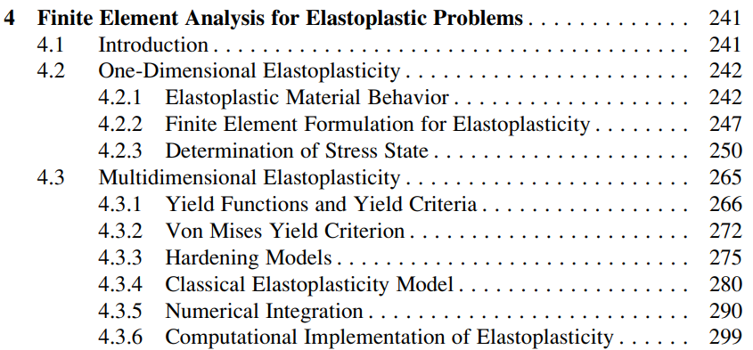

# Deviatoric Stress Plane
Von Mises yield function은 다음과 같다.
$$ f_{VM} = \frac{3}{2} ((\sigma_1 - \sigma_m)^2 + (\sigma_2 - \sigma_m)^2 + (\sigma_3 - \sigma_m)^2) - \sigma_Y^2 $$

따라서 Von Mises yield surface는 다음과 같다.
$$ \begin{aligned} & f_{VM} = 0 \\ \Rightarrow \enspace & (\sigma_1 - \sigma_m)^2 + (\sigma_2 - \sigma_m)^2 + (\sigma_3 - \sigma_m)^2 = \frac{2}{3} \sigma_Y^2 \end{aligned} $$

$\tilde \sigma$의 principal stress를 $\tilde \sigma_{1,2,3}$로 두면 Von Mises yield surface는 다음과 같다.
$$ x^2 + \tilde \sigma_2^2 + \tilde \sigma_3^2 = \frac{2}{3} \sigma_Y^2 $$

즉, Von Mises yield surface는 $\tilde \sigma_{1,2,3}$를 축으로 삼는 3차원 공간상에서 반지름이 $\sqrt{\frac{2}{3}} \sigma_Y$인 구가 된다. 

하지만 $\tilde \sigma_{1,2,3}$는 정의상 반드시 다음 방정식을 만족해야한다.
$$ \tilde \sigma_1 + \tilde \sigma_2 + \tilde \sigma_3 = 0 $$

위 방정식으로 나타나는 평면을 `deviatoric stress plane`이라고 하며 이 평면상에서만 deviatoric stress의 principal stress가 존재할 수 있다.

따라서, Von Mises yield surface는 $\tilde \sigma_{1,2,3}$를 축으로 삼는 3차원 공간상에서 다음 두 곡면에 교선으로 나타난다.
$$ \begin{aligned} \tilde \sigma_1^2 + \tilde \sigma_2^2 + \tilde \sigma_3^2 &= \frac{2}{3} \sigma_Y^2 \\ \tilde \sigma_1 + \tilde \sigma_2 + \tilde \sigma_3 &= 0 \end{aligned}  $$

원점을 지나는 구의 방정식과 원점을 지나는 평면의 교선은 구의 반지름과 동일한 원이 되고 이 원이 $\tilde \sigma_{1,2,3}$를 축으로 삼는 3차원 공간상의 Von Mises yield surface가 된다.

### 명제
$\tilde \sigma$의 principal stress를 $\tilde \sigma_{1,2,3}$라 하자.

$\tilde \sigma_{1,2,3}$를 $x,y,z$축으로 하는 3차원 공간상에서 Von Mises yield surface가 다음 매개변수 방정식으로 나타남을 증명하여라.
$$ \begin{aligned} x &= \frac{\sigma_Y}{3}( \sqrt 3 \cos t - \sin t) \\  y &= \frac{\sigma_Y}{3} 2 \sin t \\ z &= -\frac{\sigma_Y}{3}( \sqrt 3 \cos t + \sin t) \end{aligned} $$

**Proof**

Von Mises yield surface는 다음 두 곡면에 교선으로 나타난다.
$$ \begin{aligned} x^2 + y^2 + z^2 &= \frac{2}{3} \sigma_Y^2 \\ x + y + z &= 0 \end{aligned}  $$

두번째 방정식에 의해, $z = -(x+y)$임으로 다음이 성립한다.
$$ \begin{aligned} & x^2 + y^2 + xy = \frac{1}{3} \sigma_Y^2 \\ \Rightarrow \enspace & (x + \frac{1}{2}y)^2 + \frac{3}{4}y^2 = \frac{1}{3}\sigma_Y^2 \\ \Rightarrow \enspace & X^2 + Y^2 = \frac{1}{3}\sigma_Y^2 \\ \Rightarrow \enspace & X = \frac{1}{\sqrt 3} \sigma_Y \cos t, \enspace Y = \frac{1}{\sqrt 3} \sigma_Y \sin t \\ \Rightarrow \enspace & x = \frac{\sigma_Y}{3} (\sqrt 3 \cos t - \sin t) \\ & y= \frac{\sigma_Y}{3} 2 \sin t \\ & z = -\frac{\sigma_Y}{3} (\sqrt 3 \cos t + \sin t) \quad {_\blacksquare} \end{aligned}  $$

# Graphical View of Yield Function

## Maximum shear stress 
$$f_{MS}(\sigma, \sigma_Y) = \max(\sigma_1,\sigma_2,\sigma_3) - \min(\sigma_1,\sigma_2,\sigma_3) - \sigma_Y $$

$\sigma_Y = 3$

## Von Mises 
$$ f_{VM}(\sigma, \sigma_Y) = (\sigma_1 - \sigma_2)^2 + (\sigma_2 - \sigma_3)^2 + (\sigma_3 - \sigma_1)^2 - 2\sigma_Y^2  $$

$\sigma_Y = 2$

# Hardening Models

# 계획

- 다음주는 목요일 아니면 다다음주 월요일로 회의 날짜 변경하기
- 기하학적으로 어떻게 생겼는지 