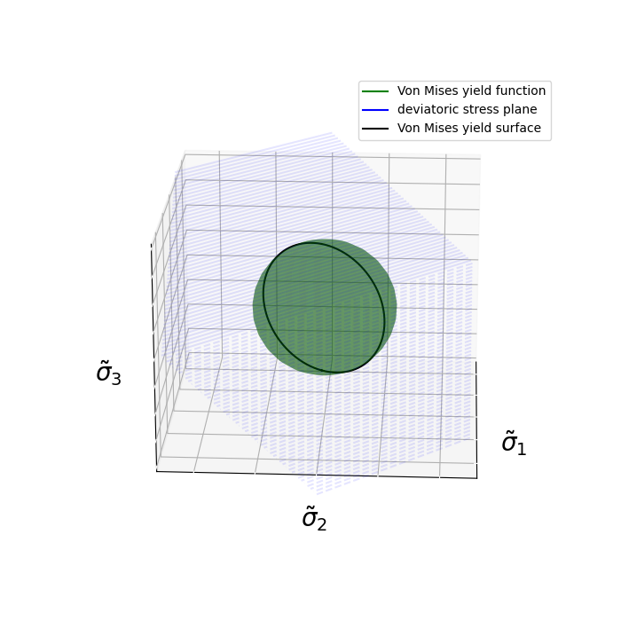

# Von Mises Yield Criterion
항복은 분자간의 상대적인 미끄러짐에 의해 발생한다. 그리고 분자간의 상대적인 미끄러짐이 발생할 경우 부피는 변하지 않는다.

따라서 distortion strain energy density를 이용하여 failure criterion을 결정하는 방법을 `Von Mises yield criterion`이라 한다.

1D tensile test의 항복응력이 가해졌을 때 $U_d$를 $U_d|_Y$라 할 때, Von Mises yield criterion은 다음과 같다.
$$ \begin{aligned} U_d &\le U_d|_Y \\ \frac{1}{4\mu}(\tilde \sigma : \tilde \sigma) &\le \frac{1}{6\mu}\sigma_Y^2 \\ \frac{3}{2} \tilde \sigma : \tilde \sigma &\le \sigma_Y^2 \\ \sigma_e^2 &\le \sigma_Y^2 \end{aligned}  $$

$$ \text{Where, } \sigma_e := \sqrt{\frac{3}{2} \tilde \sigma : \tilde \sigma} $$

이 때, $\sigma_e$를 `equivalent stress` 혹은 `von Mises stress`라고 한다.

### 명제1
$\tilde \sigma$의 second invariant를 $I_2$라 할 떄, $J_2$를 다음과 같이 정의하자.
$$ J_2 = -I_2 $$

이 떄, 다음을 증명하여라.
$$ \sigma_e = \sqrt{3J_2} $$

**Proof**

$I_2$의 정의에 의해 다음이 성립한다
$$ \begin{aligned} I_2 &= \frac{1}{2}(\text{tr}(\tilde \sigma)^2 - \text{tr}(\tilde \sigma^2)) \\ &= -\frac{1}{2}(\tilde \sigma : \tilde \sigma) \end{aligned} $$

이 떄, $\sigma_e$의 정의에 의해 다음이 성립한다.
$$ \begin{aligned} \sigma_e = \sqrt{\frac{3}{2} \tilde \sigma : \tilde \sigma} = \sqrt{-3I_2} = \sqrt{3J_2} \quad {_\blacksquare} \end{aligned} $$

# Von Mises Yield Function
Yield function은 $f$는 다음을 만족하는 함수이다.
$$ \begin{gathered} f \le 0 & \text{elastic region} \\ f > 0 & \text{plastic region} \\ f = 0 & \text{yield surface} \end{gathered} $$

## Form1
Von Mises yield criterion이 $\sigma_e^2 \le \sigma_Y^2$로 주어짐으로 yield function $f^1_{VM}$을 다음과 같이 정의하는 것이 자연스럽다.
$$ f^1_{VM}(\sigma) = \sigma_e^2 - \sigma_Y^2 $$

## Form2
Yield function $f_{VM}^2$을 다음과 같이 정의하자.
$$ f^2_{VM}(\sigma) = \sigma_e - \sigma_Y $$

$0 < \sigma_e, \sigma_Y$이기 때문에 $f_{VM}^2$도 Yield function의 정의를 만족한다.

## Form3
Yield function $f_{VM}^3$을 다음과 같이 정의하자.
$$ \begin{aligned} f^3_{VM}(\sigma) &= \sqrt{\frac{2}{3}} f^2_{VM} \\ &= \sqrt{\frac{2}{3}} (\sigma_e - \sigma_Y) \\ &= \lVert \tilde\sigma \rVert - \sqrt{\frac{2}{3}}\sigma_Y \end{aligned} $$

$f_{VM}^2$에 양수를 곱한 형태이기 때문에 $f_{VM}^3$ Yield function의 정의를 만족한다.

# Von Mises Yield Surface
Yield function $f$라 할 때, $f = 0$을 만족하는 level surface를 `yield surface`라고 한다.

### 명제1
$\sigma$의 eigen value가 $\sigma_{1,2,3}$이고 $\sigma_Y$가 주어졌다고 하자.

이 떄, Von Mises yield surface가 다음과 같음을 증명하여라.
$$ (\sigma_1 - \sigma_m)^2 + (\sigma_2 - \sigma_m)^2 + (\sigma_3 - \sigma_m)^2 = \frac{2}{3}\sigma_Y^2 $$

#### 참고

### 명제2
$\sigma$의 eigen value가 $\sigma_{1,2,3}$이고 $\sigma_Y$가 주어졌다고 하자.

이 떄, Von Mises yield surface가 다음과 같음을 증명하여라.
$$ (\sigma_1 - \sigma_2)^2 + (\sigma_2 - \sigma_3)^2 + (\sigma_3 - \sigma_1)^2 = 2\sigma_Y^2 $$

# Deviatoric Stress Plane
Von Mises yield function은 다음과 같다.
$$ f_{VM} = \frac{3}{2} ((\sigma_1 - \sigma_m)^2 + (\sigma_2 - \sigma_m)^2 + (\sigma_3 - \sigma_m)^2) - \sigma_Y^2 $$

따라서 Von Mises yield surface는 다음과 같다.
$$ \begin{aligned} & f_{VM} = 0 \\ \Rightarrow \enspace & (\sigma_1 - \sigma_m)^2 + (\sigma_2 - \sigma_m)^2 + (\sigma_3 - \sigma_m)^2 = \frac{2}{3} \sigma_Y^2 \end{aligned} $$

$\tilde \sigma$의 principal stress를 $\tilde \sigma_{1,2,3}$로 두면 Von Mises yield surface는 다음과 같다.
$$ x^2 + \tilde \sigma_2^2 + \tilde \sigma_3^2 = \frac{2}{3} \sigma_Y^2 $$

즉, Von Mises yield surface는 $\tilde \sigma_{1,2,3}$를 축으로 삼는 3차원 공간상에서 반지름이 $\sqrt{\frac{2}{3}} \sigma_Y$인 구가 된다. 

하지만 $\tilde \sigma_{1,2,3}$는 정의상 반드시 다음 방정식을 만족해야한다.
$$ \tilde \sigma_1 + \tilde \sigma_2 + \tilde \sigma_3 = 0 $$

위 방정식으로 나타나는 평면을 `deviatoric stress plane`이라고 하며 이 평면상에서만 deviatoric stress의 principal stress가 존재할 수 있다.

따라서, Von Mises yield surface는 $\tilde \sigma_{1,2,3}$를 축으로 삼는 3차원 공간상에서 다음 두 곡면에 교선으로 나타난다.
$$ \begin{aligned} \tilde \sigma_1^2 + \tilde \sigma_2^2 + \tilde \sigma_3^2 &= \frac{2}{3} \sigma_Y^2 \\ \tilde \sigma_1 + \tilde \sigma_2 + \tilde \sigma_3 &= 0 \end{aligned}  $$

원점을 지나는 구의 방정식과 원점을 지나는 평면의 교선은 구의 반지름과 동일한 원이 되고 이 원이 $\tilde \sigma_{1,2,3}$를 축으로 삼는 3차원 공간상의 Von Mises yield surface가 된다.

### 명제
$\tilde \sigma$의 principal stress를 $\tilde \sigma_{1,2,3}$라 하자.

$\tilde \sigma_{1,2,3}$를 $x,y,z$축으로 하는 3차원 공간상에서 Von Mises yield surface가 다음 매개변수 방정식으로 나타남을 증명하여라.
$$ \begin{aligned} x &= \frac{\sigma_Y}{3}( \sqrt 3 \cos t - \sin t) \\  y &= \frac{\sigma_Y}{3} 2 \sin t \\ z &= -\frac{\sigma_Y}{3}( \sqrt 3 \cos t + \sin t) \end{aligned} $$

**Proof**

Von Mises yield surface는 다음 두 곡면에 교선으로 나타난다.
$$ \begin{aligned} x^2 + y^2 + z^2 &= \frac{2}{3} \sigma_Y^2 \\ x + y + z &= 0 \end{aligned}  $$

두번째 방정식에 의해, $z = -(x+y)$임으로 다음이 성립한다.
$$ \begin{aligned} & x^2 + y^2 + xy = \frac{1}{3} \sigma_Y^2 \\ \Rightarrow \enspace & (x + \frac{1}{2}y)^2 + \frac{3}{4}y^2 = \frac{1}{3}\sigma_Y^2 \\ \Rightarrow \enspace & X^2 + Y^2 = \frac{1}{3}\sigma_Y^2 \\ \Rightarrow \enspace & X = \frac{1}{\sqrt 3} \sigma_Y \cos t, \enspace Y = \frac{1}{\sqrt 3} \sigma_Y \sin t \\ \Rightarrow \enspace & x = \frac{\sigma_Y}{3} (\sqrt 3 \cos t - \sin t) \\ & y= \frac{\sigma_Y}{3} 2 \sin t \\ & z = -\frac{\sigma_Y}{3} (\sqrt 3 \cos t + \sin t) \quad {_\blacksquare} \end{aligned}  $$

# Graphical View of Yield Function

## Maximum shear stress 
$$f_{MS}(\sigma, \sigma_Y) = \max(\sigma_1,\sigma_2,\sigma_3) - \min(\sigma_1,\sigma_2,\sigma_3) - \sigma_Y $$

$\sigma_Y = 3$

## Von Mises 
$$ f_{VM}(\sigma, \sigma_Y) = (\sigma_1 - \sigma_2)^2 + (\sigma_2 - \sigma_3)^2 + (\sigma_3 - \sigma_1)^2 - 2\sigma_Y^2  $$

$\sigma_Y = 2$

# Hardening Models

# 계획

- 다음주는 목요일 아니면 다다음주 월요일로 회의 날짜 변경하기
- 기하학적으로 어떻게 생겼는지 