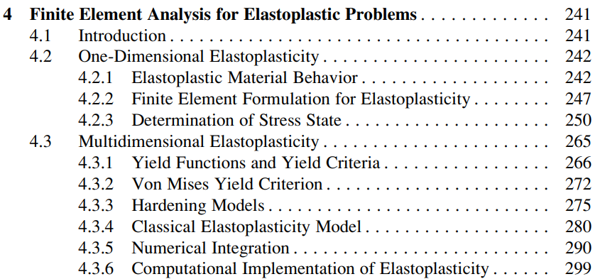

# Tangent Stiffness
선형 탄성 재료에 J2 plasticity model을 사용한다고 하자.

J2 plasticity model에 의해 이론적으로 유도되는 Continuum elastoplastic tangent stiffness는 다음과 같다.
$$ C^{ep} := \frac{\partial \sigma}{\partial \epsilon} = \begin{dcases} C & \gamma = 0 \text{ (elastic)}  \\ \\ C - \frac{4 \mu^2 N \otimes N}{2\mu + H + \frac{2}{3}\frac{\partial K}{\partial \epsilon_e^p}} & \gamma > 0 \text{ (plastic)} \end{dcases} $$

J2 plasticity model을 기반으로한 알고리즘에 의해 유도되는 Algorithmic elastoplastic tangent stiffness는 다음과 같다.
$$ C^{alg} := \frac{\partial \Delta \sigma}{\partial \Delta \epsilon} = \begin{dcases} C & \gamma = 0 \text{ (elastic)}  \\ \\ C - \frac{4 \mu^2 N \otimes N}{2\mu + H + \frac{2}{3}\frac{\partial K}{\partial \epsilon_e^p}} - \frac{4 \mu^2 \Delta \gamma}{\lVert {}^{tr}\eta \rVert}(I_{dev} - N \otimes N) & \gamma > 0 \text{ (plastic)} \end{dcases} $$

# Classical Elastoplasticity Model
Classical elastoplasticity model에서는 다음과 같은 가정을 한다.

## 1.Additive decomposition
Small deformation의 경우 strain을 elastic part와 plastic part의 합으로 표현된다고 가정한다. 
$$ \epsilon = \epsilon^e + \epsilon^p $$

## 2. Linear elastic 
$\sigma$와 $\epsilon^e$가 선형 탄성관계를 만족한다고 가정한다.

그러면 strain energy density function $W$가 존재해서 다음 관계를 만족한다.
$$ \begin{aligned} \sigma(x,t) &= \frac{\partial W(x, \epsilon^e(x,t))}{\partial \epsilon^e} \\&= C \epsilon^e \end{aligned}  $$

이 떄, $C$는 linear elastic stiffness tensor이다.

## 3. Flow rule
비가역적인 plastic strain의 시간에 대한 변화율이 flow rule을 따른다고 가정한다.
$$ \frac{\partial \epsilon^p}{\partial t} = \gamma r(\sigma, q) $$

## 4. Hardening rule
Internal plastic variables의 시간에 대한 변화율이 hardening rule을 따른다고 가정한다.
$$ \frac{\partial q}{\partial t} = \gamma h(\sigma, q) $$

> Reference  
> [Book] (Simo & Hughes) Computational Inelasticity chap 2.2.2

# J2 Plasiticity Model with Hardening
먼저, Internal plastic variable $q$를 다음과 같이 정의한다.
$$ q := \{ \alpha, \epsilon_e^p \} $$

이 떄, $\alpha$는 back stress로 symmetric & deviatoric tensor라고 가정한다. 그리고 $\epsilon_e^p$는 equivalent strain이라고 한다.

다음으로 Yield function $f(\sigma,q)$는 다음과 같이 정의한다.
$$ f(\sigma, \alpha, \epsilon_e^p) := \lVert \eta(\sigma,\alpha) \rVert - \sqrt{\frac{2}{3}}K(\epsilon_e^p) $$

$$ \text{Where, } \eta := \tilde\sigma - \alpha $$

이 떄, 함수 $K$는 isotropic hardening modulus라고 한다.

J2 plasticity model은 classical elastoplasticiy model의 기본 가정을 따르고, flow rule과 hardeng rule을 다음과 같이 정의한다.

## Flow rule
Associative flow rule을 따른다고 가정한다.
$$ r := \frac{\partial f}{\partial \sigma} $$

따라서 Flow rule은 다음과 같다.
$$ \frac{\partial \epsilon^p}{\partial t} = \gamma \frac{\partial f}{\partial \sigma} $$

## Hardening rule
Hardening rule은 다음과 같이 정의한다.
$$ \begin{aligned} \frac{\partial \alpha}{\partial t} &= H(\epsilon_e^p)\frac{\partial \epsilon^p}{\partial t} \\ \frac{\partial \epsilon^p_e}{\partial t} &= \sqrt{\frac{2}{3}}\gamma \end{aligned}  $$

이 떄, 함수 $H$는 kinematic hardening modulus라고 한다.

> Reference  
> [Book] (Simo & Hughes) Computational Inelasticity chap 2.3.2  
> [Book] (Kim) Introduction to Nonlinear Finite Element Analysis 4.3.4

### 명제1
J2 plasticity model에서 다음을 증명하여라.
$$ \eta \text{ is a symmetric and deviatoric tensor.} $$

**Proof**

$\tilde \sigma$는 정의에 의해 symmetric & deviatoric tensor이고 $\alpha$는 hardening rule에 의해 symmetric & deviatoric tensor이다. 

따라서, $\eta$의 정의에 의해 $\eta$ 또한 symmetric & deviatoric tensor이다.

### 명제2
J2 plasticity model에서 다음을 증명하여라.
$$ \frac{\partial f}{\partial \sigma} = N $$

$$ \text{Where, } N := \frac{\eta}{\lVert \eta \rVert} $$

**Proof**

$f$의 정의에 의해 다음이 성립한다.
$$ \begin{aligned} \frac{\partial f}{\partial \sigma} &= \frac{\partial f}{\partial \sigma_{ij}}e_{ij} \\&= \frac{\partial f}{\partial \eta_{kl}} \frac{\partial \eta_{kl}}{\partial \sigma_{ij}} e_{ij} \\&= \frac{1}{\lVert \eta \rVert} \eta_{kl} \bigg(\delta_{ik}\delta_{jl} - \frac{1}{3}\delta_{ij}\delta_{kl} \bigg) e_{ij} \\&= \frac{1}{\lVert \eta \rVert} \bigg( \eta_{ij} - \frac{1}{3}\eta_{kk} \delta_{ij} \bigg) e_{ij} \end{aligned} $$

$\eta$가 symmetric & deviatoric tensor임으로 다음이 성립한다.
$$ \begin{aligned} \frac{\partial f}{\partial \sigma} &= \frac{1}{\lVert \eta \rVert} \bigg( \eta_{ij} - \frac{1}{3}\eta_{kk} \delta_{ij} \bigg) e_{ij} \\&= \frac{1}{\lVert \eta \rVert} \eta_{ij} e_{ij} \\&= \frac{\eta}{\lVert \eta \rVert} \\&= N \quad {_\blacksquare} \end{aligned} $$

#### 명제1.1
J2 plasticity model에서 다음을 증명하여라.
$$ \frac{\partial \epsilon^p}{\partial t} = \gamma N $$

**Proof**

Flow rule과 명제 1에 의해 다음이 성립한다.
$$ \begin{aligned} \frac{\partial \epsilon^p}{\partial t} &= \gamma \frac{\partial f}{\partial \sigma} \\ &= \gamma N \quad {_\blacksquare} \end{aligned}  $$

### 명제3
J2 plasticity model에서 다음을 증명하여라.
$$ N : N = 1 $$

**Proof**

$N$의 정의에 의해 다음이 성립한다.
$$ \begin{aligned} N : N &= \frac{\eta}{\lVert \eta \rVert} : \frac{\eta}{\lVert \eta \rVert} \\&= \frac{1}{\lVert \eta \rVert ^2} \eta:\eta \\&= \frac{1}{\eta : \eta} \eta:\eta \\&= 1 \quad {_\blacksquare} \end{aligned} $$

### 명제4
선형 탄성 재료에 J2 plasticity model을 적용할 때, 다음을 증명하여라.
$$ N:C = 2\mu N $$

$$ \text{Where, } C \text{ is an linear elastic stiffness tensor} $$

**Proof**

$C$는 다음과 같다.
$$ C_{ijkl} = \lambda \delta_{ij}\delta_{kl} + \mu (\delta_{ik} \delta_{jl} + \delta_{il} \delta_{jk}) e_{ijkl}  $$

따라서, $N : C$를 Tensor notation으로 적으면 다음이 성립한다. 
$$ \begin{aligned} N : C &= N_{ij}C_{klmn} e_{ij} : e_{klmn} \\&= N_{ij}C_{klmn} \delta_{ik}\delta_{jl} e_{mn} \\&= N_{ij}C_{ijmn}e_{mn} \\&= N_{ij}(\lambda \delta_{ij}\delta_{mn} + \mu (\delta_{im} \delta_{jn} + \delta_{in} \delta_{jm}))e_{mn} \\&= \lambda N_{ii} \delta_{mn} + \mu(N_{mn} + N_{nm}) \end{aligned} $$

$N$은 symmetric & deviatoric tensor임으로 다음이 성립한다.
$$ \begin{aligned} N : D &= \lambda N_{ii} \delta_{mn} + \mu(N_{mn} + N_{nm}) \\&= 2\mu N_{mn} e_{mn} \\&= 2\mu N \quad {_\blacksquare} \end{aligned} $$

#### 명제4.1
선형 탄성 재료에 J2 plasticity model을 적용할 때, 다음을 증명하여라.
$$ C:N = 2\mu N $$

$$ \text{Where, } C \text{ is an linear elastic stiffness tensor} $$

**Proof**

명제 4와 동일한 방식으로 증명할 수 있다.

### 명제5
선형 탄성 재료에 J2 plasticity model을 적용할 때, 다음을 증명하여라.
$$ \frac{\partial f}{\partial t} = 2\mu N : \frac{\partial \epsilon}{\partial t} - \gamma(2\mu + H + \frac{2}{3}\frac{\partial K}{\partial \epsilon_e^p}) $$

**Proof**

$f$의 정의에 의해 다음이 성립한다.
$$ \begin{aligned} \frac{\partial f}{\partial t} &= \frac{\partial f}{\partial \sigma} \frac{\partial \sigma}{\partial t} + \frac{\partial f}{\partial \alpha} \frac{\partial \alpha}{\partial t} + \frac{\partial f}{\partial \epsilon_e^p} \frac{\partial \epsilon_e^p}{\partial t} \end{aligned} $$

명제 5.1-3에 의해 다음이 성립한다.
$$ \frac{\partial f}{\partial t} = 2\mu N : \frac{\partial \epsilon}{\partial t} - \gamma(2\mu + H + \frac{2}{3}\frac{\partial K}{\partial \epsilon_e^p}) \quad {_\blacksquare} $$

#### 명제 5.1
선형 탄성 재료에 J2 plasticity model을 적용할 때, 다음을 증명하여라.
$$ \frac{\partial f}{\partial \sigma}\frac{\partial \sigma}{\partial t} = 2\mu N : \frac{\partial \epsilon}{\partial t} -2 \mu \gamma   $$

**Proof**

선형 탄성 가정에 의해 다음이 성립한다.
$$ \begin{aligned} \frac{\partial \sigma}{\partial t} &= C :\frac{\partial \epsilon^e}{\partial t} \\&= C : \bigg( \frac{\partial \epsilon}{\partial t} - \frac{\partial \epsilon^p}{\partial t} \bigg) \end{aligned} $$

명제1.1에 의해 다음이 성립한다.
$$ \begin{aligned} \frac{\partial \sigma}{\partial t} &= C : \bigg( \frac{\partial \epsilon}{\partial t} - \frac{\partial \epsilon^p}{\partial t} \bigg) \\&= C : \bigg( \frac{\partial \epsilon}{\partial t} - \gamma N \bigg) \end{aligned} $$

명제4에 의해 다음이 성립한다.
$$ \begin{aligned} \frac{\partial \sigma}{\partial t} &= C : \bigg( \frac{\partial \epsilon}{\partial t} - \gamma N \bigg) \\&= C : \frac{\partial \epsilon}{\partial t} -2 \mu \gamma N \end{aligned} $$

명제1에 의해 다음이 성립한다.
$$ \begin{aligned} \frac{\partial f}{\partial \sigma}\frac{\partial \sigma}{\partial t} &= N : \bigg( C : \frac{\partial \epsilon}{\partial t} -2 \mu \gamma N \bigg) \\&=  N : C : \frac{\partial \epsilon}{\partial t} - 2 \mu \gamma N : N  \end{aligned} $$

명제3,4에 의해 다음이 성립한다.
$$ \begin{aligned} \frac{\partial f}{\partial \sigma}\frac{\partial \sigma}{\partial t} &=  N : C : \frac{\partial \epsilon}{\partial t} - 2 \mu \gamma N : N \\&= 2\mu N : \frac{\partial \epsilon}{\partial t} - 2 \mu \gamma  \end{aligned} $$

#### 명제 5.2
J2 plasticity model에서 다음을 증명하여라.
$$ \frac{\partial f}{\partial \alpha} \frac{\partial \alpha}{\partial t} = -H \gamma$$

**Proof**

$f$의 정의에 의해 다음이 성립한다.
$$ \begin{aligned} \frac{\partial f}{\partial \alpha} &= - \frac{\tilde \sigma - \alpha}{\lVert \tilde \sigma - \alpha \rVert} \\&= -N \end{aligned} $$

Hardening rule에 의해 다음이 성립한다.
$$ \begin{aligned} \frac{\partial f}{\partial \alpha} \frac{\partial \alpha}{\partial t} &= -H N :\frac{\partial \epsilon^p}{\partial t} \\&= - H \gamma N : N \end{aligned} $$

명제 3에 의해 다음이 성립한다.
$$ \begin{aligned} \frac{\partial f}{\partial \alpha} \frac{\partial \alpha}{\partial t} &= - H \gamma N : N \\&= - H \gamma \quad {_\blacksquare} \end{aligned} $$

#### 명제 5.3
J2 plasticity model에서 다음을 증명하여라.
$$ \frac{\partial f}{\partial \epsilon_e^p} \frac{\partial \epsilon_e^p}{\partial t} = -\frac{2}{3} \frac{\partial K}{\partial \epsilon_e^p} \gamma$$

**Proof**

$f$의 정의에 의해 다음이 성립한다.
$$ \frac{\partial f}{\partial \epsilon_e^p} = - \sqrt{\frac{2}{3}} \frac{\partial K}{\partial \epsilon_e^p} $$

Hardening rule에 의해 다음이 성립한다.
$$ \begin{aligned} \frac{\partial \epsilon_e^p}{\partial t} &= \sqrt{\frac{2}{3}} \gamma \end{aligned} $$

따라서 다음이 성립한다.
$$ \frac{\partial f}{\partial \epsilon_e^p} \frac{\partial \epsilon_e^p}{\partial t} = -\frac{2}{3} \frac{\partial K}{\partial \epsilon_e^p} \gamma$$

# Plastic Consistency Requirement
Plastic state에서는 yield surface에 머물러 있어야 함으로 다음이 성립해야 한다.
$$ \begin{aligned} & \frac{\partial f}{\partial t} = 0 \\ \Rightarrow \enspace & 2\mu N : \frac{\partial \epsilon}{\partial t} - \gamma(2\mu + H + \frac{2}{3}\frac{\partial K}{\partial \epsilon_e^p}) = 0 \\ \Rightarrow \enspace & \gamma = \frac{2 \mu N : \frac{\partial \epsilon}{\partial t}}{2\mu + H + \frac{2}{3}\frac{\partial K}{\partial \epsilon_e^p}} \end{aligned}  $$

### 명제
선형 탄성 재료에 J2 plasticity model을 사용한다고 하자.

Plastic state에서 다음을 증명하여라.
$$ \frac{\partial \sigma}{\partial t} = \bigg( C - \frac{4 \mu^2 N \otimes N}{2\mu + H + \frac{2}{3}\frac{\partial K}{\partial \epsilon_e^p}} \bigg) : \frac{\partial \epsilon}{\partial t} $$

**Proof**

선형 탄성 재료에 J2 plasticity model을 사용하였음으로 다음이 성립한다.
$$ \begin{aligned} \frac{\partial \sigma}{\partial t} &= C : \bigg( \frac{\partial \epsilon}{\partial t} - \frac{\partial \epsilon^p}{\partial t} \bigg) \\&= C : \frac{\partial \epsilon}{\partial t} -2 \mu \gamma N \\&= C : \frac{\partial \epsilon}{\partial t} - \frac{4 \mu^2 N : \frac{\partial \epsilon}{\partial t}}{2\mu + H + \frac{2}{3}\frac{\partial K}{\partial \epsilon_e^p}} N\end{aligned} $$

명제 2.1에 의해 다음이 성립한다.
$$ \begin{aligned} \frac{\partial \sigma}{\partial t} &= C : \frac{\partial \epsilon}{\partial t} - \frac{4 \mu^2 N : \frac{\partial \epsilon}{\partial t}}{2\mu + H + \frac{2}{3}\frac{\partial K}{\partial \epsilon_e^p}} N \\&= C : \frac{\partial \epsilon}{\partial t} - \frac{4 \mu^2 N \otimes N}{2\mu + H + \frac{2}{3}\frac{\partial K}{\partial \epsilon_e^p}} : \frac{\partial \epsilon}{\partial t} \\&= \bigg( C - \frac{4 \mu^2 N \otimes N}{2\mu + H + \frac{2}{3}\frac{\partial K}{\partial \epsilon_e^p}} \bigg) : \frac{\partial \epsilon}{\partial t}\end{aligned} $$

#### 명제 2.1
$A,B,C$가 2차 tensor일 떄, 다음을 증명하여라.
$$ (A:B) C = (C \otimes A) : B $$

**Proof**

$$ (A:B) C = A_{kl}B_{kl}C_{ij}e_{ij} $$

$$ (C \otimes A) : B = C_{ij}A_{kl}B_{kl}e_{ij} $$

# Discrete Plastic Consistency Requirement
선형 탄성 재료에 J2 plasticity model을 기반으로한 알고리즘을 사용한다고 하자.

Stress calculation 과정에서 plastic state일 때, yield surface에 머물러 있어야 함으로 다음이 성립해야 한다.
$$ \begin{aligned} \frac{\partial f(\Delta\gamma)}{\partial \Delta \epsilon} &= 0 \\  \end{aligned} $$

$$ \text{Where, } f(\Delta\gamma) = \lVert {}^{tr}\eta \rVert - (H({}^{n+1}\epsilon_e^p) + 2\mu) \Delta\gamma - \sqrt{\frac{2}{3}}K({}^{n+1}\epsilon_e^p)$$

Plastic state일 때, 알고리즘을 통해 계산된 $\Delta \sigma$는 다음과 같다.
$$ \Delta \sigma = C : \Delta \epsilon - 2 \mu \Delta\gamma N $$

### 명제1
선형 탄성 재료에 J2 plasticity model을 사용한다고 할 때, 다음을 증명하여라.
$$ \frac{\partial \lVert {}^{tr}\eta \rVert}{\partial \Delta \epsilon} = 2\mu N $$

**Proof**

${}^{tr}\eta$의 정의에 의해 다음이 성립한다.
$$ \begin{aligned} \frac{\partial {}^{tr}\eta}{\partial \Delta\epsilon} &= \frac{\partial \lVert {}^n \tilde \sigma + 2 \mu \Delta \tilde \epsilon - {}^n\alpha \rVert}{\partial \Delta \tilde \epsilon} \frac{\partial \Delta \tilde \epsilon}{\partial \Delta \epsilon} \\&= 2\mu (\delta_{ik}\delta_{jl} - \frac{1}{3} \delta_{ij}\delta_{kl})e_{ijkl} \end{aligned}  $$

따라서, 다음이 성립한다.
$$ \begin{aligned} \frac{\partial \lVert {}^{tr}\eta \rVert}{\partial \Delta \epsilon} &= \frac{\partial \lVert {}^{tr}\eta \rVert}{\partial {}^{tr}\eta} \frac{\partial {}^{tr}\eta}{\partial \Delta\epsilon} \\&= \end{aligned} $$

### 명제2
선형 탄성 재료에 J2 plasticity model을 사용한다고 할 때, 다음을 증명하여라.
$$ \frac{\partial F({}^{n+1}\epsilon_e^p)}{\partial \Delta \epsilon} = \sqrt{\frac{2}{3}} \frac{\partial F}{\partial \epsilon_e^p} \frac{\partial \Delta \gamma}{\partial \Delta \epsilon} $$

**Proof**

### 명제3
선형 탄성 재료에 J2 plasticity model을 사용한다고 하자.

Plastic state일 때, 알고리즘을 통해 계산된 $\Delta \sigma$가 있다고 할 때, 다음을 증명하여라.
$$ \frac{\partial \Delta \sigma}{ \partial \Delta \epsilon} = C - \frac{4 \mu^2 N \otimes N}{2\mu + H + \frac{2}{3}\frac{\partial K}{\partial \epsilon_e^p}} - \frac{4 \mu^2 \Delta \gamma}{\lVert{}^{tr}\sigma - {}^{tr}\alpha\rVert}(I_{dev} - N \otimes N)   $$

**Proof**

$$ \begin{aligned} \frac{\partial \Delta \sigma}{ \partial \Delta \epsilon} = C - 2\mu N \otimes \frac{\partial \Delta \gamma}{\partial \Delta \epsilon} - 2\mu \Delta \gamma \frac{\partial N}{\partial \Delta \epsilon} \end{aligned} $$

# Tangent Stiffness
선형 탄성 재료에 J2 plasticity model을 사용한다고 하자.

Continuum elastoplastic tangent stiffness는 다음과 같다.
$$ C^{ep} := \frac{\partial \sigma}{\partial \epsilon} = \begin{dcases} C & \gamma = 0 \text{ (elastic)}  \\ \\ C - \frac{4 \mu^2 N \otimes N}{2\mu + H + \frac{2}{3}\frac{\partial K}{\partial \epsilon_e^p}} & \gamma > 0 \text{ (plastic)} \end{dcases} $$

Algorithmic elastoplastic tangent stiffness는 다음과 같다.
$$ C^{alg} := \frac{\partial \Delta \sigma}{\partial \Delta \epsilon} = \begin{dcases} C & \gamma = 0 \text{ (elastic)}  \\ \\  C - \frac{4 \mu^2 N \otimes N}{2\mu + H + \frac{2}{3}\frac{\partial K}{\partial \epsilon_e^p}} - \frac{4 \mu^2 \Delta \gamma}{\lVert{}^{tr}\sigma - {}^{tr}\alpha\rVert}(I_{dev} - N \otimes N) & \gamma > 0 \text{ (plastic)} \end{dcases} $$

두 stiffness tensor를 비교해보면 plastic state일 떄, $C^{alg}$에 세번째 항에서 차이가 나는 것을 알 수 있다.

이 항은 $\Delta \epsilon$에 의해서 $N$의 방향이 변하는 경우를 고려하는 항이다. 따라서 유한한 time step을 고려하는 discrete form에서는 나타나지만 time rate form에는 나타나지 않는다.