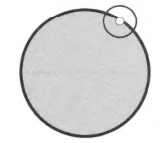

# Open ball
$\mathbf x \in \R^n$과 $0 < r$이 있을 때, 반지름이 $r$인 $\mathbf x$ 주위의 `open ball`은 다음과 같이 정의된 $\R^n$의 부분집합이다.
$$ B_r(\mathbf x) := \{ \mathbf y \in \R^n \enspace | \enspace |\mathbf x - \mathbf y| < r \} $$

여기서 주목할만한 점은, open이기 위해서 반드시 $|\mathbf x - \mathbf y| \neq r$ 이어야 한다는 점이다.

또한 open ball은 1차원에서 개구간(open interval)과 같다.

> 참고  
> [Book] (Hubbard & Hubbard) Vector Calculus, Linear Algebra, and Differential Forms_ A Unified Approach chap 1.5  

# Open set
부분집합 $U \subset \R^n$이 있을 때, 다음을 만족하는 $U$를 $\R^n$에서의 `open set`이라고 한다.
$$ \mathbf x \in U \Rightarrow \exist r > 0 \quad s.t. \quad B_r(\mathbf x) \subset U $$

### 예시1
부분집합 $U \subset \R^2$가 아래 그림과 같이 회색으로 표현된 영역에서 boundary를 뺀 부분이라고 하자.

그러면 그림과 같이, 흰색으로 표현된 $\mathbf x \in U$를 어떻게 잡아도 검은색 실선으로 표현된 $B_r(\mathbf X)$이 존재하게 된다.

즉, open set이 되기 위해서는 기하학적으로 boundary를 하나도 포함하지 않아야 된다는 것을 알 수 있다.

### 예시2
$a,b,c,d \in \R$라 하자.

* $a < b$라 할 때, $(a,b) := \{ x \in \R \enspace | \enspace a < x < b \}$는 open set이다.
* $a < b, \enspace c < d$라 할때, $(a,b) \times (c,d) := \{ (x,y) \in \R^2 \enspace | \enspace a < x < b, \enspace c < y < d \}$는 open set이다.
* $(a,\infty)$는 open set이다.
* $(-\infty, a)$는 open set이다.

> 참고  
> [Book] (Hubbard & Hubbard) Vector Calculus, Linear Algebra, and Differential Forms_ A Unified Approach chap 1.5  

# Closed set
부분집합 $U \subset \R^n$이 있을 때, 다음을 만족하는 $U$를 $\R^n$에서의 `closed set`이라고 한다.
$$ \R^n - U \text { is an open set of } \R^n $$

### 명제1
closed set $U \subset \R^n$와 sequence $i \mapsto \mathbf x_i \in U$가 있다고 하자.

$\lim_{i \rightarrow \infty} \mathbf x_i = \mathbf x_0$일 때 다음을 증명하여라.
$$ \mathbf x_0 \in U $$

**Proof**

$\mathbf x_0 \in \R^n - U$라 하자.

$\R^n - U$는 open set이기 때문에 다음이 성립한다.
$$ \exist r >0 \quad s.t. \quad B_r(\mathbf x_0) \subset (\R^n - U) $$

따라서, 모든 $\mathbf x_m$에 대해서 다음이 성립해야 한다.
$$ r \le  |\mathbf x_m - \mathbf x_0| $$

하지만 수렴의 정의에 의해 다음도 동시에 성립해야 한다.
$$  0 < \epsilon \Rightarrow \exist m \quad s.t. \quad |\mathbf x_m - \mathbf x_0| < \epsilon $$

이는 모순임으로, $\mathbf x_0 \in U$이다. $\quad {_\blacksquare}$

### 예시1
부분집합 $U \subset \R^2$가 아래 그림과 같이 회색으로 표현된 영역과 굵은 선으로 표시된 boundary를 포함한 부분이라고 하자.

그러면 그림과 같이, 흰색으로 표현된 $\mathbf x \in U$를 boundary에 잡게 되면, open set이 되기 위한 $r$이 존재하지 않음을 알 수 있다. 

반면에 $\R^2 - U$의 경우 $U$가 모든 boundary를 포함하고 있기 때문에 반대로 boundary를 포함하지 않게 된다. 따라서 $\R^2 - U$은 open set이 됨을 알 수 있으며, 이로써 $U$는 closed set이 된다.

즉, closed set이 되기 위해서는 기하학적으로 boundary를 전부 포함해야 된다는 것을 알 수 있다.

### 예시2
$a,b \in \R$라 하자.
* $a < b$라 할 때, $[a,b] := \{ x \in \R \enspace | \enspace a \le x \le b \}$는 closed set이다.
* $a < b$라 할 때, $(a,b] := \{ x \in \R \enspace | \enspace a < x \le b \}$는 open set도 closed set도 아니다.
* $[a, \infty]$는 closed set이다.

두 번째, 예시에서 알 수 있듯이, open set이 아니라고 반드시 closed set인것은 아니다. open set도 closed set도 아닌 경우가 있다.

### 예시3
$f(x,y) = \sqrt{\frac{x}{y}}$의 natural domain(함수가 well-defined되는 정의역)은 open set도 closed set도 아니다.

> 참고  
> [Book] (Hubbard & Hubbard) Vector Calculus, Linear Algebra, and Differential Forms_ A Unified Approach chap 1.5  