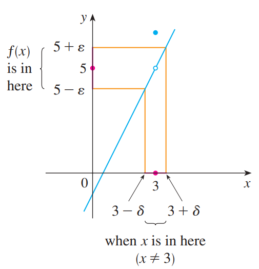
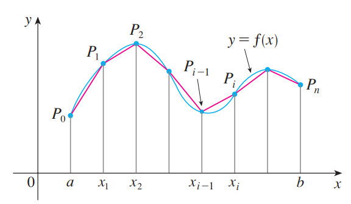

# 극한
함수 $f(x)$가 $a$를 포함하는 개구간에서 정의되어 있다고 하자. $x$가 $a$로 갈 때 $f(x)$의 극한값이 $L$이라는 말은 다음과 동치이다.
$$ \forall \epsilon > 0, \quad \exist  \delta \enspace \text{satisfying} \quad 0 < |x-a| < \delta \Rightarrow |f(x) - L| < \epsilon. $$

이를 간단하게 표현하면 다음과 같다.
$$\lim_{x \rightarrow a} f(x) = L$$

이 때, $x$는 $a$와 항상 $\delta$만큼 떨어져 있기 때문에 극한을 정의하는데 있어 함수 $f$는 $x=a$에서 반드시 정의되어 있을 필요는 없다.

왜 저 두표현이 동치 표현인지 이해하기 위해 구체적인 예시로 살펴보자. 먼저 함수 $f(x)$가 다음과 같이 정의되어 있다고 하자.
$$ f(x) = \begin{cases} 2x-1 & \text{if} \quad x \neq 3 \\ 6 & \text{if} \quad x = 3 \end{cases} $$

함수의 정의로부터 $x \neq 3$일 때, $x$가 $3$으로 다가갈수록 $f(x)$가 5에 가까워진다는 것을 직관적으로 알 수 있다. 하지만 "다가간다"는 표현과 "가까워진다"는 표현이 명확하지 않아 "다가간다는것은 무엇인가?", "$x$가 $3$에 얼마나 다가가야 하는가?", "가까워진다는것은 무엇인가?", "$f(x)$가 $5$에 얼마나 가까워지는가?"에 대한 질문에 대답을 하기가 어렵다. 따라서 모호한 표현을 명확하게 하기 위해 다음과 같은 질문을 해보자.

"$x$와 3의 거리가 얼마 이하여야 $f(x)$와 5의 거리가 $\epsilon$이하가 되는가?"

여기서는 "다가간다", "가까워진다"라는 표현대신 거리라는 표현을 사용하였고 이를 통해 위의 질문을 수학적으로 표현할 수 있으며 위의 질문은 다음과 같은 수학 문제가 된다.

$$ \text{find } \delta \enspace \text{satisfying} \quad 0 < |x-3| < \delta \Rightarrow |f(x) - 5| < \epsilon $$

위 문제의 해가 존재한다면 $x$가 $(3-\delta, 3+\delta)$구간에 들어갈정도로 3에 충분히 가까이 가면 $f(x)$와 5의 오차가 $\epsilon$보다 작아진다는 의미를 갖는다. 즉, "$x$가 $3$에 얼마나 다가가야 하는가?"에 대한 대답이 $\delta$가 되고 "$f(x)$가 $5$에 얼마나 가까워지는가?"에 대한 대답이 $\epsilon$이 된다.  이를 그림으로 표현하면 다음과 같다.

만약 임의의 양수 $\epsilon$에 대해서 위 문제에 해가 존재한다면, $x$가 3에 충분히 가까이만 간다면 $f(x)$는 얼마든지 5에 가까워 질 수 있다는 의미를 갖게되고 이러한 논의를 통해 $x$가 $3$으로 갈 때 $f(x)$의 극한값이 $5$라는 말은 다음과 같이 표현할 수 있다.
$$ \forall \epsilon > 0, \quad \exist \delta \enspace \text{satisfying} \quad 0 < |x-3| < \delta \Rightarrow |f(x) - 5| < \epsilon $$

다음은 실제로 $\delta$가 존재하는지를 확인해보자. $|f(x) - 5| = 2|x -3|$임으로, $|x-3| < 0.5\epsilon$면 $|f(x) - 5| < \epsilon$임을 알 수 있다. 따라서 $\delta$는 $0.5 \epsilon$보다 작은 임의의 양수면 되고 이로써 $\delta$는 존재함을 알 수 있다. $\delta$의 존재성을 보였음으로 $x$가 $3$으로 갈 때 $f(x)$의 극한값은 $5$다.

>참고  
[J. Stewart] Calculus 1.7

# 연속
함수 $f$가 있을 때, $\lim_{x \rightarrow a} f(x) = f(a)$면 $f(x)$는 $x=a$에서 `연속(continuous)`이라고 한다.

연속의 정의는 다음 세가지를 요구한다.
1. $f(a)$가 정의되어 있어야 한다.
2. $\lim_{x \rightarrow a} f(x)$이 존재해야 한다.
3. $\lim_{x \rightarrow a} f(x) = f(a)$

만약 함수 $f$가 연속이라면 $x \rightarrow a$일 때, $f(x) \rightarrow f(a)$임으로 $x$가 조금 변화면 $f(x)$도 조금 변한다.

>참고  
[J. Stewart] Calculus 1.8

## 명제1
함수 $f$와 $g$가 있을 때, 다음을 증명하여라.
$$ \lim_{x \rightarrow a} f(x) = f(a) \land \lim_{x \rightarrow b} g(x) = a \Rightarrow \lim_{x \rightarrow b} f(g(x)) = f(a)$$

**Proof**

$\lim_{x \rightarrow a} f(x) = f(a)$임으로 $\forall \epsilon > 0$에 대해서 다음을 만족하는 $\delta_1$가 존재한다.
$$ \begin{equation} 0 < |x-a| < \delta_1 \Rightarrow |f(x) - f(a)| < \epsilon. \end{equation}  $$

이 때, 식(1)에 $x$ 대신 $g(x)$를 대입하면 $\lim_{g(x) \rightarrow a} f(g(x)) = f(a)$임으로 $\forall \epsilon > 0$에 대해서 다음을 만족하는 $\delta_1$가 존재한다.
$$ \begin{equation} 0 < |g(x)-a| < \delta_1 \Rightarrow |f(g(x)) - f(a)| < \epsilon. \end{equation}  $$

다음으로, $\lim_{x \rightarrow b} g(x) = a$임으로 $\forall \epsilon > 0$에 대해서 다음을 만족하는 $\delta_2$가 존재한다.
$$ \begin{equation} 0 < |x - b| < \delta_2 \Rightarrow |g(x) - a| < \epsilon. \end{equation}  $$

이 때, 식(3)의 $\epsilon = \delta_1$으로 두고 식(3)과 식(2)를 합하면 $\forall \epsilon > 0$에 대해서 다음을 만족하는 $\delta_2$가 존재한다.
$$ 0 < |x - b| < \delta_2 \Rightarrow |f(g(x)) - f(a)| < \epsilon. $$

따라서 $\lim_{x \rightarrow b} f(g(x))  = f(a)$이다. $\quad {_\blacksquare}$

### 따름명제
함수 $f$와 $g$가 있을 때, 다음을 증명하여라.
$$ \lim_{x \rightarrow a} f(x) = f(a) \land \lim_{x \rightarrow b} g(x) = a \Rightarrow \lim_{x \rightarrow b} f(g(x)) = f(\lim_{x \rightarrow b} g(x))$$

**Proof**

가정에 의해 $f(\lim_{x \rightarrow b} g(x)) = f(a)$이고 명제1에 의해 $a \Rightarrow \lim_{x \rightarrow b} f(g(x)) = f(a)$이다.

# 미분

## Chain Rule 보조정리
미분 가능한 함수 $f(x)$가 있을 때, 다음을 증명하여라.
$$ f(x+h) - f(x) = \Big( \epsilon(x,h) + f'(x) \Big)h  $$
$$ \text{Where, } \epsilon \rightarrow 0 \text{ as } h \rightarrow 0 \text{ and } \epsilon \text{ is continuous function}  $$

**Proof**

$\epsilon(x,h)$을 다음과 같이 정의하자.
$$\epsilon = \begin{cases} 0 & \text{if } h = 0 \\\\ \displaystyle \frac{f(x+h) - f(x)}{h} - f'(x) & \text{if } h \neq 0 \end{cases} $$

$h \neq 0$일 때 $\epsilon$을 정리하면 다음과 같다.
$$ f(x+h) - f(x) = \epsilon(x,h)h + f'(x)h $$

그리고 이 식에 $h=0$을 대입해보면 $h=0$일때도 성립하는 식임을 알 수 있다. $\quad {_\blacksquare}$

>참고  
[J. Stewart] Calculus 2.5

## Chain Rule
미분 가능한 두 함수 $f(x),g(x)$가 있을 때, 다음을 증명하여라.
$$ \frac{d(f \circ g)(x)}{dx} = (f' \circ g)(x)g'(x)  $$

$$ \frac{df}{dx} = \frac{df}{dg}\frac{dg}{dx} $$

**Proof**

미분의 정의에의해 다음이 성립한다.
$$ \frac{d}{dx} f(g(x)) = \lim_{h \rightarrow 0} \frac{f(g + \Delta g) - f(g)}{h} $$
$$ \text{Where, } \Delta g = g(x+h) - g(x) $$

$f(g(x))$는 $g$에 대해 미분가능함으로 보조정리에의해 다음이 성립한다.
$$ \begin{equation} f(g + \Delta g) - f(g) = \Big(\epsilon_1 (g, \Delta g ) + f'(g)\Big)\Delta g \end{equation} $$ 

$g(x)$도 $x$에 대해 미분가능함으로 보조정리에의해 다음이 성립한다.
$$ \begin{equation} g(x+h) - g(x) = \epsilon_2(x,h)h + g'(x)h \end{equation} $$ 

식(5)를 식(4)에 대입하고 정리하면 다음과 같다.
$$ \begin{equation} f(g + \Delta g) - f(g) = \Big(\epsilon_1 (g, \Delta g) + f'(g)\Big)(\epsilon_2(x,h) + g'(x))h \end{equation} $$

식(6)을 정의에 대입하고 정리하면 다음과 같다.
$$ \begin{aligned} \frac{d}{dx} f(g(x)) &= \lim_{h \rightarrow 0} (\epsilon_1 (g, \Delta g) + f'(g))(\epsilon_2(x,h) + g'(x)) \\ &= (\epsilon_1 (g, \lim_{h \rightarrow 0} \Delta g) + f'(g))(\lim_{h \rightarrow 0}\epsilon_2(x,h) + g'(x)) (\because \text{연속 명제1}) \\ &= f'(g)g'(x) \quad {_\blacksquare} \end{aligned}   $$

>참고  
[J. Stewart] Calculus 2.5  
[Section 7-2 : Proof Of Various Derivative Properties - Paul's online note](https://tutorial.math.lamar.edu/Classes/CalcI/DerivativeProofs.aspx)  

## 곡선의 길이
일반적인 곡선의 길이는 처음에 다각형으로써 곡선의 길이를 근사하고 다각형을 이루고 있는 직선의 개수에 극한을 취함으로써 정의한다.

곡선 $C$가 위의 그림처럼 $y=f(x)$로 정의되어 있다. 이 때 $C$의 길이는 정의에 의해 다음과 같다.

$$ L_C = \lim_{n \rightarrow \infty} \sum_{i=1}^n |P_{i-1}P_i| $$

### 참고
[J. Stewart] Calculus 8.1

## 매개변수 곡선
$x,y$가 다음과 같이 `매개변수(parameter)` $t$의 함수로 주여졌다고 하자.

$$ x = f(t), \quad y = g(t) $$

`매개변수 곡선(parametric curve)`이란 $t$값에 따라 결정되는 점 $(x,y)$을 좌표평면 상에 표시한 곡선이다.

### 명제1
매개변수 곡선 $r(t) = (x, y) = (f(t), g(t))$가 있을 때, $f \text{ is bijective} \Rightarrow \exist h \quad s.t. \quad y=h(x)$임을 증명하여라.

**proof**

$$\begin{aligned} & f \text{ is bijective} \\ \Leftrightarrow \enspace & \exist f^{-1} \quad s.t. \quad t=f^{-1}(x) \\ \Leftrightarrow \enspace & y= g(f^{-1}(x)) \\ \Leftrightarrow \enspace & y = h(x) \quad \text{where,} \quad h = g \circ f^{-1} \quad {_\blacksquare} \end{aligned} $$

### 참고
[J. Stewart] Calculus 10.1

# Leibniz integral rule

## 참고
[Leibniz integral rule - Wiki](https://en.wikipedia.org/wiki/Leibniz_integral_rule)  
[Reynolds transport theorem - Wiki](https://en.wikipedia.org/wiki/Reynolds_transport_theorem)  
