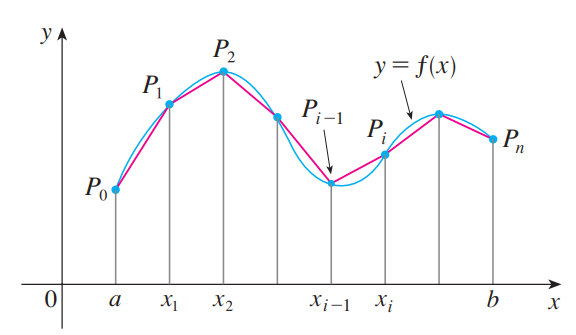

# 곡선의 길이
일반적인 곡선의 길이는 처음에 다각형으로써 곡선의 길이를 근사하고 다각형을 이루고 있는 직선의 개수에 극한을 취함으로써 정의한다.

곡선 $C$가 위의 그림처럼 $y=f(x)$로 정의되어 있다. 이 때 $C$의 길이는 정의에 의해 다음과 같다.

$$ L_C = \lim_{n \rightarrow \infty} \sum_{i=1}^n |P_{i-1}P_i| $$

## 참고
[J. Stewart] Calculus 8.1