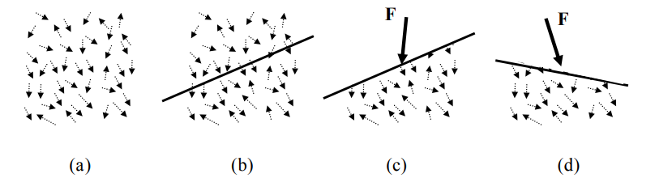
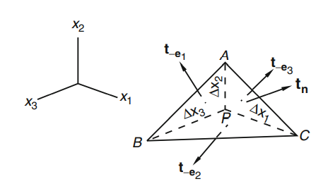

# Stress Vector

물체에 하중이 가해졌을 때, 물체 내부의 분자들에 작용하는 힘을 표시한 (a)와 물체 내부를 가상의 평면으로 나눈 (b)를 보자.

(b)에 나타난 가상의 평면에 작용하는 힘을 정확히 표현하기 위해서는 평면 위의 분자들간의 상호작용을 모두 고려해야 한다. 하지만 많은 분자를 모두 고려하는 일은 매우 어려운 일이다. 

이를 해결하기 위해 Cauchy는 (c)와 같이 물질의 분자구조를 무시하고 가상의 평면에 작용하는 가상의 분자력 $\bf F$를 고안하였다. 이 때, $\bf F$는 평면 위의 분자들에 의해 평면에 작용하는 힘이다.

(d)를 보면 알 수 있듯이 $\bf F$는 어떤 평면을 선택하냐에 따라 달라지며 이는 평면이 달라지면 평면에 힘을 가하는 분자들의 집합이 달라지기 때문이다.

다음으로, (c)와 같이 가정한 상황에서 가상의 평면위의 점 $P$에 작용하는 가상의 분자력에 의해 발생하는 응력을 고려해보자.

위의 그림과 같이 $P$를 포함하는 영역을 $\Delta A$라 하고 $\Delta A$ 위에 작용하는 가상의 분자력을 $\Delta \bf F$라 하자.

이 때, $P$에 작용하는 `응력 벡터(stress vector)` $\bf t_n$은 다음과 같이 정의한다.
$$ \mathbf{t_n} = \lim_{\Delta A \rightarrow 0} \frac{\Delta \bf F}{\Delta A} $$

위에 살펴보았듯이 평면의 선택 즉, $\bf n$에 따라서 $\Delta \bf F$가 달라지기 때문에 $\bf t_n$을 표기할 때 하첨자로 $\bf n$을 사용한다.

# Cauchy's Stress Principle
연속체 역학의 기본 공리인 Cauchy's stress principle은 다음과 같다. 

"주어진 점 $\bf x$와 시간 $t$에서 동일한 접평면을 갖는 모든 면의 응력 벡터는 동일하다."

즉, 주어진 점을 포함하는 가상의 곡면의 형태(곡률)와는 전혀 관계 없이 주어진 점에서 접평면만 동일하다면 응력벡터는 동일하다는 의미로 이를 식으로 나타내면 다음과 같다.
$$ \mathbf {t_n} = \mathbf {t_n}(\mathbf {x, n}, t) $$

또한, 동일한 접평면에서 단위 접선 벡터만 반대방향일 경우 응력 벡터 또한 크기는 같고 방향만 반대이다.
$$ \mathbf {t_n} = -\mathbf {t_{-n}} $$

이는 Newton의 작용 반작용 법칙과 동치이다.

# Stress Tensor
Cauchy's stress principle에 의해 주어진 점 $\bf x$와 시간 $t$에서 $\bf t_n$은 $\bf n$에 의해 결정된다. 

따라서 다음과 같은 함수 $\boldsymbol \sigma$를 생각해보자. 
$$ \begin{equation} \boldsymbol \sigma : \R^3 \rightarrow \R^3 \quad s.t. \quad  n \mapsto \bf t_n \end{equation} $$

이 때, $\boldsymbol \sigma$는 linear map이며 이를 `응력텐서(stress tensor)`라 한다.

### 명제1
다음을 증명하여라.
$$ \boldsymbol \sigma \text{ is an linear map} $$

**Proof**

$\R^3$공간의 임의의 기저 $\beta$가 있다고 하자.

$v_1 = a^i\beta_i, v_2 = b^i\beta_i \in \R^3, \enspace c \in \R$라 하면 명제1.1에 의해 다음이 성립한다.
$$ \begin{aligned} \boldsymbol \sigma (v_1 + cv_2) &= \boldsymbol \sigma ((a_i + cb_i)\beta_i) \\ &= (a_i + cb_i) \boldsymbol \sigma (\beta_i) \\ &= \boldsymbol \sigma (v_1) + c \boldsymbol \sigma (v_2)\end{aligned} $$

따라서, $\boldsymbol{\sigma}$는 linear map이다. $\quad {_\blacksquare}$

#### 명제1.1
$\R^3$공간의 임의의 기저 $\beta$가 있다고 하자.

이 때, 다음을 증명하여라.
$$ \boldsymbol \sigma (n^i \beta_i) = n^i \boldsymbol \sigma (\beta_i)$$

**Proof**

$B$를 $\epsilon$에서 $\beta$으로 변환하는 기저변환 행렬이라고 하면 다음이 성립한다.
$$ \beta_i = B^j_ie_j $$

따라서 명제1.1.1에 의해 다음이 성립한다.
$$ \begin{aligned} \sigma(n^i\beta_i) &= \sigma(n^iB^j_ie_j) \\ &= n^i\sigma(B^j_ie_j) \\ &= n^i \boldsymbol \sigma (\beta_i) \quad {_\blacksquare} \end{aligned} $$

##### 명제1.1.1
$\R^3$공간의 standard basis을 $\epsilon$이라 하자.

이 때, 다음을 증명하여라.
$$ \boldsymbol \sigma (n^i \mathbf e_i) = n^i \boldsymbol \sigma (\mathbf{e}_i)$$

**Proof**

Normal vector가 $\mathbf e_i$와 평행한 면의 면적을 $\Delta A^i$라 하고 $\mathbf n$과 평행한 면의 면적을 $\Delta A^n$이라 하자.

이 때, 운동 방정식은 다음과 같다.
$$ \mathbf{t_{-e_i}} \Delta A^i + \mathbf{t_{n}} \Delta A^n + \mathbf f_b \Delta V = \rho \Delta V \mathbf a $$

이 때, $\Delta x^i \ll 1 \enspace (i = 1, 2, 3)$이라면 $\Delta V \ll \Delta A$이고 $\Delta V$와 관련된 항을 무시할 수 있게 된다.

따라서 운동방정식은 다음과 같이 간단해 진다.
$$ \mathbf t_{- \mathbf e_i} \Delta A^i + \mathbf{t_{n}} \Delta A^n = \mathbf 0 $$

이 때, $\Delta A^i = n^i \Delta A^n$이고 Cauchy's stress principle에 의해 다음이 성립한다.
$$ \mathbf{t_{n}} = n^i\mathbf{t_{e_i}} $$

$\boldsymbol \sigma$의 정의에 의해 다음이 성립한다.
$$ \begin{aligned} \boldsymbol \sigma (n^i \mathbf e_i) &= \mathbf t_n \\ &= n^i \mathbf t_{\mathbf e_i} \\ &= n^i \boldsymbol \sigma (\mathbf{e}_i) \quad {_\blacksquare} \end{aligned} $$

### 명제2
$\R^3$공간의 임의의 기저 $\beta$가 있다고 하자.

$\frak m^\beta_\beta(\boldsymbol\sigma) = \sigma$라 할 떄, 다음을 증명하여라.
$$ \mathbf t_{\beta_i} = \sigma^j_i\beta_j $$

**Proof**

응력 텐서의 정의에 의해 다음이 성립한다.
$$ \frak m^\beta_\beta(\boldsymbol\sigma) = \begin{bmatrix} \frak m_\beta(\boldsymbol{\sigma}(\beta_1)) & \cdots & \frak m_\beta(\boldsymbol{\sigma}(\beta_3)) \end{bmatrix} = \begin{bmatrix} \frak m_\beta(\mathbf t_{\beta_1}) & \cdots & \frak m_\beta(\mathbf t_{\beta_3}) \end{bmatrix} $$

따라서 다음이 성립한다.
$$ \mathbf t_{\beta_i} = \sigma^j_i\beta_j $$

#### 참고
$\sigma^j_i$는 $\beta_i$를 normal vector로 갖는 평면에 작용하는 stress vector의 $\beta_j$방향의 크기다.

### 명제3
주어진 $\mathbf x,t$에서 응력텐서 $\boldsymbol{\sigma}$가 주어졌다고 하자.

$\R^3$공간의 standard basis를 $\epsilon$이라 하고 $\frak m^\epsilon_\epsilon(\boldsymbol\sigma) = \sigma$라 할 떄, 다음을 증명하여라.
$$ \sigma \text{ is symmetric.}$$

**Proof**

$\boldsymbol{\sigma}$가 아래 그림과 같이 정육면체 미소요소에 작용하고 있다고 하자.

중앙점에서 모멘트와 회전관성을 계산하면 다음과 같다.
$$ \begin{aligned} (M_A)_3 &= \sigma^2_1(\Delta x^2)(\Delta x^3)(\Delta x^1 / 2) + (\sigma^2_1 + \Delta \sigma^2_1)(\Delta x^2)(\Delta x^3)(\Delta x^1 / 2) \\ &- \sigma^1_2(\Delta x^1)(\Delta x^3)(\Delta x^2 / 2) - (\sigma^1_2 + \Delta \sigma^1_2)(\Delta x^1)(\Delta x^3)(\Delta x^2 / 2) \\ I_{33} &= \Delta x^1 \Delta x^2 \Delta x^3((\Delta x^1)^2 + (\Delta x^2)^2) \end{aligned} $$

중앙점에서 $x_3$ 방향의 모멘트 평형 방정식을 고려하면 다음과 같다.
$$ \begin{aligned} (M_A)_3 &= I_{33}\alpha \\ \sigma^2_1 + \Delta \sigma^2_1 - \sigma^1_2 - \Delta \sigma^1_2 &= \alpha ((\Delta x^1)^2 + (\Delta x^2)^2) \end{aligned} $$

미소 값을 무시하면 다음과 같다.
$$ \begin{gathered} \sigma^2_1 - \sigma^1_2 = 0 \\ \therefore \sigma^2_1 = \sigma^1_2 \end{gathered} $$

다른 방향으로의 모멘트 평형 방정식을 고려하면 다음의 결론을 얻을 수 있다.
$$ \sigma^3_1 = \sigma^1_3, \sigma^3_2 = \sigma^2_3 $$

따라서 $\sigma$는 대칭이며 6개의 독립적인 응력성분을 갖는다.

> Q. standard basis 말고는 성립안하는 특징인가?

> Reference  
[book] (Lai et al) Introduction to Continuum Mechanics Chapter4.4  

# Principal Direction & Principal Stress
주어진 $\mathbf x,t$에서 응력텐서 $\boldsymbol{\sigma}$가 주어졌다고 하자.

$\boldsymbol{\sigma}$의 eigen vectors를 `principal direction`, eigen values를 `principal stresses`라고 한다.

### 참고1
$\R^3$공간의 standard basis를 $\epsilon$이라 하고 $\frak m^\epsilon_\epsilon(\boldsymbol\sigma) = \sigma$라 하면 $\sigma$는 symmetric matrix이기 때문에 orthonormal한 3개의 eigen vector를 갖는다.

### 참고2
Principal direction을 normal vector로 갖는 평면을 `principal plane`이라고 한다.

principal plane에서는 $\boldsymbol{\sigma}$가 해당하는 principal stress만큼 scalar multiplication으로 작용한다. 다시 말해, principal stress $\sigma_1$를 갖는 principal direction $\mathbf v$를 normal vector로 갖는 평면의 stress vector는 다음과 같다.
$$ \mathbf t_v = \boldsymbol{\sigma}(\mathbf v) = \sigma_1 \mathbf v $$

즉, stress vector가 평면에 수직한 성분만 있으며, 평면에 접선방향 성분인 shearing stress는 존재하지 않는다.

### 명제1
주어진 $\mathbf x,t$에서 응력텐서 $\boldsymbol{\sigma}$가 주어졌다고 하자.

$\sigma_1,\sigma_2,\sigma_3$를 principal stress라고 했을 때, 다음을 증명하여라.
$$ \sigma_1 = \sigma_2 = \sigma_3 = \sigma \Leftrightarrow \text{every basis is a principal directions} $$

**Proof**

주어진 principal direction을 $\beta$라 하고 $\R^3$공간의 임의의 기저를 $\gamma$라 하자.

$\beta \rightarrow \gamma$인 기저변환행렬을 $B$라 하면 다음이 성립한다.
$$ \begin{aligned} \frak m^\gamma_\gamma(\boldsymbol\sigma) &= B^{-1} \frak m^\beta_\beta(\boldsymbol\sigma) B \\ &= \sigma B^{-1} I B \\ &= \sigma I \end{aligned} $$

따라서, $\R^3$공간의 임의의 기저인 $\gamma$도 principal directions가 되며 그에 해당하는 principal stress는 $\sigma$다. $\quad {_\blacksquare}$

### 명제2(Maximum Shearing Stress)
주어진 $\mathbf x,t$에서 응력텐서 $\boldsymbol{\sigma}$가 주어졌다고 하자.

$\lVert \mathbf n \rVert = 1$을 만족하는 $\mathbf n$을 normal vector로 갖는 평면의 stress vector를 $\mathbf t_n$이라 할 때, 평면에 접하는 $\mathbf t_n$의 성분을 shearing stress $\mathbf s_s$라 하자.

$\sigma_1,\sigma_2,\sigma_3$를 principal stress라고 했을 때, 다음을 증명하여라.
$$ \max( \lVert \mathbf s_s \rVert) = \max \Big( \frac{|\sigma_i-\sigma_j|}{2} \Big), \quad i,j = 1,2,3, \enspace i \neq j $$

**Proof**

$\beta$를 $\boldsymbol{\sigma}$의 principal direction이라고 하고 $\mathbf n = n^i\beta_i$라 하면 $\mathbf t_n$는 다음과 같다.
$$ t_n^i = \sigma_in^i, \quad i=1,2,3 $$

평면에 수직한 $\mathbf t_n$의 성분인 normal stress $\mathbf s_n$과 평면에 접하는 $\mathbf t_n$의 성분인 shearing stress $\mathbf s_s$는 다음과 같다.
$$ \begin{aligned} \mathbf s_n &= (\mathbf t_n \cdot n)\mathbf n \\ \mathbf s_s &= \mathbf t_n - \mathbf s_n \\ &= \mathbf t_n - (\mathbf t_n \cdot n)\mathbf n \end{aligned} $$

따라서, 다음이 성립한다.
$$ \begin{aligned} \lVert \mathbf s_s \rVert ^2 &= (\mathbf t_n - (\mathbf t_n \cdot n)\mathbf n) \cdot (\mathbf t_n - (\mathbf t_n \cdot n)\mathbf n) \\ &= \mathbf t_n \cdot \mathbf t_n - \mathbf s_n \cdot \mathbf s_n \\ &= \sum_{i=1}^3 (\sigma_in^i)^2 - \bigg( \sum_{i=1}^3 \sigma_i(n^i)^2 \bigg) \end{aligned} $$

표기를 간단하게 하기 위해 다음과 같이 정의하자.
$$ \sigma_1 = a, \enspace \sigma_2 = b, \enspace \sigma_3 = c \\ n_1 = x, \enspace n_2 = y , \enspace n_3 = z \\ \lVert \mathbf s_s \rVert^2 = f(x,y,z) = a^2x^2 + b^2y^2 + c^2z^2 - (ax^2 + by^2 + cz^2)^2 $$

Maximum shearing stress를 찾는 문제는 다음과 같다.
$$ \text{find }  \text{maximimum } f|_C $$

$$ \text{Where, } C = \{ \mathbf (x,y,z) \in \R^3 \enspace | \enspace x^2 + y^2 + z^2 = 1 \}  $$

이를 풀기 위해 Lagrange Multiplier Method를 사용하자.

Constraint function $c$를 다음과 같이 정의하자.
$$ c(x,y,z) = x^2 + y^2 + z^2 $$

그러면 다음과 같은 4개의 연립방정식을 얻을 수 있다.
$$ \begin{aligned} \frac{\partial f}{\partial x} &= \lambda \frac{\partial c}{\partial x} \\ \frac{\partial f}{\partial y} &= \lambda \frac{\partial c}{\partial y} \\ \frac{\partial f}{\partial z} &= \lambda \frac{\partial c}{\partial z} \\ c &= 1 \end{aligned} $$

위 연립방정식을 만족하는 모든 $(x,y,z)$를 대입하여 그 중 최대 $f$값이 최대 $f|_C$가 된다.

먼저 위 연립방정식을 풀어 쓰면 다음과 같다.
$$ \begin{equation} \begin{aligned} x(a^2 - 2a(ax^2 + by^2 + cz^2)) &= \lambda x \\ y(b^2 - 2b(ax^2 + by^2 + cz^2)) &= \lambda y \\ z(c^2 - 2c(ax^2 + by^2 + cz^2)) &= \lambda z \\ x^2 + y^2 + z^2 &= 1 \end{aligned} \end{equation} $$

주어진 $a,b,c$를 경우에 따라 나눠 연립방정식을 풀어보자.

[$a = b = c$]  
이 때, $f$는 다음과 같이 간단해진다.
$$ \begin{aligned} f &= a^2x^2 + b^2y^2 + c^2z^2 - (ax^2 + by^2 + cz^2)^2 \\ &= a^2(x^2 + y^2 + z^2) - a^2(x^2 + y^2 + z^2)^2 \end{aligned} $$

식(2)는 다음과 같이 간단해진다.
$$ \begin{aligned} -a^2x &= \lambda x \\ -a^2y &= \lambda y \\ -a^2z &= \lambda z \\ x^2 + y^2 + z^2 &= 1 \end{aligned} $$

해는 다음과 같다.
$$\lambda = -a^2, \enspace \forall (x,y,z) \in C$$

따라서, $\forall (x,y,z) \in C$에 대해서 $f$는 다음과 같다.
$$ \begin{aligned} f &= a^2(x^2 + y^2 + z^2) - a^2(x^2 + y^2 + z^2)^2 \\ &= a^2 - a^2 \\ &= 0 \end{aligned} $$

즉, $a=b=c$인 경우에 모든 평면은  principal plane이 되며 shearing stress가 0이다.

[$a = b \neq c$]  
$f$는 다음과 같이 간단해 진다.
$$ \begin{aligned} f &= a^2x^2 + b^2y^2 + c^2z^2 - (ax^2 + by^2 + cz^2)^2 \\ &= a^2 + (c^2-a^2)z^2 - (a + (c-a)z^2)^2 \end{aligned}  $$

식(2)는 다음과 같이 간단해 진다.
$$ \begin{equation} \begin{aligned} x(-a^2 - 2a(c-a)z^2) &= \lambda x \\ y(-a^2 - 2a(c-a)z^2) &= \lambda y \\ z(c^2 -2ac - 2c(c-a)z^2) &= \lambda z \\ x^2 + y^2 + z^2 &= 1 \end{aligned} \end{equation} $$

-[$z = 0$]  
식(3)은 다음과 같이 간단해 진다.
$$ \begin{aligned} -a^2x &= \lambda x \\ -a^2y &= \lambda y \\ x^2 + y^2 &= 1 \end{aligned} $$

해는 다음과 같다.
$$\lambda = -a^2, \enspace \forall(x,y,0) \in C$$

따라서, $\forall (x,y,0) \in C$에서 $f$는 다음과 같다.
$$ \begin{aligned} f &= a^2 + (c^2-a^2)z^2 - (a + (c-a)z^2)^2 \\ &= a^2 - a^2 \\&= 0 \end{aligned} $$

즉, $(1,0,0)$과 $(0,1,0)$을 포함해서 $\forall(x,y,0) \in C$를 normal vector로 갖는 모든 평면은 principal plane이 되며 shearing stress가 0이다.

-[$z \neq 0$]  
--[$x=y=0$]  
식(3)은 다음과 같이 간단해 진다.
$$ \begin{aligned} -c^2z &= \lambda z \\ z^2 &= 1 \end{aligned} $$

해는 다음과 같다.
$$\lambda = -c^2, \enspace z = \pm 1$$

이 때, $(0,0, \pm 1)$에서 $f$는 다음과 같다.
$$ \begin{aligned} f &= a^2 + (c^2-a^2)z^2 - (a + (c-a)z^2)^2 \\ &= c^2 - c^2 \\&= 0 \end{aligned} $$

즉, $(0,0, \pm 1)$을 normal vector로 갖는 모든 평면은 principal plane이 되며 shearing stress가 0이다.

--[$x \neq 0$]  
식(3)에 의해 다음이 성립한다.
$$ \begin{aligned} & \lambda = -a^2 - 2a(c-a)z^2 = c^2 -2ac - 2c(c-a)z^2 \\ \Leftrightarrow \enspace & 2(c-a)^2z^2 = c^2 - 2ac + a^2 \\ \Leftrightarrow \enspace & z^2 = \frac{1}{2} \end{aligned} $$

이 때, $\forall (x, y, \pm \frac{1}{\sqrt{2}}) \in C$에서 $f$는 다음과 같다.
$$ \begin{aligned} f &= a^2 + (c^2-a^2)z^2 - (a + (c-a)z^2)^2 \\ &= \frac{1}{2}(a^2 + c^2) - \frac{1}{4}(a + c)^2 = \frac{(a-c)^2}{4} = \frac{(b-c)^2}{4} \end{aligned} $$

[$a \neq b = c$]  
[$a = b \neq c$]경우와 동일한 과정을 거치면 다음 결과를 얻을 수 있다.

$\forall (0,y,z) \in C$에서 $f$는 다음과 같다.
$$ f=0 $$

$(\pm1,0,0) \in C$에서 $f$는 다음과 같다.
$$ f=0 $$

$\forall (x, y, \pm \frac{1}{\sqrt{2}}) \in C$에서 $f$는 다음과 같다.
$$ f = \frac{(b-a)^2}{4} = \frac{(c-a)^2}{4} $$

[$a = c \neq b$]  
[$a = b \neq c$]경우와 동일한 과정을 거치면 다음 결과를 얻을 수 있다.

$\forall (x,0,z) \in C$에서 $f$는 다음과 같다.
$$ f = 0 $$

$(0,\pm1,0) \in C$에서 $f$는 다음과 같다.
$$ f = 0 $$

$\forall (x, \pm \frac{1}{\sqrt{2}}, z) \in C$에서 $f$는 다음과 같다.
$$ f = \frac{(a-b)^2}{4} = \frac{(c-b)^2}{4} $$

[$a \neq b \neq c$]  
-[$x \neq 0, y \neq 0, z \neq 0$]  
식(2)로 부터 다음이 성립한다.
$$ \lambda = a^2 - 2a(ax^2 + by^2 + cz^2) =  b^2 - 2b(ax^2 + by^2 + cz^2) = c^2 - 2c(ax^2 + by^2 + cz^2) $$

두번째 등식으로 부터 다음이 성립한다.
$$ \begin{aligned} & a^2 - 2a(ax^2 + by^2 + cz^2) =  b^2 - 2b(ax^2 + by^2 + cz^2) \\ \Leftrightarrow \enspace & (a-b)(a+b) = 2(a-b)(ax^2 + by^2 + cz^2) \\ \Leftrightarrow \enspace & a + b = ax^2 + by^2 + cz^2 \end{aligned} $$

동일한 방식으로 다음이 성립한다.
$$ b + c = ax^2 + by^2 + cz^2 \\ a + c = ax^2 + by^2 + cz^2 $$

따라서, $a = b = c$가 되고 가정에 모순이 발생한다.

-[$x = 0$]  
$f$는 다음과 같이 간단해 진다.
$$ \begin{aligned} f &= a^2x^2 + b^2y^2 + c^2z^2 - (ax^2 + by^2 + cz^2)^2 \\ &= b^2y^2 + c^2z^2 - (by^2 + cz^2)^2 \end{aligned} $$

식(2)는 다음과 같이 간단해 진다.
$$ \begin{equation} \begin{aligned} y(b^2 - 2b(by^2 + cz^2)) &= \lambda y \\ z(c^2 - 2c(by^2 + cz^2)) &= \lambda z \\ y^2 + z^2 &= 1 \end{aligned} \end{equation} $$

식(4)로 부터 다음이 성립한다.
$$ \begin{aligned} & \lambda = b^2 - 2b(by^2 + cz^2) = c^2 - 2c(by^2 + cz^2) \\ \Leftrightarrow \enspace & b + c = 2(b + (c-b)z^2) \\ \Leftrightarrow \enspace & z^2 = \frac{1}{2} \end{aligned}  $$

이 때, $(0, \pm\frac{1}{\sqrt 2}, \pm\frac{1}{\sqrt 2})$에서 $f$는 다음과 같다.
$$ \begin{aligned} f &= b^2y^2 + c^2z^2 - (by^2 + cz^2)^2 \\ &= \frac{1}{2}(b^2 + c^2) - \frac{1}{4}(b+c)^2 \\ &= \frac{(b-c)^2}{4} \end{aligned} $$

-[$y = 0$]  
[$x = 0$]의 경우와 동일하게 반복하면 다음 결과를 얻을 수 있다.
$(\pm\frac{1}{\sqrt 2}, 0, \pm\frac{1}{\sqrt 2})$에서 $f$는 다음과 같다.
$$ f = \frac{(a-c)^2}{4} $$

-[$z = 0$]  
[$x = 0$]의 경우와 동일하게 반복하면 다음 결과를 얻을 수 있다.
$(\pm\frac{1}{\sqrt 2}, \pm\frac{1}{\sqrt 2}, 0)$에서 $f$는 다음과 같다.
$$ f = \frac{(a-b)^2}{4} $$

이로써 모든 경우의 수를 따져봤으며 그 결과를 통해 다음이 성립한다.
$$ \begin{aligned} & \max(\sqrt f) = \max( \frac{|a-b|}{2}, \frac{|b-c|}{2}, \frac{|a-c|}{2}) \\ \Rightarrow \enspace & \max( \lVert \mathbf s_s \rVert) = \max \Big( \frac{|\sigma_i-\sigma_j|}{2} \Big), \quad i,j = 1,2,3, \enspace i \neq j \quad {_\blacksquare} \end{aligned} $$

> Reference  
> [book] (J. Stewart) Calculus chap 14.8  
> [book] (Lai et al) Introduction to Continuum Mechanics Chap4.6

# Principal Invariants of Second Rank Tensor
Second rank tensor $\mathbf A: \R^3 \rightarrow \R^3$가 있다고 하자.

$\mathbf A$의 principal invariants $I_{1,2,3}$은 다음과 같다.
$$ \begin{aligned} I_1 &= \text{tr}(\mathbf A) \\ I_2 &= \frac{1}{2}(\text{tr}(\mathbf A)^2 - \text{tr}(\mathbf A\circ \mathbf A)) \\ I_3 &= \det(\mathbf A) \end{aligned}  $$

### 명제1
Second rank tensor $\mathbf A: \R^3 \rightarrow \R^3$가 있다고 하자.

$\R^3$의 임의의 기저를 $\beta$라 할 때, $\frak m_\beta^\beta(\mathbf A) = A$이다.

이 떄, 다음을 증명하여라.
$$ I_2 = A_{11}A_{22} + A_{22}A_{33} + A_{33}A_{11} - A_{12}A_{21} - A_{23}A_{32} - A_{13}A_{31} $$

### 명제2
Second rank tensor $\mathbf A: \R^3 \rightarrow \R^3$가 있다고 하자.

$\mathbf A$의 eigen value를 $\lambda_{1,2,3}$이라 할 떄, 다음을 증명하여라.
$$ \begin{aligned} I_1 &= \lambda_1 + \lambda_2 + \lambda_3 \\ I_2 &= \lambda_1\lambda_2 + \lambda_2\lambda_3 + \lambda_3\lambda_1 \\ I_3 &= \lambda_1\lambda_2\lambda_3 \end{aligned}  $$

### 명제3
Symmetric second rank tensor $\mathbf A: \R^3 \rightarrow \R^3$가 있다고 하자.

$\frac{1}{3}\text{tr}(\mathbf A) = A_m$ 할 때, $\mathbf A' = \mathbf A - A_m id$의 principal invariants를 $I_{1,2,3}$이라 하자.

$\mathbf A$의 eigen value를 $\lambda_{1,2,3}$이라 할 떄, 다음을 증명하여라.
$$ I_2 = -\frac{1}{6} ((\lambda_1 - \lambda_2)^2 + (\lambda_2 -\lambda_3)^2 + (\lambda_3 - \lambda_1)^2)  $$

**Proof**

$\R^3$의 임의의 기저를 $\beta$에 대해 $\frak m_\beta^\beta(\mathbf A) = A$라하고, $A$의 eigen value로 이루어진 diagonal matrix를 $\Lambda$라고 하면 다음이 성립한다.
$$ \begin{aligned} I_2 &= \frac{1}{2}(\text{tr}(\mathbf A')^2 - \text{tr}(\mathbf A' \circ \mathbf A')) \\ &= - \frac{1}{2} \text{tr}(\mathbf A' \circ \mathbf A')) \\&= - \frac{1}{2} \text{tr}((A - A_mI)^2) \\&= - \frac{1}{2} \text{tr}((\Lambda - A_mI)^2) \\&= - \frac{1}{2} (\Lambda - A_mI) : (\Lambda - A_mI) \\&= - \frac{1}{2} ((\lambda_1 - A_m)^2 + (\lambda_2 - A_m)^2 + (\lambda_3 - A_m)^2) \\ &= - \frac{1}{6}((\lambda_1 - \lambda_2)^2 + (\lambda_2 - \lambda_3)^2 + (\lambda_3 - \lambda_1)^2)) \quad {_\blacksquare} \end{aligned} $$

> Reference  
> [Wiki - Invaraints of tensors](https://en.wikipedia.org/wiki/Invariants_of_tensors)