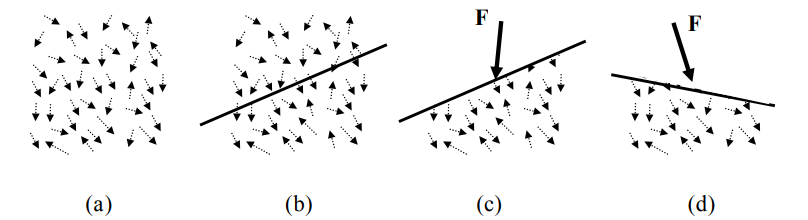
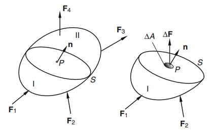
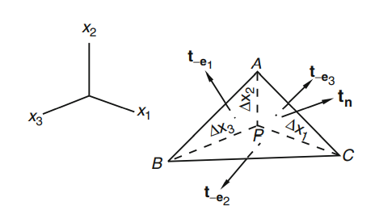
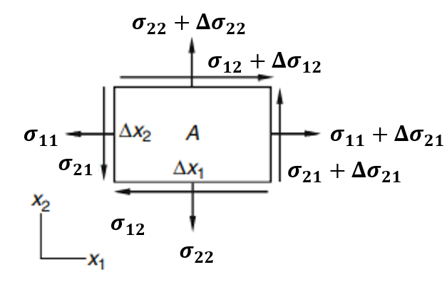

# 연속체 역학
`연속체 역학(continuum mechanics)`이란 19세기 프랑스 수학자 Augustin-Louis Cauchy에 의해 연구되기 시작한 역학의 한 분야로서, 물체를 `이산된 입자(discrete particle)`가 아닌 `연속체(continuum)`라는 수학적 대상으로 모델링 하여 그 거동을 해석하는 역학이다.

연속체 역학에서는 관측좌표에 독립적인 물리적 특성들을 다루기 때문에 좌표계 독립적인 `텐서(tensor)`를 이용하여 물리량들을 서술한다.

## 연속체
연속체란 물체 내에 입자가 균일하게 분포되어 있고, 물체가 차지한 공간을 완전히 꽉 채우고 있어 물체를 더 작은 요소로 무한하게 나누어도 그 각각의 요소가 전체로서의 물질의 성질을 그대로 유지되는 물질을 뜻한다. 

연속체로 가정할 경우 물체가 원자라는 이산적인 입자로 이루어져 있어 불균일한 미시 구조를 갖고 있다는 점을 무시하고 연속적이라고 가정한다. 하지만 원자간 거리(inter-atomic distances)보다 훨씬 큰 길이 단위를 갖는 물체의 경우 연속체 가정은 유효하다. 

연속체 모델을 사용하면 질량 보존, 운동량 보존, 에너지 보종, 구성 방정식등 기본 물리법칙이 적용되는 물체의 거동을 미분 방정식을 이용해 묘사할 수 있다.

# Kinematics of a Continuum
연속체의 내부 한 점의 공간좌표가 시간 $t$에 대한 벡터 함수로 나타난다고 해보자.
$$ \mathbf x = \mathbf p(t) $$

연속체 내부 점의 시간에 대한 변화 즉, 연속체의 운동을 표현하기 위해 연속체 내부의 모든점의 공간좌표를 시간에 대한 벡터 함수로 나타내면 다음과 같다.
$$ \mathbf x_i = \mathbf p_i(t), \quad i=1, \cdots, N, \cdots $$

하지만 연속체 내부에는 무한한 점이 포함되어 있기 때문에 점마다 번호를 부여하여 모든점을 표현하는 방법은 한계가 있다. 이러한 한계를 극복하기 위해 기준 시간 $t_0$때 위치를 가지고 점을 표현하는 `물질좌표(material coordinates)` $\bm X$를 도입한다.
$$ X_i = p_i(\bm X,t_0) $$

물질좌표는 연속체의 한점을 표현하는 방법이며, 물질좌표를 이용해서 각 점의 공간좌표를 벡터 함수로 나타내면 다음과 같다.
$$ \begin{equation} \mathbf x = \mathbf p(\bm X,t) \quad \text{with} \quad \bm X = \mathbf p(\bm X, t_0) \end{equation}  $$

$\bm X = \mathbf p(\bm X, t_0)$항은 초기조건과 같다.

> 참고  
[book] (Lai et al) Introduction to Continuum Mechanics Chapter3.1

## Material description and spatial description
운동하는 연속체의 성질을 나타내는 텐서 $\bf Q$가 있다고 하자. $\bf Q$가 시간에 따라 변한다고 할 때, $\bf Q$를 다음 두가지 관점으로 서술할 수 있다.

### Material description
연속체의 한점을 따라가면서 $\bf Q$의 시간에 대한 변화를 함수로 나타내면 다음과 같다.
$$ \mathbf Q = \mathbf F(\bm X,t) $$

이러한 서술 방법을 물질 관점 혹은 Lagrangian관점이라고 한다.

물질 관점에서 서술하는것은 $\bm X$로 표현되는 연속체의 한 점에 $\bf Q$가 $t$에 따라 변화하는 정도다. 이 때 주목할만한 점은, $t$가 변하면 $\bm X$로 표현되는 점의 위치도 변한다는 점이다. 따라서 물질 관점에서 서술할 경우, 공간상의 특정 위치에서 연속체의 물리량이 어떻게 변하는지에 대한 정보를 직접적으로 제공하지는 않는다.

### Spatial description
공간상의 한 위치를 기준으로 $\bf Q$의 시간에 대한 변화를 함수로 나타내면 다음과 같다.
$$ \begin{equation} \mathbf Q = \mathbf G(\mathbf x, t) \end{equation}  $$

이러한 서술 관점을 공간 관점 혹은 Eulerian관점이라고 한다.

공간 관점에서 서술하는것은 $\bf x$에서 $\bf Q$의 $t$에 대한 변화다. 이 때 주목할만한 점은, $t$가 변하면 $\bf x$에 있는 연속체도 변한다는 점이다. 따라서 공간 관점에서 서술할 경우, 연속체의 한점에 물리량이 어떻게 변하는지에 대한 정보를 직접적으로 제공하지는 않는다.

하지만 식(1)에 의해서 공간 관점으로 서술된 표현을 물질 관점으로 서술된 표현으로 바꿀 수 있다. 식(1)을 식(2)에 대입하면 다음과 같다.
$$ \mathbf Q = \mathbf G( \mathbf p({\bm X}, t), t) = \mathbf F(\bm X, t)$$

## Material Derivative
연속체 한 점의 물리량이 시간에 따라 변하는 정도를 `물질미분(material derivative)`이라고 하며, $D/Dt$로 표현한다.

스칼라 물리량 $\phi$가 다음과 같이 Lagrangian관점과 Eulerian관점으로 표현되었다고 하자.
$$ \phi = f(\bm X, t) = g(\mathbf x, t) $$

$\phi$의 물질미분은 다음과 같다.
$$ \frac{D\phi}{Dt} = \frac{\partial\phi}{\partial t}\bigg\vert_{\bm X = const} = \frac{\partial f}{\partial t} = \frac{\partial g}{\partial x_i} \frac{\partial x_i}{\partial t} + \frac{\partial g}{\partial t} = \nabla g \cdot \mathbf u + \frac{\partial g}{\partial t}   $$

이 때, $\bf x$는 식(1)에 의해 $\bm X, t$의 함수임으로 편미분의 Chain rule을 사용하여 표현해야 한다.

이번에는 벡터 물리량 $\boldsymbol \phi$가 다음과 같이 Lagrangian관점과 Eulerian관점으로 표현되었다고 하자.
$$ \boldsymbol \phi = \mathbf f(\bm X, t) = \mathbf g(\mathbf x, t) $$

$\phi$의 물질미분은 다음과 같다.
$$ \frac{D \boldsymbol \phi}{Dt} = \frac{\partial \boldsymbol \phi}{\partial t}\bigg\vert_{\bm X = const} = \frac{\partial \mathbf f}{\partial t} = \frac{\partial g_i}{\partial x_j} \frac{\partial x_j}{\partial t} + \frac{\partial g_i}{\partial t} = \nabla \mathbf g \cdot \mathbf u + \frac{\partial \mathbf g}{\partial t}   $$

## Displacement 
연속체 한 점의 변위 $\bf d$는 식(1)에 의해 다음과 같다.
$$ \mathbf d(\bm X, t) = \mathbf p(\bm X, t) - \bm X $$

## Kinematic Equation for Rigid Body Motion
### translation
강체 `병진(translation)`운동의 방정식은 다음과 같다.
$$ \mathbf p(\bm X,t) = \bm X + \mathbf c(t) $$

따라서, 변위 벡터는 다음과 같다.
$$ \mathbf d(\bm X,t) = \mathbf c(t) $$

병진운동에서는 위치에 상관없이 모든 점이 동일한 크기와 방향의 변위를 갖는다는 것을 의미한다.

### Rotation
강체 `회전(rotation)`운동의 운동방정식은 다음과 같다.
$$ \mathbf p(\bm X,t) - \mathbf b = \mathbf R(t)(\bm X - \mathbf b) $$
$$ \text{Where, } \mathbf b \text{ is rotational center and } \\ \mathbf R \text { is a proper orthogonal tensor} $$

따라서, 변위 벡터는 다음과 같다.
$$ \mathbf d(\bm X,t) = (\mathbf R - \mathbf I)(\bm X - \mathbf b) $$

$\mathbf x - \mathbf b$는 회전중심에서 현재 위치까지의 벡터를 나타내고, $\bm X - \mathbf b$는 회정중심에서 초기 위치까지의 벡터를 나타낸다. 따라서 운동방정식이 말하는 바는, 회전중심에서 초기 위치까지의 벡터가 회전하여 회전 중심에서 현재 위치까지의 벡터가 되었다는것을 의미한다.

### General motion
강체의 운동방정식은 다음과 같다.
$$ \mathbf p(\bm X,t) - \mathbf b = \mathbf R(t)(\bm X - \mathbf b) + \mathbf c(t) $$

따라서, 변위 벡터는 다음과 같다.
$$ \mathbf d(\bm X,t) = (\mathbf R - \mathbf I)(\bm X - \mathbf b) + \mathbf c $$

#### 명제1
강체의 운동에서 서로 다른 두점의 거리는 변하지 않음을 증명하여라.

#### 명제2
Exa,ple 3.6.2

> 참고  
[book] (Lai et al) Introduction to Continuum Mechanics Chapter3.6

## Deformation
두 점 $\bm X, \bm X + \Delta \bm X$와 변위 $\mathbf d(\bm X, t)$가 있을 때, 시간 $t$에서 두 점의 공간좌표는 다음과 같다.
$$ \mathbf p(\bm X,t) = \bm X + \mathbf d (\mathbf X, t) \\ \mathbf p(\bm X + \Delta \bm X, t) = \bm X + \Delta \bm X + \mathbf d (\bm X + \Delta \bm X, t) $$

두 점의 공간좌표의 차이를 $\Delta \mathbf x$라 하면, $\Delta \mathbf x$는 다음과 같다.
$$ \Delta \mathbf x = \Delta \bm X + \mathbf d (\bm X + \Delta \bm X, t) - \mathbf d (\mathbf X, t) $$

$\Delta \bm X$가 충분히 작아 $\mathbf d (\bm X + \Delta \bm X, t)$를 선형으로 근사할 수 있다면 $\Delta \bf x$는 다음과 같다.
$$ \begin{aligned} & \Delta x_i = \Delta X_i + \frac{\partial d_i}{\partial X_j} \Delta X_j \\ \Leftrightarrow \enspace & \Delta \mathbf x = \Delta \bm X + \nabla \mathbf d \Delta \bm X \\ \Leftrightarrow \enspace & \Delta \mathbf x = \mathbf F \Delta \bm X   \end{aligned} $$
$$ \text{Where, } \mathbf F = \mathbf I + \nabla \mathbf d $$

위 식을 보면, $\nabla \mathbf d \Delta \bm X$이 변형벡터이며, $\mathbf F$에 의해서 $\Delta \bm X$가 $\Delta \mathbf x$로 변환되고 있다. 이 때, 2차 텐서인 $\Delta \mathbf d$를 `displacement gradient`, $\mathbf F$를 `deformation gradient`라고 한다. $\bf F$를 deformation gradient라고 하는 이유는 $\mathbf F = \nabla \mathbf p$이기 때문이다.

### 길이 변화
다음을 만족하는 두 점 $\bm X, \bm X + \Delta \bm X$이 있다.
$$ \Delta X = \Delta S \mathbf n $$

두 점의 변형후 공간좌표는 다음과 같다.
$$ \mathbf x = \bm X + \mathbf d (\mathbf X, t) \\ \mathbf x + \Delta \mathbf x = \bm X + \Delta \bm X + \mathbf d (\bm X + \Delta \bm X, t) $$

$\Delta \bm X$가 충분히 작아 $\mathbf d (\bm X + \Delta \bm X, t)$를 선형으로 근사할 수 있다면 $\Delta \mathbf x$는 다음과 같다.
$$ \Delta \mathbf x = \mathbf F \Delta \bm X $$

두 점이 이루는 요소를 $l_1$이라고 할 때, 변형 후 $l_1$의 길이는 다음과 같다.
$$ \begin{equation} \begin{aligned} \Delta \mathbf x \cdot \Delta \mathbf x &= \Delta \bm X ^T \mathbf F^T \mathbf F \Delta \bm X \\ (\Delta s)^2 &= \Delta \bm X ^T \mathbf C \Delta \bm X \end{aligned} \end{equation} $$
$$ \text{Where, } \Delta s = \lVert \Delta \mathbf x \rVert, \quad  \mathbf C = \mathbf F^T \mathbf F $$

이 떄, $\bf C$를 `Chauchy-Green deformation tensor`라고 한다. $\bf C$를 풀어쓰면 다음과 같다.
$$ \begin{aligned} \mathbf C &= \mathbf {(I + \nabla d)}^T \mathbf {(I + \nabla d)} \\ &= \mathbf {I + (\nabla d)}^T + \nabla \mathbf d + (\nabla \mathbf d)^T \nabla \mathbf d \\ &= \mathbf I + 2 \mathbf E_L  \end{aligned} \\  \text{Where, } \mathbf E_L =\frac{1}{2} \left(\nabla \mathbf d + \nabla \mathbf d^T + \nabla \mathbf d^T \nabla \mathbf d \right)$$

이 때, $\mathbf E_L$을 `Lagrange finite strain tensor`라고 한다. 만약 $\bf d$가 모든 점에서 동일한 강체 운동일 경우 $\nabla \bf d = 0$이고 $\mathbf E_L = 0$임으로 $\bf C = I$가 된다. 즉, $\mathbf E_L$은 변위의 변화율로 구성되어 있으며 변형률을 표현하는 값이 된다. 

식(3)을 다시 정리하면 다음과 같다.
$$ \begin{equation} \begin{aligned} (\Delta s)^2 &= \Delta \bm X^T \Delta \bm X + 2\mathbf \Delta \bm X^T \mathbf E_L \Delta \bm X \\ &= (\Delta S)^2 + 2 (\Delta S)^2 (\mathbf n^T \mathbf E_L  \mathbf n) \end{aligned} \end{equation}  $$

### 각도 변화
다음을 만족하는 세 점 $\bm X, \bm X + \Delta \bm X, \bm X + \Delta \bm Y$이 있다.
$$ \Delta \bm X = \Delta S_1 \mathbf n \\ \Delta \bm Y = \Delta S_2 \mathbf m \\ \mathbf n \cdot \mathbf m = 0  $$

세 점의 변형후 공간좌표는 다음과 같다.
$$ \mathbf x = \bm X + \mathbf d (\mathbf X, t) \\ \mathbf x + \Delta \mathbf x = \bm X + \Delta \bm X + \mathbf d (\bm X + \Delta \bm X, t) 
\\ \mathbf x + \Delta \mathbf y = \bm X + \Delta \bm Y + \mathbf d (\bm X + \Delta \bm Y, t) $$

$\Delta \bm X, \Delta \bm Y$가 충분히 작아 $\mathbf d (\bm X + \Delta \bm X, t), \mathbf d (\bm X + \Delta \bm Y, t)$를 선형으로 근사할 수 있다면
$\Delta \mathbf x, \Delta \mathbf y$는 다음과 같다.
$$ \Delta \mathbf x = \mathbf F \Delta \bm X \\ \Delta \mathbf y = \mathbf F \Delta \bm Y $$

두 점 $\bm X, \bm X + \Delta \bm X$이 이루는 요소를 $l_1$ 두 점 $\bm X, \bm X + \Delta \bm Y$가 이루는 요소를 $l_2$라 할 떄, 변형후 $l_1$과 $l_2$가 이루는 각도는 다음과 같다.
$$ \begin{equation} \begin{aligned} & \Delta \mathbf x \cdot \Delta \mathbf y = \Delta \bm X^T \Delta \bm Y + 2\mathbf \Delta \bm X^T \mathbf E_L \Delta \bm Y \\ \Leftrightarrow \enspace & \Delta s_1 \Delta s_2 \cos \theta = \Delta S_1 \Delta S_2 (\mathbf n^T \mathbf E_L \mathbf m)  \\ \Leftrightarrow \enspace & \cos \theta = \frac{\Delta S_1 \Delta S_2}{\Delta s_1 \Delta s_2 } (\mathbf n^T \mathbf E_L \mathbf m) \end{aligned} \end{equation} $$
$$ \text{Where, } \lVert \Delta \mathbf x \rVert_2 = \Delta s_1, \quad \lVert \Delta \mathbf y \rVert_2 = \Delta s_2 $$

### Infinitesimal Deformation
변형률이 매우 작다고 가정하면 변형률을 나타내는 $\nabla \mathbf d$가 매우 작은 값을 갖는다. $\nabla \mathbf d$가 충분히 작아 고차항인 $(\nabla \mathbf d)^T \nabla \mathbf d$를 무시할 수 있다면 $\bf C$는 다음과 같이 간단해진다.
$$ \mathbf C = \mathbf I + 2 \mathbf E $$
$$ \text{Where, } \mathbf E = \frac{1}{2}(\nabla \mathbf d + \nabla \mathbf d^T ) $$

이 때, $\bf E$를 `infinitesimal strain tensor`라고 하고 $\nabla \bf d$의 symmetric part이다.

#### 길이 변화
변형률이 매우 작기 때문에 $\Delta s \approx \Delta S$라 하고 식(4)를 변형하면 다음과 같다.
$$ \begin{aligned} & (\Delta s)^2 = (\Delta S)^2 + 2 (\Delta S)^2 (\mathbf n^T \mathbf E  \mathbf n) \\ \Leftrightarrow \enspace & \frac{(\Delta s)^2 - (\Delta S)^2}{2 (\Delta S)^2} = \mathbf n^T \mathbf E  \mathbf n \\ \Leftrightarrow \enspace & \frac{\Delta s - \Delta S}{\Delta S} = \mathbf n^T \mathbf E  \mathbf n \end{aligned} $$

$\bf n$방향에 있던 요소의 단위 길이당 변화율은 $\mathbf n^T \mathbf E  \mathbf n$으로 나타나며 $\bf e_1,e_2,e_3$방향의 단위 길이당 변화율은 각 각 $E_{11},E_{22},E_{33}$로 나타난다. 따라서 $\bf E$의 대각성분에 있는 값들을 `normal strain`이라고 한다.

#### 각도 변화
변형률이 매우 작기 때문에 $\Delta s_i \approx \Delta S_i, \enspace \theta = \frac{\pi}{2} - \gamma, \enspace \gamma \approx 0$로 두고 식(5)를 변형하면 다음과 같다.
$$ \begin{aligned} & \cos \left( \frac{\pi}{2} - \gamma \right) = 2 (\mathbf n^T \mathbf E \mathbf m) \\ \Leftrightarrow \enspace & \sin\gamma = 2 (\mathbf n^T \mathbf E \mathbf m) \\ \Leftrightarrow \enspace & \gamma = 2 (\mathbf n^T \mathbf E \mathbf m) \end{aligned}  $$

$\bf n, m$이 기본 기저일 경우 $\gamma = 2E_{ij}$가 되며 이는 기존에 $x_i, x_j$방향에 있던 두요소가 이루던 각도의 변화량이다.

#### 주변형률
$\bf E$가 symmetric이기 때문에 diagonalizable하며 서로 수직인 고유벡터들을 갖는다. 각각의 고유벡터들을 principal directions라고 하며 고유값들을 `주변형률(principal strain)`이라 한다. 기하학적으로, 고유벡터 방향에 있는 요소들은 변형 후에도 방향은 변하지 않으며 고유값만큼 크기만 달라진다.

주변형률은 모든 방향중에 최대 최소 normal strain값을 갖으며 다음의 특성 방정식으로 주변형률을 구할 수 있다.
$$ \lambda^3 - I_1 \lambda^2 + I_2 \lambda - I_3 = 0 $$
$$ \begin{gathered} \text{Where, } I_1 = E_{ii} \\ I_2 = \bigg|\begin{matrix} E_{11} & E_{12} \\ E_{21} & E_{22} \end{matrix} \bigg| + \bigg|\begin{matrix} E_{22} & E_{23} \\ E_{32} & E_{33} \end{matrix} \bigg| + \bigg|\begin{matrix} E_{11} & E_{13} \\ E_{31} & E_{33} \end{matrix} \bigg| \\ I_3 = |E_{ij}| \end{gathered}  $$

이 떄, $I_{1,2,3}$는 $\bf E$의 `불변량(invariant)`라고 하며 기저 변환을 하더라도 변하지 않는 값들이다.

여기서 $I_1$을 `dilatation`이라고 하며 기하학적으로 단위 부피당 변화량을 의미한다. 왜냐하면 주변형률 방향으로 길이가 각 각 $\Delta S_{1,2,3}$인 직육면체가 있다고 하면 변형후에는 각 각 $\Delta S_{1,2,3}(1 + E_{11,22,33})$의 길이를 갖는 직육면체가 된다. 따라서 부피 변화량은 다음과 같다.
$$ \begin{aligned} \Delta V &= \Delta S_1 \Delta S_2 \Delta S_3 (1 + E_{11})(1 + E_{22})(1 + E_{33}) - \Delta S_1 \Delta S_2 \Delta S_3 \\ &= \Delta S_1 \Delta S_2 \Delta S_3(E_{11} + E_{22} + E_{33}) + \text{high-order term} \end{aligned} $$

변형률이 매우 작아 $\bf E$가 매우 작고, 따라서 $\bf E$의 고차항을 무시할 수 있다면 부피 변화률은 다음과 같다.
$$ \frac{\Delta V}{V} = E_{11} + E_{22} + E_{33} $$

> 참고  
> [book] (Lai et al) Introduction to Continuum Mechanics Chapter 3.7-10

### The infinitesimal rotation tensor
$\nabla \mathbf d$를 symmetric part $\mathbf E$와 antisymmetric part $\boldsymbol{\Omega}$로 나누면 $\Delta \mathbf x$는 다음과 같다.
$$ \Delta \mathbf x = \Delta \bm X + (\mathbf E + \boldsymbol{\Omega})\Delta \bm X $$

이 때, $\boldsymbol{\Omega} = (\nabla \mathbf d)^A$는 `infinitesimal rotation tensor`라고 한다.

위의 식으로 부터 $(\mathbf E + \boldsymbol{\Omega})\Delta \bm X$항만큼 $\Delta \bm X$가 바뀌는것을 알 수 있다.

$\mathbf t^A$가 $\boldsymbol{\Omega}$의 dual vector라고하면 다음이 성립한다.
$$ \mathbf t^A \times \Delta \bm X = \boldsymbol{\Omega} \Delta \bm X $$
$$ \text{Where, } \mathbf t^A = \Omega_{32} \mathbf e_1 + \Omega_{13} \mathbf e_2 + \Omega_{21} \mathbf e_3 $$

> 참고  
> [book] (Lai et al) Introduction to Continuum Mechanics Chapter 3.11

### Time rate of change of a material element
두 점 $\bm X, \bm X + \Delta \bm X$으로 이루어진 요소를 생각해보자. 시간 $t$일 때, 요소는 다음과 같이 표현된다.
$$ \begin{equation} \Delta \mathbf x = \mathbf x(\bm X + \Delta \bm X, t) - \mathbf x(\bm X, t) \end{equation}  $$

식(6)을 물질미분하여 얻는 속도가 Lagrangian관점에서는 함수 $\mathbf u$로 Eulerian관점에서는 함수 $\mathbf v$로 표현된다고 하자.
$$ \begin{aligned} \frac{D}{Dt} \Delta \mathbf x &= \frac{D}{Dt} \mathbf x(\bm X + \Delta \bm X, t) - \frac{D}{Dt} \mathbf x(\bm X, t) \\ &= \mathbf u(\bm X + \Delta \bm X,t) - \mathbf u(\bm X,t) \\ &= \mathbf v(\mathbf x + \Delta \mathbf x,t) - \mathbf v(\mathbf x,t) \end{aligned} $$

$\Delta \bm X, \Delta \mathbf x$가 충분히 작아 $\mathbf u(\bm X + \Delta \bm X,t), \mathbf v(\mathbf x + \Delta \mathbf x,t)$를 선형으로 근사할 수 있다고 가정하면 다음과 같다.
$$ \begin{equation} \frac{D}{Dt} \Delta \mathbf x = (\nabla_{\bm X} \mathbf u) \Delta \bm X = (\nabla_{\mathbf x} \mathbf v) \Delta \mathbf x \end{equation} $$

이후로 $\nabla \mathbf v$는 Eulerian관점에서 서술한 $\nabla_{\mathbf x} \mathbf v$을 나타낸다.

> 참고  
> [book] (Lai et al) Introduction to Continuum Mechanics Chapter 3.12

#### The rate of deformation tensor
$\nabla \mathbf v$를 다음과 같이 symmetric part와 antisymmetric part로 나눠보자.
$$ \nabla \mathbf v = \mathbf D + \mathbf W $$
$$ \text{Where, } \mathbf D = \frac{1}{2} \left( \nabla \mathbf v + (\nabla \mathbf v)^T \right), \quad \mathbf W = \frac{1}{2} \left( \nabla \mathbf v - (\nabla \mathbf v)^T \right)  $$

이 때, $\mathbf D$를 `rate of deformation tensor` $\mathbf W$를 `spin tensor`라고 한다.

$\mathbf W$는 antisymmetric tensor임으로 dual vector를 $\boldsymbol \omega$라 할 때, 다음을 만족한다.
$$ \begin{equation} \mathbf W \Delta \mathbf x = \boldsymbol \omega \times \Delta \mathbf x \end{equation}  $$

식(8)을 보면 $\mathbf W$의 단위가 $/s$임으로, $\mathbf W$은 $\Delta \mathbf x$를 각속도 $\boldsymbol{\omega}$로 회전 시킨다는것을 알 수 있다.

요소의 시간변화율을 $\mathbf D, \mathbf W$로 나타내면 다음과 같다.
$$ \frac{D}{Dt} \Delta \mathbf x = \mathbf D \Delta \mathbf x + \mathbf W \Delta \mathbf x = \mathbf D \Delta \mathbf x + \boldsymbol \omega \times \Delta \mathbf x$$

> 참고  
> [book] (Lai et al) Introduction to Continuum Mechanics Chapter 3.14 + Prob. 3.48

#### 길이의 시간 변화율
두 점 $\bm X, \bm X + \Delta \bm X$으로 이루어진 요소가 시간 $t$에서 다음과 같이 표현된다고 하자.
$$ \Delta \mathbf x = \Delta S \mathbf n $$

요소 길이의 시간 변화율을 보기 위해 다음과 같은 과정을 거치자.
$$ \begin{equation} \begin{aligned} & \Delta \mathbf x \cdot \Delta \mathbf x = (\Delta S)^2 \\  \rightarrow \enspace & 2 \Delta \mathbf x \cdot \frac{D}{Dt} \Delta \mathbf x = 2 \Delta S \frac{D}{Dt}\Delta S \end{aligned} \end{equation} $$

왼쪽항을 rate of deformation tensor와 spin tensor를 이용해서 표현하면 다음과 같다.
$$ \Delta \mathbf x \cdot \frac{D}{Dt} \Delta \mathbf x = \Delta \mathbf x \cdot \nabla \mathbf v \Delta \mathbf x = \Delta \mathbf x \cdot (\mathbf D + \mathbf W) \Delta \mathbf x = \Delta \mathbf x \cdot \mathbf D \Delta \mathbf x = (\Delta S)^2 \mathbf n \cdot \mathbf{Dn} $$

식(8)에 대입해서 정리하면 다음과 같다.
$$ \begin{equation} \frac{1}{\Delta S} \frac{D}{Dt} \Delta S = \mathbf n \cdot \mathbf{Dn} \end{equation} $$

$\mathbf n$방향에 있는 요소의 단위 길이당 길이의 시간변화율은 $\mathbf n \cdot \mathbf{Dn}$으로 표현되며 $D_{ii}$은 $\mathbf e_i$방향에 있는 요소의 단위 길이당 길이의 시간변화율을 나타낸다.

식(10)에서 알 수 있듯이, $\mathbf W$는 $\Delta \mathbf x$로 표현되는 요소의 길이 변화에 영향을 주지 않는다.

#### 각도의 시간 변화율
이번에는 두 요소가 이루는 각도가 시간에 따라 어떻게 변화하는지 알아보자.

시간 $t$에서 요소가 다음과 같이 표현된다고 하자.
$$ \begin{gathered} \Delta \mathbf x = \Delta S_1 \mathbf n \\ \Delta \mathbf y = \Delta S_2 \mathbf m \end{gathered}  $$

따라서 다음이 성립한다.
$$ \begin{equation} \Delta \mathbf x \cdot \Delta \mathbf y  = \Delta S_1 \Delta S_2 \cos \theta \end{equation} $$

시간에 따른 변화율을 보기 위해 식(9)를 물질미분하면 다음과 같다.
$$ \begin{equation} \begin{aligned} \frac{D}{Dt} \Delta \mathbf x \cdot \Delta \mathbf y + \Delta \mathbf x \cdot \frac{D}{Dt} \Delta \mathbf y  = & \left( \frac{D}{Dt} \Delta S_1 \right) \Delta S_2 \cos \theta + \Delta S_1 \left( \frac{D}{Dt} \Delta S_2 \right) \cos \theta \\  &- \Delta S_1 \Delta S_2 \sin \theta \frac{D\theta}{Dt} \end{aligned} \end{equation} $$

식 (10)의 왼쪽항을 rate of deformation tensor와 spin tensor를 이용해서 표현하면 다음과 같다.
$$ \begin{aligned} & \frac{D}{Dt} \Delta \mathbf x \cdot \Delta \mathbf y + \Delta \mathbf x \cdot \frac{D}{Dt} \Delta \mathbf y \\ = \enspace & \nabla \mathbf v \Delta \mathbf x \cdot \Delta \mathbf y + \Delta \mathbf x \cdot \nabla \mathbf v \Delta \mathbf y \\ = \enspace & \Delta \mathbf x \cdot ( \nabla \mathbf v + (\nabla \mathbf v)^T) \Delta \mathbf y \\ = \enspace & 2 \Delta \mathbf x \cdot \mathbf D \Delta \mathbf y \\ = \enspace & 2 \Delta S_1 \Delta S_2 \mathbf n \cdot \mathbf D \mathbf m  \end{aligned} $$

식 (10)에 다시 대입해서 정리하면 다음과 같다.
$$ 2 \mathbf n \cdot \mathbf D \mathbf m =  \left( \frac{1}{\Delta S_1} \frac{D}{Dt} \Delta S_1 + \frac{1}{\Delta S_2} \frac{D}{Dt} \Delta S_2 \right) \cos \theta - \sin \theta \frac{D\theta}{Dt}$$

만약 $\mathbf {n = e_i,m = e_j}$이었다면, $2D_{ij}$는 $\mathbf e_i$방향과 $\mathbf e_j$방향에 있는 요소사이의 각도의 감소율을 나타낸다.

#### 부피의 시간 변화율
$$ \frac{1}{\Delta V} \frac{D}{Dt} \Delta V = \text{div} (\mathbf v) $$

# 오일러-코시 응력 법칙
연속체로 가정한 물체 내부의 모든점에 작용하는 `체적력(body force)`과 `표면력(surface force)`을 고려해보자.

체적력은 중력, 전자기력과 같이 단위 부피당 작용하는 힘을 의미하며 표면력은 실제 표면이나 물체를 두부분으로 나누는 가상의 표면에 작용하는 힘이다.

먼저 표면력을 생각해보자. 

## 응력 벡터

물체에 하중이 가해졌을 때, 물체 내부의 분자들에 작용하는 힘을 표시한 (a)와 물체 내부를 가상의 평면으로 나눈 (b)를 보자.

(b)에 나타난 가상의 평면에 작용하는 힘을 정확히 표현하기 위해서는 평면 위의 분자들간의 상호작용을 모두 고려해야 한다. 하지만 많은 분자를 모두 고려하는 일은 매우 어려운 일이다. 

이를 해결하기 위해 Cauchy는 (c)와 같이 물질의 분자구조를 무시하고 가상의 평면에 작용하는 가상의 분자력 $\bf F$를 고안하였다. 이 때, $\bf F$는 평면 위의 분자들에 의해 평면에 작용하는 힘이다.

(d)를 보면 알 수 있듯이 $\bf F$는 어떤 평면을 선택하냐에 따라 달라지며 이는 평면이 달라지면 평면에 힘을 가하는 분자들의 집합이 달라지기 때문이다.

다음으로, (c)와 같이 가정한 상황에서 가상의 평면위의 점 $P$에 작용하는 가상의 분자력에 의해 발생하는 응력을 고려해보자.

위의 그림과 같이 $P$를 포함하는 영역을 $\Delta A$라 하고 $\Delta A$ 위에 작용하는 가상의 분자력을 $\Delta \bf F$라 하자.

이 때, $P$에 작용하는 `응력 벡터(stress vector)` $\bf t_n$은 다음과 같이 정의한다.
$$ \mathbf{t_n} = \lim_{\Delta A \rightarrow 0} \frac{\Delta \bf F}{\Delta A} $$

위에 살펴보았듯이 평면의 선택 즉, $\bf n$에 따라서 $\Delta \bf F$가 달라지기 때문에 $\bf t_n$을 표기할 때 하첨자로 $\bf n$을 사용한다.

## Cauchy's stress principle
연속체 역학의 기본 공리인 Cauchy's stress principle은 다음과 같다. 

"주어진 점 $\bf x$와 시간 $t$에서 동일한 접평면을 갖는 모든 면의 응력 벡터는 동일하다."

즉, 주어진 점을 포함하는 가상의 곡면의 형태(곡률)와는 전혀 관계 없이 주어진 점에서 접평면만 동일하다면 응력벡터는 동일하다는 의미로 이를 식으로 나타내면 다음과 같다.
$$ \mathbf {t_n} = \mathbf {t_n}(\mathbf {x, n}, t) $$

또한, 동일한 접평면에서 단위 접선 벡터만 반대방향일 경우 응력 벡터 또한 크기는 같고 방향만 반대이다.
$$ \mathbf {t_n} = -\mathbf {t_{-n}} $$

이는 Newton의 작용 반작용 법칙과 동치이다.

## 응력 텐서
Cauchy's stress principle에 의해 주어진 점 $\bf x$와 시간 $t$에서 $\bf t_n$은 $\bf n$에 의해 결정된다는 것을 알 수 있다. 따라서 다음을 만족하는 임의의 변환 $\boldsymbol \sigma$가 있다고 가정하자.

$$ \begin{equation} \bf t_n = \boldsymbol \sigma n \end{equation} $$

다음으로 $\boldsymbol \sigma$가 선형임을 증명해보자.

위의 그림의 힘 평형 방정식은 다음과 같다.
$$ \begin{equation} \mathbf{t_{-e_i}} \Delta A_i + \mathbf{t_{n}} \Delta A_n + \mathbf f_b \Delta V = \rho \Delta V \mathbf a \end{equation} $$

이 때, $\Delta x_i \ll 1 \enspace (i = 1, 2, 3)$이라면 $\Delta V \ll \Delta A$이고 $\Delta V$와 관련된 항을 무시할 수 있게 된다.

따라서 식(2)는 다음과 같이 간단해 진다.
$$ \begin{equation} \mathbf t_{- \mathbf e_i} \Delta A_i + \mathbf{t_{n}} \Delta A_n = \mathbf 0 \end{equation} $$

이 때, $\Delta A_i = n_i \Delta A_n$이고 Cauchy's stress principle에 의해 식(3)은 다음과 같다.
$$ \begin{equation} \mathbf{t_{n}} = \mathbf{t_{e_i}}n_i \end{equation} $$

식(4)에 식(1)을 대입하고 풀어 쓰면 다음과 같다.
$$ \begin{equation} \boldsymbol \sigma (n_i \mathbf e_i) = n_i \boldsymbol \sigma \mathbf{e}_i \end{equation} $$

따라서 $\boldsymbol \sigma$는 선형변환이며 이를 `응력텐서(stress tensor)`라 한다.

### 응력텐서의 성분
응력 텐서의 정의에 의해 다음 관계가 성립한다.
$$ \mathbf t_{\mathbf e_i} =  \boldsymbol \sigma \mathbf e_i = \sigma_{ji}\mathbf e_j $$

즉, $\sigma_{ji}$는 $i$평면에서 $j$방향으로 작용하는 응력의 크기다.

### 응력텐서의 대칭성

응력텐서 $\boldsymbol{\sigma}$가 작용하는 정육면체 미소요소의 $A$점에서 $x_3$ 방향의 모멘트 평형 방정식을 고려해보자.
$$ \begin{equation} (M_A)_3 = I_{33}\alpha \end{equation} $$

정중앙의 점 $A$에서 모멘트와 회전관성을 계산하면 다음과 같다.
$$ \begin{equation} \begin{aligned} (M_A)_3 &= \sigma_{21}(\Delta x_2)(\Delta x_3)(\Delta x_1 / 2) + (\sigma_{21} + \Delta \sigma_{21})(\Delta x_2)(\Delta x_3)(\Delta x_1 / 2) \\ &- \sigma_{12}(\Delta x_1)(\Delta x_3)(\Delta x_2 / 2) - (\sigma_{12} + \Delta \sigma_{12})(\Delta x_1)(\Delta x_3)(\Delta x_2 / 2) \\ I_{33} &= \Delta x_1 \Delta x_2 \Delta x_3((\Delta x_1)^2 + (\Delta x_2)^2) \end{aligned} \end{equation}  $$

식(6)에 식 (7)을 대입하고 미소 값의 고차항은 무시하고  정리하면 다음과 같다.
$$ \begin{gathered} (\sigma_{21} - \sigma_{12})\Delta x_1 \Delta x_2 \Delta x_3 = 0 \\ \therefore \sigma_{21} = \sigma_{12} \end{gathered} $$

다른 방향으로의 모멘트 평형 방정식을 고려하면 다음의 결론을 얻을 수 있다.
$$ \sigma_{31} = \sigma_{13}, \sigma_{32} = \sigma_{23} $$

따라서 $\boldsymbol{\sigma}$는 대칭이며 6개의 독립적인 응력성분을 갖는다.

> 참고  
[book] (Lai et al) Introduction to Continuum Mechanics Chapter4.4  

# 운동 방정식(운동역학)
Euler의 운동방정식은 다음과 같다.
$$ \int_{\partial\Omega} \mathbf {f}_s \thinspace dS + \int_\Omega \rho \mathbf f_b \thinspace dV = \frac{d}{dt} \int_\Omega \rho\mathbf u \thinspace dV $$

Euler-Cauchy stress principle을 적용하면 다음과 같다.
$$ \int_{\partial\Omega} \boldsymbol{\sigma}\mathbf n \thinspace dS + \int_\Omega \rho \mathbf f_b \thinspace dV = \frac{d}{dt} \int_\Omega \rho\mathbf u \thinspace dV $$

$\boldsymbol{\sigma}$가 충분히 매끄러울 때, divergence theorem과 Reynolds transport theorem을 적용하면 다음과 같다.
$$ \begin{equation} \int_\Omega \mathrm{div}(\boldsymbol\sigma) + \rho \mathbf f_b \thinspace dV = \int_\Omega \frac{\partial}{\partial t}(\rho \mathbf u) + \mathrm{div}(\rho \mathbf{u \otimes u}) \thinspace dV \end{equation} $$

식(8)은 임의의 $\Omega$에 대해서 성립함으로 다음이 성립한다.
$$\mathrm{div}(\boldsymbol\sigma) + \rho \mathbf f_b = \frac{\partial}{\partial t}(\rho \mathbf u) + \mathrm{div}(\rho \mathbf{u \otimes u}) $$

## non-conservative form

>참고  
[Navier-Stokes equation - Wiki](https://en.wikipedia.org/wiki/Navier%E2%80%93Stokes_equations)  
[Navier-Stokes Equation - Nasa](https://www.grc.nasa.gov/www/k-12/airplane/nseqs.html)  
[Derivation of the Navier-Stokes equation - Wiki](https://en.wikipedia.org/wiki/Derivation_of_the_Navier%E2%80%93Stokes_equations)  

# 평형 방정식
정적 평형 상태의 물체에 Euler의 운동방정식은 다음과 같다.
$$ \int_{\partial\Omega} \mathbf {f}_s \thinspace dS + \int_\Omega \rho \mathbf f_b \thinspace dV = 0 $$

Euler-Cauchy stress principle을 적용하면 다음과 같다.
$$ \int_{\partial\Omega} \boldsymbol{\sigma}\mathbf n \thinspace dS + \int_\Omega \rho \mathbf f_b \thinspace dV = 0 $$

$\boldsymbol{\sigma}$가 충분히 매끄러울 때, divergence theorem을 적용하면 다음과 같다.
$$ \begin{equation} \int_\Omega \mathrm{div}(\boldsymbol\sigma) + \rho \mathbf f_b \thinspace dV = 0 \end{equation} $$

식(9)는 임의의 $\Omega$에 대해서 성립함으로 다음이 성립한다.
$$\mathrm{div}(\boldsymbol\sigma) + \rho \mathbf f_b = 0 $$

# 유체
## 구성방정식

> 참고  
[Navier-Stokes equation - Wiki](https://en.wikipedia.org/wiki/Navier%E2%80%93Stokes_equations)  

# 선형 탄성 재료
## 구성방정식
선형 탄성 재료의 응력-변형률 관계식인 `구성 방정식(constitutive equation)`을 생각해보자.

$$ \begin{equation} \boldsymbol \sigma = G(\boldsymbol \epsilon) \end{equation} $$

이 때, $\boldsymbol \sigma$는 Cauchy stress tensor이고 $\boldsymbol{\epsilon}$은 infinitesimal strain tensor이다.

식(10)을 간단히 하기위해 다음과 같은 상황을 가정하자.
1. 하중과 변형은 선형관계이다
2. 하중은 정적으로 가해진다.
3. 하중을 제거하면 변형이 완전히 사라진다.
4. 변형이 매우 작다

위의 가정과 같은 상황에서 식(10)을 다음과 같이 표현할 수 있다.
$$ \begin{equation} \sigma_{ij} = C_{ijkl}\epsilon_{kl} \end{equation} $$

이 때, $\bf C$는 4차 텐서로 선형관계의 계수들을 표현한 텐서이며 이를 `탄성 텐서(elasticity tensor)`라고 한다.

## 변형률 에너지 함수
응력에 의한 일률 $P_s$가 내부 변형률 에너지 함수 $U$의 시간에 대한 변화량과 같다고 하자.
$$ P_s = \frac{dU}{dt} $$

이 때, $P_s = \sigma_{ij}D_{ij}$임으로 다음 관계식이 만족한다.(Ex 5.2.1.)
$$ \begin{equation} \sigma_{ij} = \frac{\partial U}{\partial \epsilon_{ij}} \end{equation}  $$

구성 방정식을 대입하면 다음과 같다.
$$ C_{ijkl}\epsilon_{kl} = \frac{\partial U}{\partial \epsilon_{ij}} $$

## 탄성 텐서
$\bf C$는 4차 텐서임으로 81개의 독립변수를 갖는다. 하지만 $\boldsymbol{\epsilon}$과 $\boldsymbol{\sigma}$의 대칭성 및 $U$에 의해 독립변수 개수가 줄어들게 된다.

먼저 $\boldsymbol{\epsilon}$의 대칭성을 고려해보자. $\epsilon_{kl} = \epsilon_{lk}$임으로 $C_{ijkl}\epsilon_{kl} + C_{ijlk}\epsilon_{lk} = (C_{ijkl} + C_{ijlk} ) \epsilon_{kl}$이다(여기서는 summation notation이 사용된게 아니다). 따라서 두개의 독립변수 $C_{ijkl}, C_{ijlk}$가 있는 것이 아닌 하나의 독립변수 $( C_{ijkl} + C_{ijlk} )$가 있게 된다. $( C_{ijkl} + C_{ijlk} )$를 하나의 독립변수로 두는 것은 $C_{ijkl} = C_{ijlk}$로 두는것과 동치이다. 이를 통해 $\bf C$의 독립변수 숫자는 $3 \times 3 \times 6 = 54$로 줄어들게 된다.

다음으로 $\boldsymbol{\sigma}$의 대칭성을 고려해보자. $\sigma_{ij} = \sigma_{ji} \Rightarrow C_{ijkl}\epsilon_{kl} = C_{jikl}\epsilon_{kl}$임으로 $C_{ijkl} = C_{jikl}$이 된다. 따라서 $\bf C$의 독립변수 숫자는 $6 \times 6 = 36$로 줄어들게 된다.

마지막으로 $U$를 고려하자. $\sigma_{ij} = C_{ijkl}\epsilon_{kl}$임으로 다음이 성립한다.
$$ C_{ijkl} = \frac{\partial\sigma_{ij}}{\partial \epsilon_{kl}} $$

식(12)를 대입하면 다음과 같다.
$$ C_{ijkl} = \frac{\partial^2 U}{\partial \epsilon_{ij}\partial \epsilon_{kl}} = \frac{\partial\sigma_{kl}}{\partial \epsilon_{ij}} = C_{klij} $$

따라서 $\bf C$의 독립변수 숫자는 21개로 줄어들게 된다.

>참고  
[book] (Lai et al) Introduction to Continuum Mechanics Chap5.2

# 등방성 선형 탄성 재료
특정 방향에 따라 물성치가 변하지 않을 때 `등방성(isotropic)`재료라고 한다. 따라서 등방성 재료의 경우 모든 방향에서 응력-변형률 관계가 같아야 한다. 그리고 모든 방향에서 응력-변형률 관계가 같으려면 $\bf C$가 isotropic tensor여야 한다.

fourth-order isotropic tensor의 경우 다음과 같은 general form을 갖는다.
$$ C_{ijkl} = \lambda \delta_{ij}\delta_{kl} + \alpha \delta_{ik}\delta_{jl} + \beta \delta_{il}\delta_{jk} $$

식(11)에 대입하여 응력-변형률 관계식을 정리하면 다음과 같다.
$$ \begin{equation} \sigma_{ij} = \lambda \epsilon_{kk}\delta_{ij} + 2\mu\epsilon_{ij} \end{equation} $$
$$ \text{Where, } 2\mu = \alpha + \beta$$

식(13)으로부터 다음 관계식을 얻을 수 있다.
$$ \sigma_{ii} = (3\lambda + 2\mu) \epsilon_{kk} $$

따라서 식(13)을 정리하여 변형률-응력 관계식을 정리하면 다음과 같다.
$$ \begin{equation} \epsilon_{ij} = \frac{1}{2\mu} \left( \sigma_{ij} - \frac{\lambda}{3\lambda + 2\mu}\sigma_{kk}\delta_{ij} \right) \end{equation} $$

응력-변형률 관계식과 변형률-응력 관계식에서 공통적으로 나타나는 두 개의 재료 상수 $\lambda$, $\mu$를 `Lame's constant`라고 한다. $\epsilon$이 무차원 변수임으로 Lame's constant는 응력과 동일한 차원을 갖는다.

> 참고  
[book] (Lai et al) Introduction to Continuum Mechanics Chap5.3

## unaxial stress state
만약 하나의 normal stree만 존재하고 나머지는 전부 0인 경우를 `uniaxial stress state`라고 한다. 

uniaxial stress state 일 때, 변형률-응력 관계식은 다음과 같다.
$$ \begin{equation} \begin{gathered} \epsilon_{11} = \frac{1}{2\mu} \left( \sigma_{11} - \frac{\lambda}{3\lambda + 2\mu}\sigma_{11} \right) = \frac{\lambda + \mu}{\mu (3\lambda + 2\mu)}\sigma_{11} \\ \epsilon_{22} = \epsilon_{33} = \frac{1}{2\mu} \left( 0 - \frac{\lambda}{3\lambda + 2\mu}\sigma_{11} \right) = -\frac{\lambda}{2\mu (3\lambda + 2\mu)}\sigma_{11} = - \frac{\lambda}{2(\lambda + \mu)}\epsilon_{11} \\ \epsilon_{12} = \epsilon_{13} = \epsilon_{23} = 0 \end{gathered} \end{equation} $$

식(15)로부터 다음과 같은 새로운 재료상수를 얻을 수 있다.
$$ \begin{equation} \begin{gathered} E_Y = \frac{\sigma_{11}}{\epsilon_{11}} =  \frac{\mu (3\lambda + 2\mu)}{\lambda + \mu} \\ \nu = -\frac{\epsilon_{22}}{\epsilon_{11}} = -\frac{\epsilon_{33}}{\epsilon_{11}} = \frac{\lambda}{2(\lambda + \mu)} \end{gathered} \end{equation}   $$

이 때, $E_Y$를 `탄성계수(Young's modulus, modulus of elasticity)`라고 하며 $\nu$를 `프와송비(Poisson's ratio)`라고 한다.

식(16)에서 $\lambda$를 제거하면 $\mu(E_Y,\nu)$을 얻을 수 있고 이를 통해 $\lambda(E_Y,\nu)$도 얻을 수 있다.
$$ \begin{equation} \begin{aligned} \mu &= \frac{E_Y}{2(1+\nu)} \\ \lambda &= \frac{\nu}{(1-2\nu)(1+\nu)}E_Y \end{aligned} \end{equation} $$

식(16)에서 얻은 재료 상수를 식(13)에 대입하고 식(17)의 관계를 이용하면 다음과 같은 변형률-응력 관계식을 얻는다.
$$ \begin{equation} \begin{aligned} \epsilon_{ij} &= \frac{1}{2\mu} \left( \sigma_{ij} - \frac{\lambda}{3\lambda + 2\mu}\sigma_{kk}\delta_{ij} \right) \\ &=  \frac{\lambda + \mu}{\mu(3\lambda + 2\mu)} \left( \frac{3\lambda + 2\mu}{2(\lambda + \mu)} \sigma_{ij} - \frac{\lambda}{2(\lambda + \mu)}\sigma_{kk}\delta_{ij} \right) \\ &= \frac{1}{E_Y} \left( \frac{E_Y}{2\mu} \sigma_{ij} - \nu\sigma_{kk}\delta_{ij} \right) \\ &= \frac{1}{E_Y} \Big( (1 + \nu) \sigma_{ij} - \nu\sigma_{kk}\delta_{ij} \Big) \end{aligned} \end{equation} $$

> 참고  
[book] (Lai et al) Introduction to Continuum Mechanics Chap5.4

## Simple shear stress state
하나의 shear stress만 존재하고 나머지는 전부 0인 경우를 `simple shear stress state`라고 한다.

simple shear stress state일 때 Lame's constant로 나타낸 변형률-응력 관계식은 다음과 같다.
$$ \begin{equation} \epsilon_{12} = \frac{\sigma_{12}}{2\mu} \end{equation} $$

식(19)로부터 다음과 같은 재료상수를 얻을 수 있다.
$$ G = \frac{\sigma_{12}}{2\epsilon_{12}} = \mu $$

이 때, $G$를 `전단계수(shear modulus)`라고 한다.

다음으로, simple shear stress state일 때 $E_Y, \nu$로 나타낸 변형률-응력 관계식은 다음과 같다.
$$ \epsilon_{12} = \frac{1+\nu}{E_Y}\sigma_{12} $$

따라서 다음이 성립한다.
$$ G =\frac{\sigma_{12}}{2\epsilon_{12}} = \frac{E_Y}{2(1 + \nu)} $$

> 참고  
[book] (Lai et al) Introduction to Continuum Mechanics Chap5.4

## hydrostatic state of stress
$\boldsymbol{\sigma} = p \bf I$인 경우를 `hydrostatic state of stress`라고 한다.

hydrostatic state of stress일 때 Lame's constant로 나타낸 변형률-응력 관계식은 다음과 같다.
$$ \begin{equation} \epsilon_{ii} = \frac{3p}{3\lambda + 2\mu} \end{equation} $$

식(20)으로부터 다음과 같은 재료상수를 얻을 수 있다.
$$ k = \frac{p}{\epsilon_{ii}} = \lambda + \frac{2}{3}\mu $$

이 떄, $k$를 `체적계수(bulk modulus)`라고 한다.

다음으로, hydrostatic state of stress일 때 $E_Y, \nu$로 나타낸 변형률-응력 관계식은 다음과 같다.
$$ \epsilon_{ii} = \frac{3(1 - 2\nu)}{E_Y}p $$

따라서 다음이 성립한다.
$$ k =\frac{p}{\epsilon_{ii}} = \frac{E_Y}{3(1 - 2\nu)} $$

## 상수간의 관계식
지금까지 본 재료상수들 $\lambda, \mu, E_Y, \nu, G, \kappa$중 등방성 선형 탄성재료에서는 2개만 독립이다. 즉, 두개의 재료상수로 나머지 재료 상수들을 전부 표현할 수 있고 그 관계식은 [book] (Lai et al) Introduction to Continuum Mechanics의 Table 5.1(212p)에 잘 정리되어 있다.

> 참고  
[book] (Lai et al) Introduction to Continuum Mechanics Chap5.4

# 비등방성 선형탄성 재료
방향에 따라 물성치가 변할 경우 이를 `비등방성(anistropic)`재료라고 한다.
