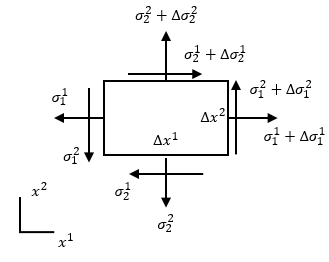

# 연속체 역학
`연속체 역학(continuum mechanics)`이란 19세기 프랑스 수학자 Augustin-Louis Cauchy에 의해 연구되기 시작한 역학의 한 분야로서, 물체를 `이산된 입자(discrete particle)`가 아닌 `연속체(continuum)`라는 수학적 대상으로 모델링 하여 그 거동을 해석하는 역학이다.

연속체 역학에서는 관측좌표에 독립적인 물리적 특성들을 다루기 때문에 좌표계 독립적인 `텐서(tensor)`를 이용하여 물리량들을 서술한다.

연속체 역학에서는 강체가 아닌 물체를 다룬다. 

## 연속체
연속체란 물체 내에 입자가 균일하게 분포되어 있고, 물체가 차지한 공간을 완전히 꽉 채우고 있어 물체를 더 작은 요소로 무한하게 나누어도 그 각각의 요소가 전체로서의 물질의 성질을 그대로 유지되는 물질을 뜻한다. 

연속체로 가정할 경우 물체가 원자라는 이산적인 입자로 이루어져 있어 불균일한 미시 구조를 갖고 있다는 점을 무시하고 연속적이라고 가정한다. 하지만 원자간 거리(inter-atomic distances)보다 훨씬 큰 길이 단위를 갖는 물체의 경우 연속체 가정은 유효하다. 

연속체 모델을 사용하면 질량 보존, 운동량 보존, 에너지 보종, 구성 방정식등 기본 물리법칙이 적용되는 물체의 거동을 미분 방정식을 이용해 묘사할 수 있다.

## 연속체에 작용하는 힘
고전역학에서는 물체의 운동은 체적력 $\mathbf{F}_V$와 표면력 $\mathbf {F}_S$에 의해서 발생한다. 따라서 물체에 작용하는 총 힘은 다음과 같다.
$$ \mathcal {F} = \mathbf {F}_V + \mathbf{F}_S $$

### 표면력

Surface forces or contact forces, expressed as force per unit area, can act either on the bounding surface of the body, as a result of mechanical contact with other bodies, or on imaginary internal surfaces that bound portions of the body, as a result of the mechanical interaction between the parts of the body to either side of the surface (Euler-Cauchy's stress principle). 

When a body is acted upon by external contact forces, internal contact forces are then transmitted from point to point inside the body to balance their action, according to Newton's third law of motion of conservation of linear momentum and angular momentum (for continuous bodies these laws are called the Euler's equations of motion). 

The internal contact forces are related to the body's deformation through constitutive equations. The internal contact forces may be mathematically described by how they relate to the motion of the body, independent of the body's material makeup.

The distribution of internal contact forces throughout the volume of the body is assumed to be continuous. Therefore, there exists a contact force density or Cauchy traction field $\mathbf {T} (\mathbf {n} ,\mathbf {x} ,t)$ that represents this distribution in a particular configuration of the body at a given time $t$. It is not a vector field because it depends not only on the position $\mathbf {x}$ of a particular material point, but also on the local orientation of the surface element as defined by its normal vector $\mathbf {n}$.

Any differential area $dS$ with normal vector $\mathbf {n}$  of a given internal surface area $S$ bounding a portion of the body, experiences a contact force $d\mathbf {F} _{C}$ arising from the contact between both portions of the body on each side of $S$, and it is given by

$$ d\mathbf {F} _{C} = \mathbf {T} ^{(\mathbf {n} )}\,dS $$
where $\mathbf {T} ^{(\mathbf {n} )}$ is the surface traction. The surface traction is a frame-indifferent vector (see Euler-Cauchy's stress principle).

## 참고
[Continuum mechanics - Wiki](https://en.wikipedia.org/wiki/Continuum_mechanics)  
[Cauchy stress tensor - wiki](https://en.wikipedia.org/wiki/Cauchy_stress_tensor)

https://en.wikipedia.org/wiki/Constitutive_equation  
https://en.wikipedia.org/wiki/Euler%27s_laws_of_motion  
https://en.wikipedia.org/wiki/Divergence_theorem  

# 오일러 운동 법칙
`오일러의 운동 법칙(Euler's law of motion)`이란 

## 제 1 오일러 운동 법칙
관성좌표계에서 연속체의 선형 운동량 $\mathbf p_l$의 시간에 대한 변화량은 작용한 외력 $\bf f$와 같다.

$$ \begin{gathered} \frac{d \mathbf p_l}{dt} = \mathbf f \\\\ \frac{d}{dt} \int _{\Omega} \rho \mathbf u \; dV = \int _{\Omega} \mathbf f_b \; dV + \int _{\partial\Omega} \mathbf f_s \; dS \end{gathered}  $$

이 때, $\mathbf f_b$는 단위 부피당 체적력, $\mathbf f_s$는 단위 면적당 표면력이다.

## 제 2 오일러 운동 법칙
관성좌표계에서 연속체의 각 운동량 $\mathbf p_a$의 시간에 대한 변화량은 작용한 토크 $\boldsymbol \tau$와 같다.

$$ \begin{gathered} \frac{d \mathbf p_a}{dt} = \boldsymbol \tau \\\\ \frac{d}{dt} \int _{\Omega} \mathbf x \times \rho \mathbf u \; dV = \int _{\Omega} \mathbf x \times \mathbf f_b \; dV + \int _{\partial\Omega}  \mathbf x \times \mathbf f_s \; dS \end{gathered} $$

The distribution of internal forces in a deformable body are not necessarily equal throughout, i.e. the stresses vary from one point to the next. This variation of internal forces throughout the body is governed by Newton's second law of motion of conservation of linear momentum and angular momentum, which for their simplest use are applied to a mass particle but are extended in continuum mechanics to a body of continuously distributed mass. 

## 참고
[Euler's law of motion - Wiki](https://en.wikipedia.org/wiki/Euler%27s_laws_of_motion)

# Kinematics of a Continuum
연속체의 내부 한 점의 공간좌표가 시간 $t$에 대한 벡터 함수로 나타난다고 해보자.
$$ \mathbf x = \mathbf f(t) $$

연속체 내부 점의 시간에 대한 변화 즉, 연속체의 운동을 표현하기 위해 연속체 내부의 모든점의 공간좌표를 벡터 함수로 나타내면 다음과 같다.
$$ \mathbf x_n = \mathbf f_n(t), \quad n=1, \cdots, N, \cdots $$

하지만 연속체 내부에는 무한한 점이 포함되어 있기 때문에 점마다 번호를 부여하여 모든점을 표현하는 방법은 한계가 있다. 이러한 한계를 극복하기 위해 기준 시간 $t_0$때 위치를 가지고 점을 표현하는 `물질좌표(material coordinates)` $\bm X$를 도입한다.
$$ X_i = x_i(\bm X,t_0) $$

물질좌표는 연속체의 한점을 표현하는 방법이며, 물질좌표를 이용해서 각 점의 공간좌표을 벡터 함수로 나타내면 다음과 같다.
$$ \begin{equation} \mathbf x = \mathbf f(\bm X,t) \quad \text{with} \quad \bm X = \mathbf x(\bm X, t_0) \end{equation}  $$

$\bm X = \mathbf x(\bm X, t_0)$항은 초기조건과 같다.

> 참고  
[book] (Lai et al) Introduction to Continuum Mechanics Chapter3.1

## Material description and spatial description
운동하는 연속체의 성질을 나타내는 임의 차원의 텐서 $\bf Q$가 있다고 하자. $\bf Q$가 시간에 따라 변한다고 할 때, $\bf Q$를 다음 두가지 관점으로 서술할 수 있다.

### Material description
연속체의 한점을 따라가면서 $\bf Q$의 시간에 대한 변화를 함수로 나타내면 다음과 같다.
$$ \mathbf Q = \mathbf F(\bm X,t) $$

이러한 서술 방법을 물체 관점 혹은 Lagrangean 관점이라고 한다.

물질 관점에서 서술하는것은 $\bm X$로 표현되는 연속체의 한 점에 $\bf Q$가 $t$에 따라 변화하는 정도다. 이 때 주목할만한 점은, $t$가 변하면 $\bm X$의 위치도 변한다는 점이다. 따라서 물질 관점에서 서술할 경우, 공간상의 특정 위치에서 연속체의 물리량이 어떻게 변하는지에 대한 정보를 직접적으로 제공하지는 않는다.

하지만 식(1)과 식(2)에 의해서 공간 관점으로 서술된 표현을 물질 관점으로 서술된 표현으로 바꿀 수 있다.

식(1)을 식(2)에 대입하면 다음과 같다.
$$ \mathbf Q = \mathbf G(f({\bm X}, t), t) = \mathbf F(\bm X, t)$$

### Spatial description
이번에는 공간상의 한 위치를 기준으로 $\bf Q$의 시간에 대한 변화를 함수로 나타내면 다음과 같다.
$$ \begin{equation} \mathbf Q = \mathbf G(\mathbf x, t) \end{equation}  $$

이러한 서술 관점을 공간 관점 혹은 Eulerian 관점이라고 한다.

공간 관점에서 서술하는것은 $\bf x$에서 $\bf Q$의 $t$에 대한 변화다. 이 때 주목할만한 점은, $t$가 변하면 $\bf x$를 지나는 연속체상의 점도 변한다는 점이다. 따라서 공간 관점에서 서술할 경우, 연속체의 한점에 물리량이 어떻게 변하는지에 대한 정보를 직접적으로 제공하지는 않는다.

하지만 식(1)과 식(2)에 의해서 공간 관점으로 서술된 표현을 물질 관점으로 서술된 표현으로 바꿀 수 있다.

식(1)을 식(2)에 대입하면 다음과 같다.
$$ \mathbf Q = \mathbf G(f({\bm X}, t), t) = \mathbf F(\bm X, t)$$

# 오일러-코시 응력 법칙
연속체로 가정한 물체 내부의 모든점에 작용하는 `체적력(body force)`과 `표면력(surface force)`을 고려해보자.

체적력은 중력, 전자기력과 같이 단위 부피당 작용하는 힘을 의미하며 표면력은 실제 표면이나 물체를 두부분으로 나누는 가상의 표면에 작용하는 힘이다.

먼저 표면력을 생각해보자. 

## 응력 벡터

물체에 하중이 가해졌을 때, 물체 내부의 분자들에 작용하는 힘을 표시한 (a)와 물체 내부를 가상의 평면으로 나눈 (b)를 보자.

(b)에 나타난 가상의 평면에 작용하는 힘을 정확히 표현하기 위해서는 평면 위의 분자들간의 상호작용을 모두 고려해야 한다. 하지만 많은 분자를 모두 고려하는 일은 매우 어려운 일이다. 

이를 해결하기 위해 Cauchy는 (c)와 같이 물질의 분자구조를 무시하고 가상의 평면에 작용하는 가상의 분자력 $\bf F$를 고안하였다. 이 때, $\bf F$는 평면 위의 분자들에 의해 평면에 작용하는 힘이다.

(d)를 보면 알 수 있듯이 $\bf F$는 어떤 평면을 선택하냐에 따라 달라지며 이는 평면이 달라지면 평면에 힘을 가하는 분자들의 집합이 달라지기 때문이다.

다음으로, (c)와 같이 가정한 상황에서 가상의 평면위의 점 $P$에 작용하는 가상의 분자력에 의해 발생하는 응력을 고려해보자.

위의 그림과 같이 $P$를 포함하는 영역을 $\Delta A$라 하고 $\Delta A$ 위에 작용하는 가상의 분자력을 $\Delta \bf F$라 하자.

이 때, $P$에 작용하는 `응력 벡터(stress vector)` $\bf t_n$은 다음과 같이 정의한다.
$$ \mathbf{t_n} = \lim_{\Delta A \rightarrow 0} \frac{\Delta \bf F}{\Delta A} $$

위에 살펴보았듯이 평면의 선택 즉, $\bf n$에 따라서 $\Delta \bf F$가 달라지기 때문에 $\bf t_n$을 표기할 때 하첨자로 $\bf n$을 사용한다.

## Cauchy's stress principle
연속체 역학의 기본 공리인 Cauchy's stress principle은 다음과 같다. 

"주어진 점 $\bf x$와 시간 $t$에서 동일한 접평면을 갖는 모든 면의 응력 벡터는 동일하다."

즉, 주어진 점을 포함하는 가상의 곡면의 형태(곡률)와는 전혀 관계 없이 주어진 점에서 접평면만 동일하다면 응력벡터는 동일하다는 의미로 이를 식으로 나타내면 다음과 같다.
$$ \mathbf {t_n} = \mathbf {t_n}(\mathbf {x, n}, t) $$

또한, 동일한 접평면에서 단위 접선 벡터만 반대방향일 경우 응력 벡터 또한 크기는 같고 방향만 반대이다.
$$ \mathbf {t_n} = -\mathbf {t_{-n}} $$

이는 Newton의 작용 반작용 법칙과 동치이다.

## 응력 텐서
Cauchy's stress principle에 의해 주어진 점 $\bf x$와 시간 $t$에서 $\bf t_n$은 $\bf n$에 의해 결정된다는 것을 알 수 있다. 따라서 다음을 만족하는 임의의 변환 $\boldsymbol \sigma$가 있다고 가정하자.

$$ \begin{equation} \bf t_n = \boldsymbol \sigma n \end{equation} $$

다음으로 $\boldsymbol \sigma$가 선형임을 증명해보자.

위의 그림의 힘 평형 방정식은 다음과 같다.
$$ \begin{equation} \mathbf{t_{-e_i}} \Delta A_i + \mathbf{t_{n}} \Delta A_n + \mathbf f_b \Delta V = \rho \Delta V \mathbf a \end{equation} $$

이 때, $\Delta x_i \ll 1 \enspace (i = 1, 2, 3)$이라면 $\Delta V \ll \Delta A$이고 $\Delta V$와 관련된 항을 무시할 수 있게 된다.

따라서 식(2)는 다음과 같이 간단해 진다.
$$ \begin{equation} \mathbf t_{- \mathbf e_i} \Delta A_i + \mathbf{t_{n}} \Delta A_n = \mathbf 0 \end{equation} $$

이 때, $\Delta A_i = n_i \Delta A_n$이고 Cauchy's stress principle에 의해 식(3)은 다음과 같다.
$$ \begin{equation} \mathbf{t_{n}} = \mathbf{t_{e_i}}n_i \end{equation} $$

식(4)에 식(1)을 대입하고 풀어 쓰면 다음과 같다.
$$ \begin{equation} \boldsymbol \sigma (n_i \mathbf e_i) = n_i \boldsymbol \sigma \mathbf{e}_i \end{equation} $$

따라서 $\boldsymbol \sigma$는 선형변환이며 이를 `응력텐서(stress tensor)`라 한다.

### 응력텐서의 성분
응력 텐서의 정의에 의해 다음 관계가 성립한다.
$$ \mathbf t_{\mathbf e_i} =  \boldsymbol \sigma \mathbf e_i = \sigma_{ji}\mathbf e_j $$

즉, $\sigma_{ji}$는 $i$평면에서 $j$방향으로 작용하는 응력의 크기다.

### 응력텐서의 대칭성

응력텐서 $\boldsymbol{\sigma}$가 작용하는 정육면체 미소요소의 $A$점에서 $x_3$ 방향의 모멘트 평형 방정식을 고려해보자.
$$ \begin{equation} (M_A)_3 = I_{33}\alpha \end{equation} $$

정중앙의 점 $A$에서 모멘트와 회전관성을 계산하면 다음과 같다.
$$ \begin{equation} \begin{aligned} (M_A)_3 &= \sigma_{21}(\Delta x_2)(\Delta x_3)(\Delta x_1 / 2) + (\sigma_{21} + \Delta \sigma_{21})(\Delta x_2)(\Delta x_3)(\Delta x_1 / 2) \\ &- \sigma_{12}(\Delta x_1)(\Delta x_3)(\Delta x_2 / 2) - (\sigma_{12} + \Delta \sigma_{12})(\Delta x_1)(\Delta x_3)(\Delta x_2 / 2) \\ I_{33} &= \Delta x_1 \Delta x_2 \Delta x_3((\Delta x_1)^2 + (\Delta x_2)^2) \end{aligned} \end{equation}  $$

식(6)에 식 (7)을 대입하고 미소 값의 고차항은 무시하고  정리하면 다음과 같다.
$$ \begin{gathered} (\sigma_{21} - \sigma_{12})\Delta x_1 \Delta x_2 \Delta x_3 = 0 \\ \therefore \sigma_{21} = \sigma_{12} \end{gathered} $$

다른 방향으로의 모멘트 평형 방정식을 고려하면 다음의 결론을 얻을 수 있다.
$$ \sigma_{31} = \sigma_{13}, \sigma_{32} = \sigma_{23} $$

따라서 $\boldsymbol{\sigma}$는 대칭이며 6개의 독립적인 응력성분을 갖는다.

> 참고  
[book] (Lai et al) Introduction to Continuum Mechanics Chapter4.4  

# 운동 방정식(운동역학)
Euler의 운동방정식은 다음과 같다.
$$ \int_{\partial\Omega} \mathbf {f}_s \thinspace dS + \int_\Omega \rho \mathbf f_b \thinspace dV = \frac{d}{dt} \int_\Omega \rho\mathbf u \thinspace dV $$

Euler-Cauchy stress principle을 적용하면 다음과 같다.
$$ \int_{\partial\Omega} \boldsymbol{\sigma}\mathbf n \thinspace dS + \int_\Omega \rho \mathbf f_b \thinspace dV = \frac{d}{dt} \int_\Omega \rho\mathbf u \thinspace dV $$

$\boldsymbol{\sigma}$가 충분히 매끄러울 때, divergence theorem과 Reynolds transport theorem을 적용하면 다음과 같다.
$$ \begin{equation} \int_\Omega \mathrm{div}(\boldsymbol\sigma) + \rho \mathbf f_b \thinspace dV = \int_\Omega \frac{\partial}{\partial t}(\rho \mathbf u) + \mathrm{div}(\rho \mathbf{u \otimes u}) \thinspace dV \end{equation} $$

식(8)은 임의의 $\Omega$에 대해서 성립함으로 다음이 성립한다.
$$\mathrm{div}(\boldsymbol\sigma) + \rho \mathbf f_b = \frac{\partial}{\partial t}(\rho \mathbf u) + \mathrm{div}(\rho \mathbf{u \otimes u}) $$

## non-conservative form

>참고  
[Navier-Stokes equation - Wiki](https://en.wikipedia.org/wiki/Navier%E2%80%93Stokes_equations)  
[Navier-Stokes Equation - Nasa](https://www.grc.nasa.gov/www/k-12/airplane/nseqs.html)  
[Derivation of the Navier-Stokes equation - Wiki](https://en.wikipedia.org/wiki/Derivation_of_the_Navier%E2%80%93Stokes_equations)  

# 평형 방정식
정적 평형 상태의 물체에 Euler의 운동방정식은 다음과 같다.
$$ \int_{\partial\Omega} \mathbf {f}_s \thinspace dS + \int_\Omega \rho \mathbf f_b \thinspace dV = 0 $$

Euler-Cauchy stress principle을 적용하면 다음과 같다.
$$ \int_{\partial\Omega} \boldsymbol{\sigma}\mathbf n \thinspace dS + \int_\Omega \rho \mathbf f_b \thinspace dV = 0 $$

$\boldsymbol{\sigma}$가 충분히 매끄러울 때, divergence theorem을 적용하면 다음과 같다.
$$ \begin{equation} \int_\Omega \mathrm{div}(\boldsymbol\sigma) + \rho \mathbf f_b \thinspace dV = 0 \end{equation} $$

식(9)는 임의의 $\Omega$에 대해서 성립함으로 다음이 성립한다.
$$\mathrm{div}(\boldsymbol\sigma) + \rho \mathbf f_b = 0 $$

# 유체
## 구성방정식

> 참고  
[Navier-Stokes equation - Wiki](https://en.wikipedia.org/wiki/Navier%E2%80%93Stokes_equations)  

# 선형 탄성 재료
## 구성방정식
선형 탄성 재료의 응력-변형률 관계식인 `구성 방정식(constitutive equation)`을 생각해보자.

$$ \begin{equation} \boldsymbol \sigma = G(\boldsymbol \epsilon) \end{equation} $$

이 때, $\boldsymbol \sigma$는 Cauchy stress tensor이고 $\boldsymbol{\epsilon}$은 infinitesimal strain tensor이다.

식(10)을 간단히 하기위해 다음과 같은 상황을 가정하자.
1. 하중과 변형은 선형관계이다
2. 하중은 정적으로 가해진다.
3. 하중을 제거하면 변형이 완전히 사라진다.
4. 변형이 매우 작다

위의 가정과 같은 상황에서 식(10)을 다음과 같이 표현할 수 있다.
$$ \begin{equation} \sigma_{ij} = C_{ijkl}\epsilon_{kl} \end{equation} $$

이 때, $\bf C$는 4차 텐서로 선형관계의 계수들을 표현한 텐서이며 이를 `탄성 텐서(elasticity tensor)`라고 한다.

## 변형률 에너지 함수
응력에 의한 일률 $P_s$가 내부 변형률 에너지 함수 $U$의 시간에 대한 변화량과 같다고 하자.
$$ P_s = \frac{dU}{dt} $$

이 때, $P_s = \sigma_{ij}D_{ij}$임으로 다음 관계식이 만족한다.(Ex 5.2.1.)
$$ \begin{equation} \sigma_{ij} = \frac{\partial U}{\partial \epsilon_{ij}} \end{equation}  $$

구성 방정식을 대입하면 다음과 같다.
$$ C_{ijkl}\epsilon_{kl} = \frac{\partial U}{\partial \epsilon_{ij}} $$

## 탄성 텐서
$\bf C$는 4차 텐서임으로 81개의 독립변수를 갖는다. 하지만 $\boldsymbol{\epsilon}$과 $\boldsymbol{\sigma}$의 대칭성 및 $U$에 의해 독립변수 개수가 줄어들게 된다.

먼저 $\boldsymbol{\epsilon}$의 대칭성을 고려해보자. $\epsilon_{kl} = \epsilon_{lk}$임으로 $C_{ijkl}\epsilon_{kl} + C_{ijlk}\epsilon_{lk} = (C_{ijkl} + C_{ijlk} ) \epsilon_{kl}$이다(여기서는 summation notation이 사용된게 아니다). 따라서 두개의 독립변수 $C_{ijkl}, C_{ijlk}$가 있는 것이 아닌 하나의 독립변수 $( C_{ijkl} + C_{ijlk} )$가 있게 된다. $( C_{ijkl} + C_{ijlk} )$를 하나의 독립변수로 두는 것은 $C_{ijkl} = C_{ijlk}$로 두는것과 동치이다. 이를 통해 $\bf C$의 독립변수 숫자는 $3 \times 3 \times 6 = 54$로 줄어들게 된다.

다음으로 $\boldsymbol{\sigma}$의 대칭성을 고려해보자. $\sigma_{ij} = \sigma_{ji} \Rightarrow C_{ijkl}\epsilon_{kl} = C_{jikl}\epsilon_{kl}$임으로 $C_{ijkl} = C_{jikl}$이 된다. 따라서 $\bf C$의 독립변수 숫자는 $6 \times 6 = 36$로 줄어들게 된다.

마지막으로 $U$를 고려하자. $\sigma_{ij} = C_{ijkl}\epsilon_{kl}$임으로 다음이 성립한다.
$$ C_{ijkl} = \frac{\partial\sigma_{ij}}{\partial \epsilon_{kl}} $$

식(12)를 대입하면 다음과 같다.
$$ C_{ijkl} = \frac{\partial^2 U}{\partial \epsilon_{ij}\partial \epsilon_{kl}} = \frac{\partial\sigma_{kl}}{\partial \epsilon_{ij}} = C_{klij} $$

따라서 $\bf C$의 독립변수 숫자는 21개로 줄어들게 된다.

>참고  
[book] (Lai et al) Introduction to Continuum Mechanics Chap5.2

# 등방성 선형 탄성 재료
특정 방향에 따라 물성치가 변하지 않을 때 `등방성(isotropic)`재료라고 한다. 따라서 등방성 재료의 경우 모든 방향에서 응력-변형률 관계가 같아야 한다. 그리고 모든 방향에서 응력-변형률 관계가 같으려면 $\bf C$가 isotropic tensor여야 한다.

fourth-order isotropic tensor의 경우 다음과 같은 general form을 갖는다.
$$ C_{ijkl} = \lambda \delta_{ij}\delta_{kl} + \alpha \delta_{ik}\delta_{jl} + \beta \delta_{il}\delta_{jk} $$

식(11)에 대입하여 응력-변형률 관계식을 정리하면 다음과 같다.
$$ \begin{equation} \sigma_{ij} = \lambda \epsilon_{kk}\delta_{ij} + 2\mu\epsilon_{ij} \end{equation} $$
$$ \text{Where, } 2\mu = \alpha + \beta$$

식(13)으로부터 다음 관계식을 얻을 수 있다.
$$ \sigma_{ii} = (3\lambda + 2\mu) \epsilon_{kk} $$

따라서 식(13)을 정리하여 변형률-응력 관계식을 정리하면 다음과 같다.
$$ \begin{equation} \epsilon_{ij} = \frac{1}{2\mu} \left( \sigma_{ij} - \frac{\lambda}{3\lambda + 2\mu}\sigma_{kk}\delta_{ij} \right) \end{equation} $$

응력-변형률 관계식과 변형률-응력 관계식에서 공통적으로 나타나는 두 개의 재료 상수 $\lambda$, $\mu$를 `Lame's constant`라고 한다. $\epsilon$이 무차원 변수임으로 Lame's constant는 응력과 동일한 차원을 갖는다.

> 참고  
[book] (Lai et al) Introduction to Continuum Mechanics Chap5.3

## unaxial stress state
만약 하나의 normal stree만 존재하고 나머지는 전부 0인 경우를 `uniaxial stress state`라고 한다. 

uniaxial stress state 일 때, 변형률-응력 관계식은 다음과 같다.
$$ \begin{equation} \begin{gathered} \epsilon_{11} = \frac{1}{2\mu} \left( \sigma_{11} - \frac{\lambda}{3\lambda + 2\mu}\sigma_{11} \right) = \frac{\lambda + \mu}{\mu (3\lambda + 2\mu)}\sigma_{11} \\ \epsilon_{22} = \epsilon_{33} = \frac{1}{2\mu} \left( 0 - \frac{\lambda}{3\lambda + 2\mu}\sigma_{11} \right) = -\frac{\lambda}{2\mu (3\lambda + 2\mu)}\sigma_{11} = - \frac{\lambda}{2(\lambda + \mu)}\epsilon_{11} \\ \epsilon_{12} = \epsilon_{13} = \epsilon_{23} = 0 \end{gathered} \end{equation} $$

식(15)로부터 다음과 같은 새로운 재료상수를 얻을 수 있다.
$$ \begin{equation} \begin{gathered} E_Y = \frac{\sigma_{11}}{\epsilon_{11}} =  \frac{\mu (3\lambda + 2\mu)}{\lambda + \mu} \\ \nu = -\frac{\epsilon_{22}}{\epsilon_{11}} = -\frac{\epsilon_{33}}{\epsilon_{11}} = \frac{\lambda}{2(\lambda + \mu)} \end{gathered} \end{equation}   $$

이 때, $E_Y$를 `탄성계수(Young's modulus, modulus of elasticity)`라고 하며 $\nu$를 `프와송비(Poisson's ratio)`라고 한다.

식(16)에서 $\lambda$를 제거하면 $\mu(E_Y,\nu)$을 얻을 수 있고 이를 통해 $\lambda(E_Y,\nu)$도 얻을 수 있다.
$$ \begin{equation} \begin{aligned} \mu &= \frac{E_Y}{2(1+\nu)} \\ \lambda &= \frac{\nu}{(1-2\nu)(1+\nu)}E_Y \end{aligned} \end{equation} $$

식(16)에서 얻은 재료 상수를 식(13)에 대입하고 식(17)의 관계를 이용하면 다음과 같은 변형률-응력 관계식을 얻는다.
$$ \begin{equation} \begin{aligned} \epsilon_{ij} &= \frac{1}{2\mu} \left( \sigma_{ij} - \frac{\lambda}{3\lambda + 2\mu}\sigma_{kk}\delta_{ij} \right) \\ &=  \frac{\lambda + \mu}{\mu(3\lambda + 2\mu)} \left( \frac{3\lambda + 2\mu}{2(\lambda + \mu)} \sigma_{ij} - \frac{\lambda}{2(\lambda + \mu)}\sigma_{kk}\delta_{ij} \right) \\ &= \frac{1}{E_Y} \left( \frac{E_Y}{2\mu} \sigma_{ij} - \nu\sigma_{kk}\delta_{ij} \right) \\ &= \frac{1}{E_Y} \Big( (1 + \nu) \sigma_{ij} - \nu\sigma_{kk}\delta_{ij} \Big) \end{aligned} \end{equation} $$

> 참고  
[book] (Lai et al) Introduction to Continuum Mechanics Chap5.4

## Simple shear stress state
하나의 shear stress만 존재하고 나머지는 전부 0인 경우를 `simple shear stress state`라고 한다.

simple shear stress state일 때 Lame's constant로 나타낸 변형률-응력 관계식은 다음과 같다.
$$ \begin{equation} \epsilon_{12} = \frac{\sigma_{12}}{2\mu} \end{equation} $$

식(19)로부터 다음과 같은 재료상수를 얻을 수 있다.
$$ G = \frac{\sigma_{12}}{2\epsilon_{12}} = \mu $$

이 때, $G$를 `전단계수(shear modulus)`라고 한다.

다음으로, simple shear stress state일 때 $E_Y, \nu$로 나타낸 변형률-응력 관계식은 다음과 같다.
$$ \epsilon_{12} = \frac{1+\nu}{E_Y}\sigma_{12} $$

따라서 다음이 성립한다.
$$ G =\frac{\sigma_{12}}{2\epsilon_{12}} = \frac{E_Y}{2(1 + \nu)} $$

> 참고  
[book] (Lai et al) Introduction to Continuum Mechanics Chap5.4

## hydrostatic state of stress
$\boldsymbol{\sigma} = p \bf I$인 경우를 `hydrostatic state of stress`라고 한다.

hydrostatic state of stress일 때 Lame's constant로 나타낸 변형률-응력 관계식은 다음과 같다.
$$ \begin{equation} \epsilon_{ii} = \frac{3p}{3\lambda + 2\mu} \end{equation} $$

식(20)으로부터 다음과 같은 재료상수를 얻을 수 있다.
$$ k = \frac{p}{\epsilon_{ii}} = \lambda + \frac{2}{3}\mu $$

이 떄, $k$를 `체적계수(bulk modulus)`라고 한다.

다음으로, hydrostatic state of stress일 때 $E_Y, \nu$로 나타낸 변형률-응력 관계식은 다음과 같다.
$$ \epsilon_{ii} = \frac{3(1 - 2\nu)}{E_Y}p $$

따라서 다음이 성립한다.
$$ k =\frac{p}{\epsilon_{ii}} = \frac{E_Y}{3(1 - 2\nu)} $$

## 상수간의 관계식
지금까지 본 재료상수들 $\lambda, \mu, E_Y, \nu, G, \kappa$중 등방성 선형 탄성재료에서는 2개만 독립이다. 즉, 두개의 재료상수로 나머지 재료 상수들을 전부 표현할 수 있고 그 관계식은 [book] (Lai et al) Introduction to Continuum Mechanics의 Table 5.1(212p)에 잘 정리되어 있다.

> 참고  
[book] (Lai et al) Introduction to Continuum Mechanics Chap5.4

# 비등방성 선형탄성 재료
방향에 따라 물성치가 변할 경우 이를 `비등방성(anistropic)`재료라고 한다.
