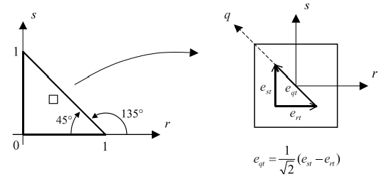
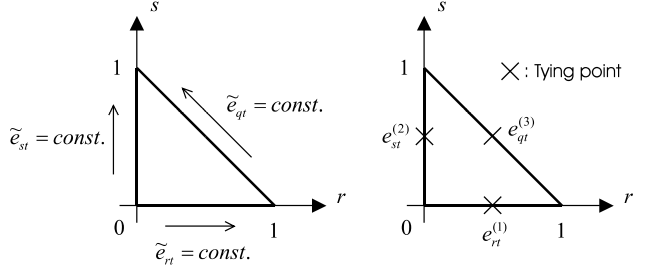
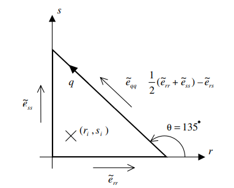
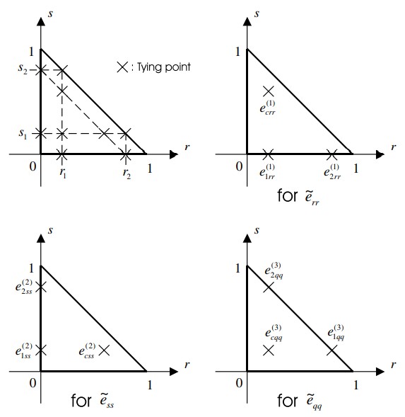
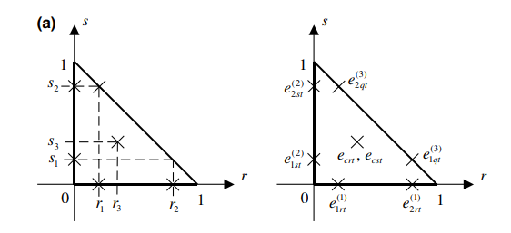
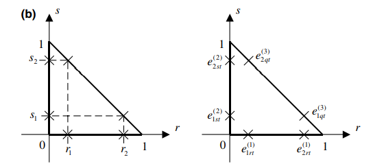

# 1 Introduction

diplacement-based shell elements는 shell element가 얇아질수록 bending dominated problem에서 displacement interpolation order와 관계 없이 too stiff해진다. characteristic length $t/L$에 depend하여 stiff해지는 성질을 shear and membrane locking이라고 한다.
> Q. shear and membrane locking은 언제 발생하는가?  
> Q. shear and membrane locking이 발생하면 어떻게 되길래 element가 stiff해지는가?  

Mixed Interpolation of Tensorial Components(MITC) approach는 사각형 plate/shell요소에서 성공적으로 locking 문제를 해결하였다.

shell finite element analyses에서 중요한 사안은 "주어진 shell finite element가 genenral shell structures에서 uniformly optimal인가?" 이다. 최근 연구에서 [11-14]
quadrilateral element의 경우에는 MITC technique을 사용한 quadrilateral shell finite elements가 optimal에 가깝다는 것을 보였다.

하지만 triangular element에는 "uniformly optimal" element뿐만 아니라 close to optimal인 element도 없다.

Ellipcity, Consistency, Inf-sup condition, spatial isotropy을 만족하는 triangular element를 만드는것이 목표이다.

Ellipcity란 zero energy mode가 없어서 FE 차분식이 물리적으로 의미 있는 값으로 풀리는 성질이다.
> Q. zero energy mode란?  
> Q. unsupported shell이란?  
> Q. unsupported shell에서 stiffness matrix 계산 방법?  
> Q. single shell finite element는 왜 6개의 zero energy mode를 갖는가?  

Consistency는 element가 작아질수록 FE solution이 mathematical solution으로 수렴하는 성질이다. 즉, FE formulation에서 나타나는 Bilinear form이 $h$가 작아질수록 mathematical model의 bilinear form으로 수렴하는 성질이다.

Inf-sup condition은 이상적으로 mixed FE 차분이 만족해야 하는 조건이다. 이 조건을 만족하는 shell FE는 bending-dominated shell problem에서 uniform optimal convergence를 갖는다는 것을 알 수 있다.
> Q. Inf-sup condition이란?  
> Q. Inf-sup condition을 만족하면 왜 shear & membrance locking 현상으로 부터 자유로운가?  

spatial isotropy란 triangular element의 stiffness matrices가 node numbering에 독립적이여야 한다는 성질이다. 자세히 말하면, 모든 변의 길이가 같은 isotropic trianglular element에서는 각 corner에서 nodal displacement/rotation 그리고 each midside nodal displacement/rotation이 동일한 방식으로 변한다. 만약 element의 성질이 orientation에 의존하면 각 element의 orientation에 대해 특별히 신경을 써줘야 한다. 
> Q. spatial isotropy란?  
> Q. stiffness matrices가 node numbering에 독립적이지 않을 수가 있나?  
> Q. 왜 sptatil isotropy 조건이 locking-free trianglular shell element를 만드는데 가장 큰 장애물이지?  

위의 조건을 모두 만족하는 optimal triangular element를 만드는 것은 상당히 어려운 일임으로 다음과 같이 완화된 조건을 만족시키는 triangular element를 만드는것이 목적이다.
* spatially isotropic behavior
* no spurious zero energy mode (ellipticity condition)
* no shear locking in plate bending problem
* optimal result for membrane dominated shell problem
* optimal result for bending dominated shell problem in practical range of $t/L$
* 비선형 해석으로 확장성

# 2 MITC formulation
MITC의 핵심 아이디어는 변위와 변형률을 각각 interpolation하고 tying points에서 두 interpolation을 연결시켜주는 방법이다.
> Q. 변위와 변형률을 각각 interpolation 하는 이유가 뭐지 ?  
> (see 1984 Bathe & Dvorkin)

continuum mechanics displacement-based shell element의 geometry는 다음과 같다.
$$ \mathbf x( r_1,r_2,r_3) = n_i(r_1,r_2) \mathbf x_i + \frac{r_3}{2} n_i(r_1,r_2) a_i \mathbf v^i $$
> Q. geometry가 왜 이렇게 표현되지?  
> (see [book] (Bathe) The finite element shell element chap 6.3)

이 때, $n_i$는 $i$점의 standard 2D shape function이고 $\mathbf x_i$는 $i$점의 직교 좌표이며 $a_i$는 $i$점의 shell thickness, $\mathbf v^i$는 $i$점의 director vector이다. 이 때, $\mathbf v^i$는 shell midsurface에 수직일 필요는 없다.
> Q.director vector가 뭐지?

Element의 displacement는 다음과 같이 주어진다.
$$ \mathbf d(r_1,r_2,r_3) = n_i(r_1,r_2)\mathbf d(\mathbf x_i) + \frac{r_3}{2} a_in_i(-\mathbf v_2^i \alpha_i + \mathbf v_1^i \beta_i) $$
> Q. 왜 displacement가 이렇게 표현되지?  
> (see [book] (Bathe) The finite element shell element chap 6.3)

이 때, $\mathbf v^i_{1,2}$는 각 각 $\mathbf v^i$에 수직한 단위 벡터이고, $\alpha_i, \beta_i$는 rotation of the director vector $\mathbf v^i$ about $\mathbf v^i_{1,2}$.

covariant strain component는 다음과 같다.
$$ e_{ij} = \frac{1}{2} \left( \frac{\partial \bf x}{\partial r_i} \cdot \frac{\partial \bf d}{\partial r_j} + \frac{\partial \bf x}{\partial r_j} \cdot \frac{\partial \bf d}{\partial r_i} \right)$$ 
> Q. covariant strain component가 왜 이렇게 표현되지?  
> (see [book] (Bathe) The finite element shell element chap 4.1)

shell midsurface위에 있는 $n_{ij}$개의 tying points를 정의하자.
$$\{(r_1)_k, (r_2)_k\} \enspace k=1,\cdots,n_{ij}$$

assumed covariant strain component를 다음과 같이 정의하자.
$$ \begin{equation} \tilde{e}_{ij}(r_1,r_2,r_3) = \tilde{n}_k(r_1,r_2)e_{ij}|_{((r_1)_k,(r_2)_k,r_3)} \end{equation}  $$

$\tilde{n}_{k}$는 assumed interpolation function으로 다음을 만족한다.
$$ \tilde n_i((r_1)_j , (r_2)_j) = \delta_{ij} $$

Displacement-based covariant strain component는 다음과 같이 주어진다.
$$ \boldsymbol \epsilon = \mathbf B \mathbf d $$

따라서 Displacement-based assumed strain component는 다음과 같이 주어진다.
$$ \tilde{\boldsymbol \epsilon} = \tilde{\mathbf B} \mathbf d$$
$$ \text{Where, } \tilde{\mathbf B} = \tilde{n}_k(r_1,r_2) \mathbf B |_{((r_1)_k,(r_2)_k,r_3)} $$

> Q. $\tilde{\mathbf B}$를 어떻게 구하는거지..?

# 3 Strain interpolation
MITC 기법을 성공적으로 적용하기 위해서는 assumed strain interpolations(EQ.(1))을 잘 정해야 하며 또한 tying points를 잘 정해야 한다.

## 3.1 Strain interpolation methods
3 node isoparametric beam element를 고려하자.

quadratic variation of transverse shear strain $e_{rt}$을 가지고 있기 때문에 shear locking을 제거하기 위해서는 transverse shear strain을 linearly interpolate해야 한다. linearly interpolate하기 위해서는 서로 다른 두 tying points에서의 transverse shear strains을 알면 된다.
> Q. 왜 3node 일 때 transverse shear strain이 quadratic이지?  
> Q. 왜 linearly interpolate해야 shear locking을 제거할 수 있지?  

assumed transverse shear strain를 $\tilde e_{rt}$라 하고 서로 다른 두 tying points을 $r_1,r_2$라 하자. 이 때 $r_1,r_2$가 중심점 0을 기준으로 대칭으로 주어졌다고 하자.

#### Method i
$\tilde e_{rt}$가 선형임을 알고 있음으로 다음과 같이 가정한다.
$$ \tilde e_{rt}(r) = a_0 + a_1 r$$

$r_1, r_2$에서 $\tilde e_{rt} =e_{rt}$여야 함으로 다음 2개의 선형방정식이 유도된다.
$$ \tilde e_{rt}(r_1) = e_{rt}(r_1), \enspace \tilde e_{rt}(r_2) = e_{rt}(r_2)  $$

두개의 선형방정식을 연릭하여 풀어 미지수 $a_0, a_1$을 결정한다. 

#### Method ii
$r_1, r_2$에서 $\tilde e_{rt} =e_{rt}$여야 함으로 shape functions of the standard isoparametric procedure을 이용하여 다음과 같이 가정한다.
$$ \tilde e_{rt}(r) = e_{rt}(r_i)n_i(r) $$

이 때, $n_i$는 linear shape function 임으로 다음을 만족한다.
$$ n_1 = a_0 + a_1r, \quad n_2 = b_0 + b_1r, \quad n_i(r_j) = \delta_{ij} $$

다음 4개의 선형방정식을 풀어 $a_i,b_i$를 구한다.
$$ n_1(r_1) = 1, \quad n_1(r_2) = 0, \quad  n_2(r_1) = 0, \quad n_2(r_1) = 1 $$

#### New Method
displacement-based three node isoparametric beam element의 transverse shear strain의 order가 quadratic임으로 $\tilde e_{rt}$를 다음과 같이 가정한다.
$$ \tilde e_{rt}(r) =  a_0 + a_1r + a_2 r^2 $$

다음 세가지 조건이 주어졌다고 하자.
$$ \begin{aligned} \tilde e_{rt}(-1) &= m_{rt} - l_{rt} \\ \tilde e_{rt}(0) &= m_{rt} \\ \tilde e_{rt}(1) &= m_{rt} + l_{rt} \end{aligned} $$
$$ \text{Where, } m_{rt} = \frac{1}{2}(e_{rt}(r_1) + e_{rt}(r_2)), \enspace l_{rt} = \frac{e_{rt}(r_2) - e_{rt}(r_1)}{r_2 - r_1} $$

이 때, $m_{rt}$는 두 tying strain의 중간값이며, $l_{rt}$는 중간과 edge에서의 값의 차이이다.

주어진 조건을 통해 미지수 $a_0, a_1, a_2$를 구한다.

method i과 method ii는 linear polynomials로 시작한것과는 다르게 new method에서는 quadratic polynomial로 시작하고 linear variation을 imposition하여 자연스럽게 quadratic term이 없어지게 하였다. 이러한 점 때문에 정확한 space of function을 알지 못하는 2D,3D element에서도 new method를 사용할 수 있다.
> Q. 이게 무슨말이지??

## 3.2 Interpolation of transverse shear strain field
isotropic한 tranverse shear strain fields를 얻기 위해서는 strain variations corresponding to the three edge directions of the element가 동일해야 한다.

> Q1. isotropic한 tranverse shear strain이 뭐지??  
> Q2. strain variations corresponding to the three edge directions of the element가 동일하다는게 무슨말이지?  
> Q3. node numbering이 달라지면 결과가 달라지는 경우가 있나??(chap 5.1 isotropic element test)

따라서 두 independent covariant transverse shear strains $e_{rt}, e_{st}$를 interpolation할 때, $e_{qt}$도 고려해야 한다. 위 그림을 통해 삼각형 내부의 한점의 $e_{rt}$와 $e_{st}$로부터 $e_{qt}$를 어떻게 얻는지 알 수 있다. tensor transformation에 의해 $e_{qt}$는 다음과 같다.
$$ \begin{equation} e_{qt} = \frac{1}{\sqrt{2}}(e_{st} - e_{rt}) \end{equation} $$

> Q1. 그림으로부터 뭘 알 수 있지?  
> Q2. tensor transformation이 무엇이지?  

예를 들어, constant transverse shear strain along its edge이고, tying points가 center of the edges로 결정된 경우를 생각해보자.

첫번째로, assumed transverse shear strain $\tilde e_{rt}, \tilde e_{st}$를 다항식으로 근사한다.
$$ \tilde e_{rt} = a_0 + a_1 r + a_2 s \\ \tilde e_{st} = b_0 + b_1 r + b_2 s $$

식(1)으로 부터 $\tilde e_{qt}$ 또한 근사된다.
$$ \tilde e_{qt} = (a_0-b_0) + (a_1-b_1) r + (a_2-b_2) s $$

두번째로 strain tying points을 결정한다. tying points는 isotropically 위치해야 하며 displacement-based strain과 assumed strain이 이 점에서 tied 된다. 현재 예시에서는 center of the edges로 결정되어있다.

new method를 이용한 tying은 judiciously chosen points에서 assumed strain을 displacement-based strain으로부터 evaluating 함으로써 얻어지며 이 points들은 tying points일 필요가 없다.

> Q1. judicously chosen points는 어떻게 정하는거야 도대체

이를 식으로 나타내면 다음과 같다.
$$ \begin{equation} \begin{aligned} \tilde{e}_{rt}(0,0) = e^{(1)}_{rt}, \quad \tilde{e}_{rt}(1,0) = e^{(1)}_{rt} \\ \tilde{e}_{st}(0,0) = e^{(2)}_{st}, \quad \tilde{e}_{st}(0,1) = e^{(2)}_{st} \\ \tilde{e}_{qt}(1,0) = e^{(3)}_{qt}, \quad \tilde{e}_{qt}(0,1) = e^{(3)}_{qt} \end{aligned} \end{equation} $$

주의할 점은 assumed strain variations가 displacement-based strain보다 lower order여야 한다.
> Q1. 왜 assumed strain variation이 displacement based strain보다 lower order여야 하는가?

세번째로, 식(3)에 나타난 6개의 선형방정식을 풀어 6개의 미지수를 구한다.
$$ \begin{array}{l l l} a_0 = e^{(1)}_{rt}, & a_1 = 0, & a_2 = e^{(2)}_{st} - e^{(1)}_{rt} -\sqrt{2}e^{(3)}_{qt} \\ b_0 = e^{(2)}_{st}, & b_1 = -a_2, & b_2 = 0 \end{array} $$

### 3.3 Interpolation of in-plane strain field
istropic한 in-plane strain fields를 얻기 위해서 빗변의 $e_{qq}$항도 고려해야 한다.

위 그림을 통해 삼각형 내부의 한점의 $e_{rr},e_{ss}$와 $e_{rs}$로부터 $e_{qq}$를 어떻게 얻는지 알 수 있다. tensor transformation에 의해 $e_{qq}$는 다음과 같다.
$$ \begin{equation} e_{qq} = \frac{e_{rr}+e_{ss}}{2} + \frac{e_{rr} - e_{ss}}{2} \cos(2\theta) + e_{rs} \sin(2\theta) \end{equation} $$

식(4)에 $\theta = 135\degree$를 대입하고 $e_{rs}$에 대해 정리하면 다음과 같다.
$$ \begin{equation} e_{rs} = \frac{1}{2}(e_{rr} + e_{ss}) - e_{qq} \end{equation}  $$

> Q1. 그림으로부터 뭘 알 수 있지?  
> Q2. tensor transformation이 무엇이지?  

예를 들어, 6-node triangular shell element with linear normal strain along its edge이고, 각각의 normal strain에 대해 tying points가 다음과 같이 결정된 경우를 보자.

$$ \text{where, } r_1 = s_1 = \frac{1}{2} - \frac{1}{2 \sqrt{3}}, \quad r_2 = s_2 = \frac{1}{2} + \frac{1}{2 \sqrt{3}} $$

여기서 사용된 tying points는 one of the possible scheme일 뿐이며, 다른 tying scheme 또한 사용될 수 있다.

첫번째로, assumed in plane strain $\tilde e_{rr}, \tilde e_{ss}, \tilde e_{qq}$를 다항식으로 근사한다.
$$ \begin{aligned} \tilde e_{rr} &= a_0 + a_1 r + a_2 s \\ \tilde e_{ss} &= b_0 + b_1 r + b_2 s \\ \tilde e_{qq} &= c_0 + c_1 r + c_2 (1-r-s) \end{aligned} $$

여기서는 계산의 단순함을 위해 $e_{qq}$를 위와 같이 근사하였으며 다른 다항식과 동일하게 $c_0 + c_1 r + c_2 s$로 근사해도 된다.

두번째로 new method를 이용해 judiciously chosen points에서 tying한다.
$$ \begin{equation} \begin{array}{lll} \tilde{e}_{rr}(0,0) = m^{(1)}_{rr} - l^{(1)}_{rr} & \tilde{e}_{ss}(0,0) = m^{(2)}_{ss} - l^{(2)}_{ss} & \tilde{e}_{qq}(0,0) = m^{(3)}_{qq} - l^{(3)}_{qq} \\ \tilde{e}_{rr}(1/2,0) = m^{(1)}_{rr} & \tilde{e}_{ss}(0, 1/2) = m^{(2)}_{ss} & \tilde{e}_{qq}(0, 1/2) = m^{(3)}_{qq} \\ \tilde{e}_{rr}(1,0) = m^{(1)}_{rr} + l^{(1)}_{rr} & \tilde{e}_{ss}(0, 1) = m^{(2)}_{ss} + l^{(2)}_{ss} & \tilde{e}_{qq}(0, 1) = m^{(3)}_{qq} + l^{(3)}_{qq} \\ \tilde{e}_{rr}(r_1,1 / \sqrt3) = e^{(1)}_{crr} & \tilde{e}_{ss}(1 / \sqrt3 , s_1) = e^{(2)}_{css} & \tilde{e}_{qq}(r_1 , s_1) = e^{(3)}_{cqq} \end{array} \end{equation} $$
$$ \text{Where, } m_{jj}^{(i)} = \frac{1}{2}(e_{1jj}^{(i)} + e_{2jj}^{(i)}), \quad l_{jj}^{(i)} = \sqrt{3}(e_{2jj}^{(i)} - e_{1jj}^{(i)}) \\ j= r,s,q, \enspace i = 1,2,3$$

세번째로, 식(6)에 나타난 12개의 선형방정식을 풀어 9개의 미지수를 결정한다.
$$ \begin{array}{l l l} a_0 = m^{(1)}_{rr} - l^{(1)}_{rr}, & a_1 = 2l^{(1)}_{rr}, & a_2 = \sqrt{3}(e^{(1)}_{crr} - a_0 - a_1r_1) \\ b_0 = m^{(2)}_{ss} - l^{(2)}_{ss}, & b_1 = \sqrt{3}(e^{(2)}_{css} - b_0 - b_2s_1), & b_2 = 2l^{(3)}_{ss} \\ c_0 = m^{(3)}_{qq} + l^{(3)}_{qq}, & c_1 = -2l^{(3)}_{qq}, & c_2 = \sqrt{3}(e^{(3)}_{cqq} - c_0 - c_1r_1) \end{array} $$

$\tilde e_{rs}$는 식(5)로부터 바로 구할 수 있다.

## 4
bending dominated shell problem에서 좋은 성능을 보이는 element는 membrane dominated shell problem에서 좋지 못한 성능을 보인다. 또는 반대로 작동한다. 따라서 적절한 trade-off를 통해 strain interpolation을 사용해야 한다.

bending dominated shell problem에서 shear and membrane locking현상을 제거하고 membrane dominated shell problem에서는 consistency를 유지하는것이 목표이다.

optimal strain interpolations와 tying points는 displacement interpolation에 depend한다. 

### MITC3
3 node trianglular shell element의 geometry는 평평하기 때문에 transverse shear strain에만 mixed interpolation을 적용한다. 

constant transverse shear strain을 가정하고 tying points는 각 edge의 center point로 한다. 이는 3.2의 예시와 같다.

### MITC6-a
6 node triangular shell element에서는 linear transverse shear strain을 가정하고 tying points는 각 edge마다 2점을 부여하고 quadratic variation of strains inside를 표현하기 위해 $r= 1/3, s=1/3$인 tying point를 하나 결정한다.

전체 tying points는 다음과 같다.

$$ \text{where, } r_1 = s_1 = \frac{1}{2} - \frac{1}{2 \sqrt{3}}, \quad r_2 = s_2 = \frac{1}{2} + \frac{1}{2 \sqrt{3}}, \quad r_3=s_3 = \frac{1}{3} $$

assumed transverse shear strain을 2차 다항식으로 근사한다.
$$ \tilde e_{rt} = a_0 + a_1 r + a_2 s + a_3 r^2 + a_4 rs + a_5 s^2 \\ \tilde e_{st} = b_0 + b_1 r + b_2 s + b_3 r^2 + b_4 rs + b_5 s^2  $$

chapter 3.2와 동일한 과정을 거치면 미지수를 전부 결정할 수 있다.

inplane strain field는 chpater 3.3과 동일하게 한다.

### MITC6-b
6 node triangular shell element에서는 linear transverse shear strain을 가정하고 tying points는 각 edge마다 2점을 부여한다.

전체 tying points는 다음과 같다.

$$ \text{where, } r_1 = s_1 = \frac{1}{2} - \frac{1}{2 \sqrt{3}}, \quad r_2 = s_2 = \frac{1}{2} + \frac{1}{2 \sqrt{3}} $$

assumed transverse shear strain을 1차 다항식으로 근사한다.
$$ \tilde e_{rt} = a_0 + a_1 r + a_2 s \\ \tilde e_{st} = b_0 + b_1 r + b_2 s $$

chapter 3.2와 동일한 과정을 거치면 미지수를 전부 결정할 수 있다.

inplane strain field는 chpater 3.3과 동일하게 한다.