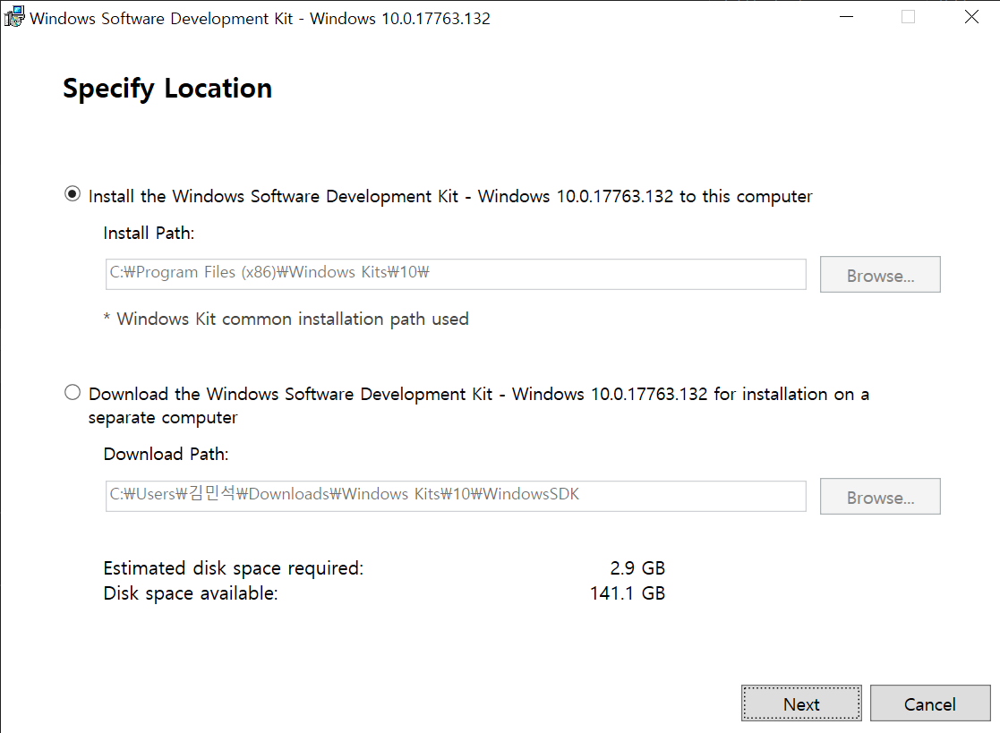

# Windows C++ 프로젝트 속성 페이지 참조
* https://docs.microsoft.com/ko-kr/cpp/build/reference/property-pages-visual-cpp?view=msvc-160

# 프로젝트 속성 상속하는 법
* http://wanochoi.com/?p=5240

# 외부 DLL 경로 추가하기
* https://m.blog.naver.com/PostView.naver?isHttpsRedirect=true&blogId=sharonichoya&logNo=220817543315
* https://pung77.tistory.com/27
* https://irmxj777.tistory.com/4
* 

# OneAPI
## MPI
* visual studio configuration   
* https://software.intel.com/content/www/us/en/develop/documentation/mpi-developer-guide-windows/top/compiling-and-linking/configuring-a-visual-studio-project.html

## ISSUE
* Environement
  * intel 홈페이지에 나와있는 환경변수가 잘못되어 있음
    * PATH=\$(I_MPI_ONEAPI_ROOT)\bin\\$(ConfigurationName);\$(I_MPI_ONEAPI_ROOT)\libfabric\bin;\$(PATH)
    * ConfigurationName $\rightarrow$ Configuration
  * 인식 못하는 dll 파일이 있는 곳의 위치를 환경변수에 연결해줘야 함
    * PATH=\$(I_MPI_ONEAPI_ROOT)\bin\\$(Configuration);\$(I_MPI_ONEAPI_ROOT)\libfabric\bin;C:\Program Files (x86)\Intel\oneAPI\mkl\2021.4.0\redist\intel64;\$(PATH)

# Google Test
## Initial Setting
1. 기본 속성
2. Test 프로젝트 속성 >> C/C++ >> 미리 컴파일된 헤더 >> 사용안함
3. Main 프로젝트 속성 >> 일반 >> 구성 형식 >> 정적 라이브러리
   1. Main 프로젝트에 main 함수가 포함되어 있어야 정적 라이브러리 생성이 가능

## Document
https://github.com/google/googletest/blob/master/docs/primer.md
https://github.com/google/googletest/blob/master/docs/advanced.md

## ISSUE
* LNK2019 error include header file instead of cpp file
  * https://stackoverflow.com/questions/43413180/google-tests-dont-work-with-class-in-other-project-in-solution
  * https://zepeh.tistory.com/466
  * https://www.javaer101.com/en/article/12126422.html

* /GL로 컴파일한 MSIL .netmodule 또는 모듈이 있습니다. /LTCG를 지정하여 링크를 다시 시작하십시오. /LTCG를 링크 명령줄에 추가하면 링커 성능이 향상됩니다.
  * https://kldp.org/node/122696  
  * https://docs.microsoft.com/ko-kr/cpp/build/reference/ltcg-link-time-code-generation?view=msvc-160  
  * https://yonjh.tistory.com/116  

# 기본 설정
* 프로젝트 >> 속성 >> 링커 >> 시스템 >> (하위 시스템 , 콘솔 , 콘솔창이 꺼지지 않음)	
*	도구 >> 옵션 >> 텍스트 편집기 >> 모든 언어 >> 스크롤 막대 >> 동작 >> 세로 스크롤 막대에 지도 모드 사용
*	도구 >> 옵션 >> 환경 >> 글꼴 및 색 >> 글꼴 : (JetBrains Mono) >> 색 : 채도를 낮게 해야 보기 편함
*	도구 >> 옵션 >> 텍스트 편집기 >> C/C++ >> 서식 >> 일반 >> ClangFormat 지원 사용 
*	도구 >> 옵션 >> 환경 >> 국가별 설정 >> 언어
*	도구 >> 옵션 >> 환경 >> 키보드 >> 단축키
  
# 단축키
* 정렬 단축키 : ctrl+k+d
* 개요 확장 축소 : ctrl M M
*	개요 전체 확장 축소 	ctrl M L
*	개요 전체 삭제 		ctrl M P
	

[Intellisense 오류시 해결방법]  
	.vs >> codename >> v15 v16 >> ipch 삭제
	
	
[폰트 설치]
	https://wonjjong.tistory.com/27

# SDK 

`소프트웨어 개발 도구(Software Development Kit; SDK)`은 주로 코드를 프로그램으로 빌드하는 과정에서 사용되는 보조 도구이다.

SDK 버전 오류는 크게 두가지 방법으로 해결 할 수 있다.

1. 현재 개발 환경에 설치된 SDK 버전에 맞게 해당 프로젝트의 SDK 버전을 바꿔서 설정해준다.
2. 현재 개발 환경의 SDK 버전을 해당 프로젝트의 SDK 버전에 맞게 업데이트해준다.

## 2번 해결 방법
[MSVC의 아카이브](https://developer.microsoft.com/ko-kr/windows/downloads/sdk-archive/)에서 필요한 SDK 버전을 찾고 Install SDK를 클릭한다.

다운로드 된 파일을 실행시키고 현재 컴퓨터의 common installation path에 SDK버전을 설치한다.

설치 후 컴퓨터를 재시작하고 visual studio에서 프로젝트를 연다음에 아래와 같은 과정을 거쳐 필요한 SDK 버전으로 바꾼다.

    솔루션 탐색기 >> 솔루션 오른쪽 마우스 >> 솔루션 대상 변경 >> Windows SDK 버전 >> 다운로드 받은 버전 선택

Q. installation path에서 지우면 지워질까?  

## 참고
[매화 블로그](https://mewha.tistory.com/12)  
[Windows SDK and emulator archive - MSVC](https://developer.microsoft.com/ko-kr/windows/downloads/sdk-archive/)