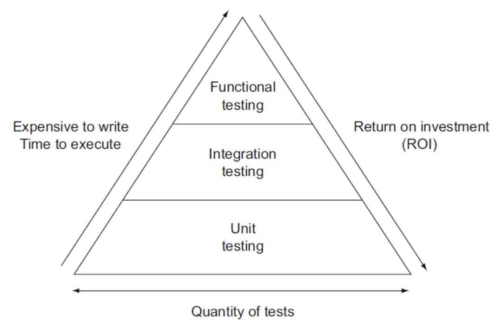

# 계획

9/3일까지 수학 라이브러리(MS Math Library; MML)에 대한 단위 테스트 코드 작성 완료
* 테스트 코드는 왜 필요한가?
* 테스트 코드의 종류에는 무엇이 있는가?
* 깨끗한 단위 테스트
  * 필요성(장점)  
  * 작성법
* Google Test Framework의 사용법

# 테스트 코드의 필요성
테스트 코드는 변경의 두려움을 없애줌으로써 수정 가능한 코드를 만드는데 필수적인 요소이기 때문에 필요하다.

테스트 코드가 없으면 제품 코드를 변경한 뒤 정상적으로 작동하는지 보장할 수 없다. 그렇기 때문에 모든 변경이 버그의 가능성을 품게 되고 변경은 두려움의 대상이 된다. 변경이 두려움의 대상이 되면 제품 코드가 훌륭한 설계를 갖어 변경을 수용할 수 있더라도 수정 중 의도하지 않는 버그를 만들 수 있다는 두려움이 변경을 시도하는 것 자체를 어렵게 만든다. 수정이 어려운 코드는 더이상 개선되지 않고 망가져간다.

하지만 테스트 코드가 있을 경우 더이상 변경을 두려워하지 않을 수 있다. 따라서 제품 코드를 유연하고, 유지보수와 재사용 가능하게 개선하는 변경을 지속적으로 시도할 수 있게 된다. 따라서 테스트 코드는 수정 가능한 코드를 만드는데 필수적인 요소이다.

## 참고
[book] (Robert C. Martin) Clean Code Chap8

# 테스트 코드의 종류
소프트웨어 테스트에는 여러 유형들이 있다. 각 테스트는 목적, 방법 등에 따라 차이점을 가진다.

## 단위 테스트
`단위 테스트(unit test)`는 개별 모듈의 기능을 확인하는 테스트이다.

테스트하려는 모듈을 실행하려면 해당 모듈을 실행할 수 있는 환경 구성이 필요하다. 실행 환경에는 테스트 할 모듈을 호출하여 실행하는 모듈이 있을 수 있으며, 반대로 테스트하려는 모듈이 다른 모듈을 호출하여 실행하는 경우도 있을 수 있다. 

하지만 테스트를 하기 위해 환경 구성을 위한 다른 모듈들을 사용하게 되면 개별 모듈의 기능을 확인하고자 하는 단위 테스트의 목적을 달성하기 어렵다. 단위 테스트의 목적인 개별 모듈의 기능을 확인하기 위해서는 다른 모듈과 종속성과 상호작용이 없는 상황에서 테스트해야 정확하다. 

따라서 상위 모듈이나 하위 모듈의 역활을 하는 가상의 모듈을 만들어 사용해야 한다. `테스트 드라이버(test driver)`는 테스트 대상이 되는 모듈을 호출하여 대상 모듈의 실행 결과를 받는 가상 모듈이며 `테스트 스텁(test stub)`은 호출하는 상황의 대상 모듈을 테스트하기 위한 가상 모듈이다.

## 통합 테스트
`통합 테스트(integration test)`는 여러 모듈들이 협력하여 구현되는 기능을 확인하는 테스트이다.

단위 테스트에서 사용한 가상 모듈들을 실제 모듈로 대체해서 수행한다.

## 기능 테스트
`기능 테스트(functional test)`는 모든 모듈이 함께 실행되는 상태에서 전체 애플리케이션의 기능을 확인하는 통합 테스트이다.

## 테스트 피라미드
높은 효율의 테스트를 위해서는 많은 단위 테스트, 적은 수의 통합 테스트 그리고 최소한의 기능 테스트가 있어야한다. 왜냐하면 단위테스트에서 기능테스트로 갈 수록 테스트를 작성 비용, 실행 비용, 유지보수 비용이 증가하기 때문이다. 

이를 그림으로 표현하면 다음과 같다.

## 예시
유저가 슬라임에게 달려가 슬라임을 때려잡고 전리품을 수집하는 하나의 과정이 있다고 해보자.

* 단위 테스트
  * 유저가 슬라임에게 달려가는 Move 함수가 주어진 입력에 올바른 출력을 하는가?
  * 유저가 슬라임을 공격하는 Attack 함수가 주어진 입력에 올바른 출력을 하는가?
  * 슬라임을 때려잡은 후 전리품을 수집하는 Gather 함수가 주어진 입력에 올바른 출력을 하는가?  
  (데이터베이스에 접근하는 코드는 실제 데이터 베이스와 통신하는 것은 아니다.)
* 통합 테스트
  * Gather 함수가 동작할 때 실제 데이터베이스에 수집한 전리품이 잘 들어갔는가?  
  (데이터베이스에 접근하는 코드는 실제 데이터 베이스와 통신한다.)
* 기능 테스트
  * 유저가 슬라임에게 달려가 슬라임을 때려잡고 전리품을 수집하는 과정이 제대로 수행되었는가?

## 참고
[소프트웨어 개발 단계에 따른 테스트 분류 - 개감사 인더스트리 블로그](https://osb0728.tistory.com/25?category=782881)  
[단위 테스트, 통합 테스트란? - 개감사 인더스트리 블로그](https://osb0728.tistory.com/26)  
[유닛 테스트, 통합 테스트, 기능 테스트란? - 코덕개발자노트 블로그](https://cjwoov.tistory.com/9)    

# 깨끗한 단위 테스트
## 필요성
깨끗한 테스트 코드를 가져야 하는 이유는 테스트 코드 또한 유지보수해야 하기 때문이다.

제품 코드를 수정하면 이전에 작성했던 테스트 코드는 더이상 유효하지 않고 실패할 수 있다. 따라서 현재 제품 코드에 맞게 테스트 코드도 유지보수가 필요하다. 하지만 지저분한 테스트 코드로 인해 테스트 코드를 수정하는데 비용이 높아질 수록 테스트 코드가 가지고 있는 장점에도 불구하고 부담으로 다가오게 된다. 

따라서 유지보수하기 쉬운 깨끗한 테스트 코드가 필요하다.

## 작성법
깨끗한 테스트 코드란 무엇인가? 첫째도 둘째도 셋째도 `가독성(readability)`이다. 테스트 코드에서는 제품코드보다 가독성이 더욱 중요하다.

그렇다면 테스트 코드의 가독성은 어떻게 높힐 수 있는가? `명확하고(clarity)` `단순하고(simplicity)` `밀도 높은 표현(density of expression)`을 사용해야 한다. 테스트 코드는 가능한 적은 표현으로 테스트하고자 하는 바를 표현해야 한다.

1. 불필요한 상세내용을 숨겨라. Build-Operate-Check 패턴을 사용하라. (ex p.125 - 126)
   1. 테스트를 위한 API를 사용하여 테스트 코드의 가독성을 높혀라.
2. A Dual standard(p.127) - 이해 안됨
3. One Assert per Test
   1. 하나의 테스트당 Assertion이 하나일 경우 테스트를 이해하기 훨씬 쉬워진다.(given - when then convenition)
   2. 하나의 테스트당 Assertion이 하나일 경우 중복 코드가 발생할 수 있다.
   3. 반드시 하나일 필요는 없지만 최소화하는것이 테스트를 이해하기 쉽게 만든다.
   4. 여러개의 Assertion이 있을 경우 결론적으로 어떤 Assertion에서 예외가 발생했는지 또 확인해야 된다.
4. Single Concept per Test
   1. 여러 컨셉을 동시에 테스트 하는경우 각각의 컨셉이 무엇인지 유추해야 한다.
5. F.I.R.S.T
   1. Fast : 테스트가 느릴경우 자주 돌리기 어렵고 결국 테스트 하기 어렵게 만든다.
   2. Independent : 모든 테스트는 독립적이여야 한다. 종속적인 테스트는 원인 분석을 어렵게 만든다.
   3. Repetable : 모든 환경에서 반복적으로 돌릴 수 있어야 한다. 인터넷이 없는 환경, 제품 환경, QA환경
   4. Self-validating : 결과가 자동으로 P/F 형식으로 나와야 한다. 수동으로 P/F 여부를 분석해서는 안된다.
   5. Timely : 제품 코드가 완성 되기 전에 테스트 코드를 작성해야 한다. 완성된 제품 코드에 테스트 코드를 끼워 맞추는것이 아니라 제품 코드를 작성하는 중에 테스트 코드를 작성함으로써 제품 코드가 테스트 가능하게 해야한다. 만약 어떤 제품 코드의 테스트 코드를 작성하기 어렵다면 이는 제품 코드를 테스트 가능하게 작성하지 않았기 때문이다.

### 단위 테스트 작성 법
1. 단위 테스트는 개별 모듈의 기능을 확인해야 하기 때문에 다른 모듈과 종속성과 상호작용 없는 상황에서 테스트해야 한다. 여기서 단위는 가장 작은 개별 기능, 방법 등 테스트 할 수 있는 가장 작은 기능이다.
2. 단위 테스트는 올바른 입력에 대한 동작뿐만 아니라 잘못된 입력에 의한 동작도 확인해야 한다.
3. 모든 테스트는 독립적으로 동작해야 한다. 하나의 테스트가 다른 테스트의 결과에 영향을 주어서는 안된다.

### 단위 테스트의 장점
1. 초기 단계에서 문제 / 버그를 찾는 것은 매우 유용하며 전체 프로젝트 비용을 절감합니다. 
2. 어디서 버그가 발생했는지 알 수 있기 때문에 디버그가 쉽다.
3. 재사용 가능하고 유지보수가 쉽다.

## 참고
[book] (Robert C. Martin) Clean Code Chap8  
[단위테스트 작성의 필요성 - 망나니 개발자 블로그](https://mangkyu.tistory.com/143)  
[단위테스트 - 예스30 블로그](https://soozl91.tistory.com/64)

# 테스트 가능한 코드

# Gmock
[How to use Google Mock - 놀고 먹고 일하는 이야기 블로그](https://ungodly-hour.tistory.com/17)

# Feed back
## 2022.06.11
* Q1. 벤치마크 문제로도 가능한거 아닌가 왜 테스트 코드 필요한가?  
벤치마크 문제는 기능 테스트에 해당한다. 따라서 테스트 비용이 크기 때문에 발생하는 문제가 생길 수 있고 버그가 발생한 위치를 파악하기 어렵다는 단점이 존재한다. (단위 테스트의 필요성, 단위 테스트의 장점)

* Q2. 테스트 코드에도 버그가 있을 수 있지 않냐?  
테스트 프레임 워크를 사용해야 하는 이유, 테스트 코드를 한번 작성해 놓으면 계속해서 재사용 가능하다.